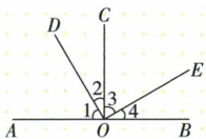
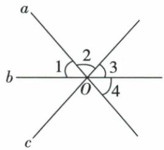

## 错法

三线共点时把相邻编号叫邻补、隔着一个编号叫对顶。原选择题A、B、D均这样忽略边，互补例则说明不相邻也可能互补。

## 正解

对顶检查两边分别反向；邻补检查一公共边与另一对反向边。只有度数相等不保证对顶，只有和180°不保证邻补。原C角4与1逐边符合两组反向，才能选。

## 例题

### 不相邻的补角借同角余角确定

> 来源ID Q17-07；第17章相交线与平行线；201-250/full.md 第301–318行。原答案与解析定位：201-250/full.md 第320–322行。

例1 如图, $\angle AOC = \angle BOC = \angle DOE = 90^{\circ}$ . 图中有与 $\angle 3$ 互补的角吗?

**原资料答案与解析：**

解析 有. 由题意得 $\angle 1 + \angle 2 = \angle 2 + \angle 3 = 90^{\circ}$ , 所以 $\angle 1 = \angle 3$ , 因为 $\angle 1 + \angle BOD = 180^{\circ}$ , 所以 $\angle 3 + \angle BOD = 180^{\circ}$ , 即 $\angle 3$ 的补角是 $\angle BOD$ .

注意 互补的两个角只有数量关系，没有位置关系，只要这两个角的和等于 $180^{\circ}$ 即可.而邻补角不但有数量上的关系，还有位置上的关系.

**展开解析（依据原详解补足理由与步骤）：**

角1、角2拼成AOC，角2、角3拼成DOE，两个整体均90°。两式同减角2，得角1=角3。由图OA与OB反向，角1即AOD，AOD与BOD为邻补角，和180°。将角1替换成相等的角3，得角3+BOD=180°，所以BOD是角3的补角。角3和BOD不必邻接，互补只要求度数和180°。不能把“补角一定紧贴着原角”作为定义。

### 三线共点逐项检查反向边与公共边

> 来源ID Q17-09；第17章相交线与平行线；201-250/full.md 第381–398行。原答案与解析定位：201-250/full.md 第400–408行。

例1 如图, 直线 a、b、c 交于点 O, 下列判断正确的是 ( )

A. $\angle 1$ 与 $\angle 2$ 是对顶角 B. $\angle 1$ 与 $\angle 3$ 是邻补角 C. $\angle 4$ 的对顶角是 $\angle 1$ D. $\angle 2$ 的邻补角是 $\angle 4$

**原资料答案与解析：**

解析 $\angle1$ 与 $\angle2$ 的两边共涉及三条直线, 不是对顶角;

∠1与∠3的两边共涉及三条直线,不是邻补角;

∠4与∠1是直线a、b相交得到的,具有公共顶点,∠4的两边是∠1两边的反向延长线,所以∠4的对顶角是∠1;

∠2 与 ∠4 的两边共涉及三条直线, 所以 ∠4 不是 ∠2 的邻补角.

答案 C

**展开解析（依据原详解补足理由与步骤）：**

A：角1与角2有共同边附近的位置，但两边不分别反向，且涉及三条线，非对顶。B：角1与角3没有组成邻补角所需的公共边和反向另两边，错。C：角4由OA的反向边及OB组成，角1的两边与角4两边分别反向，确为AB两线形成的对顶角，正确。D：角2与角4不满足一条公共边、其余两边反向，非邻补。选C。三条线共点不能只按标号“隔一格”认对顶或邻补，必须实际追踪两条边。
