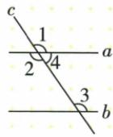

## 错法

原四句题把②③④全判正确，因角被叫同位、内错或同旁，就自动加入相等或互补，偷用了不存在的a∥b。

## 正解

名称只说明位置，数量性质必须有平行前提。原题唯①对顶恒相等；②③④不一定成立。若另已知某角关系，可以反向用判定，但不能由名称自动补出关系。

## 例题

### 未给平行时四条角关系辨析

> 来源ID Q17-15；第17章相交线与平行线；201-250/full.md 第610–615行。原答案与解析定位：201-250/full.md 第617–621行。

例2 如图, 直线 a, b 被直线 c 所截, 下列正确的是 \_\_\_\_.

①∠1=∠2;   
②∠1=∠3;   
③∠2=∠3;   
④ $\angle3+\angle4=180^{\circ}$ .

**原资料答案与解析：**

答案 ①

注意 没有平行线这个前提，同位角相等、内错角相等、同旁内角互补均不一定成立.

**展开解析（依据原详解补足理由与步骤）：**

①角1与角2是在a、c同一交点的对顶角，不需a∥b，恒相等，正确。②1与3是a、b被c截的同位角，没有平行已知，不保证相等。③2与3是同一三线系统的内错角，也无平行前提。④3与4是同旁内角，仍需a∥b才保证和180°。故只①。不能用图示两条线近似平行作为已知。②③④若额外给满足关系，可分别用于反过来判定平行；本题并未给。
