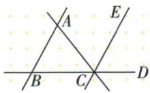
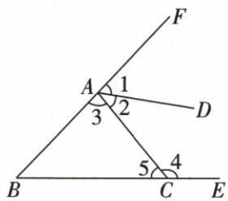
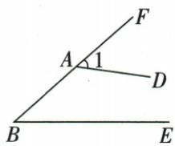
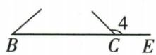
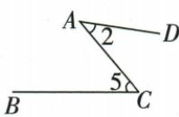
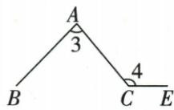
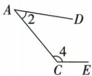
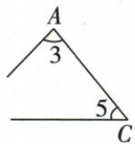
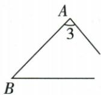
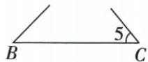

## 讲解

### 是什么

一条截线分别与两条被截线相交，在两个不同交点通常形成八个角。比较角位置时，先指定两被截线及共同截线，再讨论同位、内错、同旁内角。多线图可以有多个不同三线系统，同一角可在不同系统中有不同角色。

### 怎么来的

每个角由两条边确定。若所比较两角的一条边分别落在同一条直线上，这条共同所在直线可作截线；另外两条边所在直线是被截线。原六标角题中1与B共同用BF，4与B共同用BE，2与5共同用AC，不能让一条固定截线包办所有关系。原详解将复杂图拆为八个小图，就是暂时隐藏无关线，保留本对角实际涉及的三条线，帮助确认位置。F、Z、U形只辅助观察，不替代这个对象核对。

### 什么时候能用

适用于识别位置关系、选平行判据及使用平行性质。三线八角的名字本身不要求两被截线平行；若它们平行，才额外获得相等或互补。两比较角若没有合适共同截线，就不能仅凭外形强行套某种三线关系。文字三字母角记号中间字是顶点，可先写具体边再找共同直线。

## 例题

### 多线图指定截线与同旁内角两种选择

> 来源ID Q17-08；第17章相交线与平行线；201-250/full.md 第356–358行。原答案与解析定位：201-250/full.md 第360–360行。

例2 如图, $\angle BAC$ 和 $\angle$ \_\_\_\_ 是直线 AB, BD 被直线 \_\_\_\_ 所截得的内错角; $\angle ACB$ 的同旁内角是 \_\_\_\_.

**原资料答案与解析：**

答案 ACD; AC; $\angle BAC$ , $\angle ABC$

**展开解析（依据原详解补足理由与步骤）：**

原图B、C、D共线，B、A、F共线。AB和BD被AC所截，在A处∠BAC与C处∠ACD都在两被截线之间且在截线AC异侧，是内错角，填ACD、AC。求ACB的同旁内角时可以换选被截线：（一）AB与BD被AC截，ACB与BAC同旁内角；（二）AB与AC被BC截，ACB与ABC同旁内角。因此两答都要保留。这里识别的是角的位置类型，原题没有声明这些被截线平行，不能据此断言角相等或互补。

### 六个标角中八组关系逐一定位截线

> 来源ID Q17-10；第17章相交线与平行线；201-250/full.md 第414–428行。原答案与解析定位：201-250/full.md 第430–468行。

例2 如图所示, $\angle 1, \angle 2, \angle 3, \angle 4, \angle 5$ 和 $\angle B$ 中, 是同位角, 是内错角, 是同旁内角.

**原资料答案与解析：**

解析 由图1、图2中的“F”形图形可知∠1与∠B，∠4与∠B是两对同位角；由图3、图4中的“Z”形图形可知∠2与∠5，∠4与∠3是两对内错角；由图5、图6、图7、图8中的“U”形图形可知∠2与∠4，∠3与∠5，∠3与∠B，∠B与∠5是四对同旁内角.

图1

  
图2

  
图 3

  
图 4

  
图 5

  
图6

  
图 7

  
图8

答案 $\angle 1$ 与 $\angle B, \angle 4$ 与 $\angle B; \angle 2$ 与 $\angle 5, \angle 4$ 与 $\angle 3; \angle 2$ 与 $\angle 4, \angle 3$ 与 $\angle 5, \angle 3$ 与 $\angle B, \angle B$ 与 $\angle 5$

**展开解析（依据原详解补足理由与步骤）：**

依原分解图逐组确定“被截两线—截线”，而不是只记F、Z、U形：

同位角①1与B：AD、BE被BF截，在两交点同一相对位置；②4与B：AC、BF被BE截。

内错角③2与5：AD、BE被AC截，角位于被截线内、截线异侧；④4与3：BF、BE被AC截，角在内、异侧。

同旁内角⑤2与4：AD、BE被AC截；⑥3与5：BF、BE被AC截；⑦3与B：AC、BE被BF截；⑧B与5：BF、AC被BE截。这四组均在相应两被截线之间、相应截线同侧。每组原详解的分解小图保留，可沿同一直线核公共截线。

同一个角可以在不同三线系统中扮演不同位置，尤其角4与B是同位，但4与3是内错；不能给一个角永久贴“内错角”标签。题只要求位置关系，没有任何一组平行已知，不计算相等或180°。

### 同一截线AC的两组内错角判不同边平行

> 来源ID Q17-14；第17章相交线与平行线；201-250/full.md 第597–601行。原答案与解析定位：201-250/full.md 第603–606行。

例1 如图,由下列条件可判定哪两条直线平行?

(1) $\angle 1 = \angle 3$ . (2) $\angle 2 = \angle 4$ .

**原资料答案与解析：**

解析（1）由 $\angle1 = \angle3$ 可判定 DA
// CB.  
(2) 由 $\angle 2 = \angle 4$ 可判定 $DC \parallel AB$ .  
注意 能构成同位角或内错角或同旁内角的两个角一定有一条边共线，而不共线的两条边所在直线就是可判定平行的直线.

**展开解析（依据原详解补足理由与步骤）：**

（1）1=∠DAC，3=∠ACB，两角沿共同截线AC、另外两边分别在AD与CB，内错相等推出AD∥CB。（2）2=∠CAB，4=∠DCA，共同截线仍AC，另外两边在AB、CD，推出AB∥CD。不能从1=3推出AB∥CD，因为AB、CD不是这两个角除截线外的边；不能把截线AC和被截线之一判成平行，两者在A或C已相交。先把每个角写成三字母，再追到两条被截线。

## 易错

原ACB有两种同旁内角，是因为可换选截线系统，不是同一固定系统同一位置无条件多出两个角。原1=3和2=4均用AC截线，却指向两组不同被截线，平行结论不能串组。
