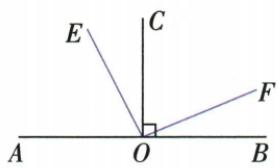
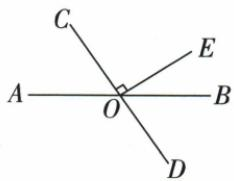

## 讲解

### 是什么

同一平面内，两条不同直线相交形成直角，就说两线互相垂直，记a⊥b；其中任一条都可叫另一条的垂线，交点叫垂足。垂直同时包含相交与90°两层条件。射线或线段垂直通常指它们所在直线垂直，不要求有限线段恰在内部相遇。

### 怎么来的

相交两线的一对邻角拼成平角，和180°。若其中一个90°，邻角也是180°−90°=90°；对面的角与它们对顶相等，四个角全直角。因此验证一个相交角为90°便足够，无需把四角都算一遍。原例1把OA⊥OD翻译成AOD=90°后再分割；原例2相反，把EOF证明为90°后翻译成OE⊥OF。这两种方向分别是使用定义和判定垂直，理由不能省成“看图”。

### 什么时候能用

所有结论在同一平面讨论。使用垂直符号前说明是哪两线、交点是谁；只给一个90°角，可以推出它两边所在直线垂直，但不能任意选图中其他线。已知垂直可以组成角方程，前提是分割射线位于相应角内部。纸面斜着的直线也可能垂直；横竖外观不是必要条件。

## 例题

### 直角内部比例与平分线求角

> 来源ID Q17-01；第17章相交线与平行线；201-250/full.md 第118–118行。原答案与解析定位：201-250/full.md 第120–126行。

例1 如图, $OA \perp OD$ , $\angle AOC = 3\angle COD$ , $OC$ 平分 $\angle BOD$ , 求 $\angle AOB$ 的度数.

**原资料答案与解析：**

解析 因为 $OA \perp OD$ ，所以 $\angle AOD = 90^{\circ}$ ，所以 $\angle AOC + \angle COD = 90^{\circ}$ .

因为 $\angle AOC = 3 \angle COD$ ，所以 $\angle COD = 22.5^{\circ}$ ，

因为 OC 平分 $\angle BOD$ ，所以 $\angle BOD = 2\angle COD = 45^{\circ}$ ，所以 $\angle AOB = \angle AOD - \angle BOD = 45^{\circ}$ .

**展开解析（依据原详解补足理由与步骤）：**

先由垂直得到直角，再按原图确认OC、OB均在直角内部。设∠COD=x，则∠AOC=3x，二者拼成∠AOD。

$$3x+x=90^\circ\Rightarrow4x=90^\circ\Rightarrow x=22.5^\circ.$$

OC是∠BOD的内部平分线，故∠BOD=2x=45°。OB在∠AOD内部，目标∠AOB是直角扣除∠BOD，故90°−45°=45°。比例条件和半角条件作用于不同的整体角，不能把∠AOB直接当成x。

### 等角加共同角证明两射线垂直

> 来源ID Q17-02；第17章相交线与平行线；201-250/full.md 第132–145行。原答案与解析定位：201-250/full.md 第147–151行。

例2 如图, $CO \perp AB$ ,垂足为 O, $\angle AOE = \angle COF$ ,则 OE,OF 有什么位置关系?请说明理由.

**原资料答案与解析：**

解析 $OE \perp OF.$ 理由: 因为 $CO \perp AB,$ 垂足为 O, 所以 $\angle AOC = 90^{\circ}.$

又因为 $\angle AOE = \angle COF$ ，所以 $\angle AOE + \angle COE = \angle COF + \angle COE$ ，即 $\angle AOC = \angle EOF = 90^{\circ}$

所以 $OE \perp OF.$

**展开解析（依据原详解补足理由与步骤）：**

原图OE、OC、OF依次位于直线AB上方。CO⊥AB给∠AOC=90°；AOE与COE相邻拼成AOC，COF与COE相邻拼成EOF。将已知∠AOE=∠COF两边同加∠COE：

$$\angle AOE+\angle COE=\angle COF+\angle COE\Rightarrow\angle AOC=\angle EOF=90^\circ.$$

因此OE与OF所在直线垂直。结论依据是形成直角，不是射线在纸上看起来近似垂直。若图中射线顺序改变，相同的加法未必表示这两个整体角。

### 垂直与对顶角求32度逐项解释

> 来源ID Q17-06；第17章相交线与平行线；201-250/full.md 第250–269行。原答案与解析定位：201-250/full.md 第232–246行。

例（2024 北京）如图，直线 AB 和 CD 相交于点 O, OE ⊥ OC. 若 $\angle AOC = 58^{\circ}$ ，则 $\angle EOB$ 的大小为 \_\_\_\_

A. $29^{\circ}$

B. $32^{\circ}$

C. $45^{\circ}$

D. $58^{\circ}$

**原资料答案与解析：**

例 解析 $\because OE \perp OC,$

$$
\therefore \angle E O D = 9 0 ^ {\circ},
$$

$$
\because \angle B O D = \angle A O C = 5 8 ^ {\circ},
$$

$$
\therefore \angle E O B = 9 0 ^ {\circ} - 5 8 ^ {\circ} = 3 2 ^ {\circ}.
$$

答案B

**展开解析（依据原详解补足理由与步骤）：**

CD是一条直线，OC与OD反向；OE⊥OC使OE也⊥OD，∠EOD=90°。AB与CD相交，∠BOD和∠AOC对顶，故BOD=58°。OB在EOD内部，EOB=90°−58°=32°。A29°是把58°减半，题无平分线条件；B32°正确；C45°把直角平分，但题未说OB平分EOD；D58°是BOD或AOC，非EOB。选B。先识别目标是哪个直角中的余下部分，再求差。

## 易错

原例2的等角没有直接等于90°，必须同加公共角得到整体直角；原例1的3倍关系不可拿来平分目标。原考试题OE垂直OC，同一条CD上的反向射线OD亦垂直OE，先确认共线再换边。
