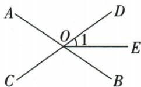
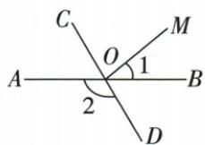

## 讲解

### 是什么

两条直线相交，一个角的两边与另一角的两边分别互为反向射线，这两个角叫对顶角。它们同顶点、不共享边，位置上在交点的对面。对顶角一定相等；同顶点的等角却未必对顶，因为相等只描述度数，不保证两组反向边。

### 怎么来的

两条相交线形成四角，选一共同邻角α。对顶的β、γ都与α邻补，因此β+α=180°、γ+α=180°。两式同减α，得到β=γ；这就是对顶角相等的依据。它不依赖量角器，不需两线垂直，也不需任何平行。原70°题用AOC的两条反向边构成DOB，把已知度数换到有平分线的那一侧。原120°题把AOD换到BOC，再扣内部角，都是先核边再等量代换。

### 什么时候能用

适用于同一交点处由同两条直线构成的两个角。不同交点的“对面角”不能叫对顶角。三条直线共点时仍须挑出构成这对角的两条直线，不能把跨越三条线的两小扇区自动匹配。若两条线只是射线图而没有反向延伸或共线说明，先确认反向关系再用。

## 例题

### 垂直与对顶角求32度逐项解释

> 来源ID Q17-06；第17章相交线与平行线；201-250/full.md 第250–269行。原答案与解析定位：201-250/full.md 第232–246行。

例（2024 北京）如图，直线 AB 和 CD 相交于点 O, OE ⊥ OC. 若 $\angle AOC = 58^{\circ}$ ，则 $\angle EOB$ 的大小为 \_\_\_\_

A. $29^{\circ}$

B. $32^{\circ}$

C. $45^{\circ}$

D. $58^{\circ}$

**原资料答案与解析：**

例 解析 $\because OE \perp OC,$

$$
\therefore \angle E O D = 9 0 ^ {\circ},
$$

$$
\because \angle B O D = \angle A O C = 5 8 ^ {\circ},
$$

$$
\therefore \angle E O B = 9 0 ^ {\circ} - 5 8 ^ {\circ} = 3 2 ^ {\circ}.
$$

答案B

**展开解析（依据原详解补足理由与步骤）：**

CD是一条直线，OC与OD反向；OE⊥OC使OE也⊥OD，∠EOD=90°。AB与CD相交，∠BOD和∠AOC对顶，故BOD=58°。OB在EOD内部，EOB=90°−58°=32°。A29°是把58°减半，题无平分线条件；B32°正确；C45°把直角平分，但题未说OB平分EOD；D58°是BOD或AOC，非EOB。选B。先识别目标是哪个直角中的余下部分，再求差。

### 三线共点逐项检查反向边与公共边

> 来源ID Q17-09；第17章相交线与平行线；201-250/full.md 第381–398行。原答案与解析定位：201-250/full.md 第400–408行。

例1 如图, 直线 a、b、c 交于点 O, 下列判断正确的是 ( )

A. $\angle 1$ 与 $\angle 2$ 是对顶角 B. $\angle 1$ 与 $\angle 3$ 是邻补角 C. $\angle 4$ 的对顶角是 $\angle 1$ D. $\angle 2$ 的邻补角是 $\angle 4$

**原资料答案与解析：**

解析 $\angle1$ 与 $\angle2$ 的两边共涉及三条直线, 不是对顶角;

∠1与∠3的两边共涉及三条直线,不是邻补角;

∠4与∠1是直线a、b相交得到的,具有公共顶点,∠4的两边是∠1两边的反向延长线,所以∠4的对顶角是∠1;

∠2 与 ∠4 的两边共涉及三条直线, 所以 ∠4 不是 ∠2 的邻补角.

答案 C

**展开解析（依据原详解补足理由与步骤）：**

A：角1与角2有共同边附近的位置，但两边不分别反向，且涉及三条线，非对顶。B：角1与角3没有组成邻补角所需的公共边和反向另两边，错。C：角4由OA的反向边及OB组成，角1的两边与角4两边分别反向，确为AB两线形成的对顶角，正确。D：角2与角4不满足一条公共边、其余两边反向，非邻补。选C。三条线共点不能只按标号“隔一格”认对顶或邻补，必须实际追踪两条边。

### 对顶加内部平分再取邻补角

> 来源ID Q17-11；第17章相交线与平行线；201-250/full.md 第474–488行。原答案与解析定位：201-250/full.md 第490–492行。

例3 如图, 直线 AB, CD 相交于点 O, OE 平分 $\angle DOB$ , 若 $\angle AOC = 70^{\circ}$ , 求 $\angle EOC$ 的度数.

**原资料答案与解析：**

解析 因为 $\angle DOB$ 与 $\angle AOC$ 是对顶角, 所以 $\angle DOB = \angle AOC = 70^{\circ}$ .

又因为 OE 平分 $\angle DOB$ ，所以 $\angle1=\frac{1}{2}\angle DOB=35^{\circ}$ 。所以 $\angle EOC=180^{\circ}-\angle1=145^{\circ}$ 。

**展开解析（依据原详解补足理由与步骤）：**

AB、CD分别成直线，所以DOB与AOC对顶，DOB=70°。OE为DOB内部平分线，DOE=DOB÷2=35°。OD与OC是反向射线，DOE与EOC邻补，故EOC=180°−35°=145°。要减去DOE，不是减去整个DOB；OE是射线，平分线没有把整个直线两侧的角都当成同一内部角。

### 对顶角换位再扣内部40度

> 来源ID Q17-12；第17章相交线与平行线；201-250/full.md 第504–527行。原答案与解析定位：201-250/full.md 第498–500行。

例（2024 山东日照）如图，直线 AB, CD 相交于点 O，若 $\angle1=40^{\circ}$ ， $\angle2=120^{\circ}$ ，则 $\angle COM$ 的度数为（）

A. ${70}^{ \circ  }$

B. ${80}^{ \circ  }$

C. ${90}^{ \circ  }$

D. ${100}^{ \circ  }$

**原资料答案与解析：**

例 解析 易知 $\angle BOC = \angle 2 = 120^{\circ}$ ，所以 $\angle COM = \angle BOC - \angle 1 = 120^{\circ} - 40^{\circ} = 80^{\circ}$ .

答案 B

**展开解析（依据原详解补足理由与步骤）：**

原角2为AOD，AB与CD相交，所以BOC为其对顶角，BOC=120°。原角1为BOM=40°，OM在BOC内部，所以COM=BOC−BOM=120°−40°=80°。A70°无相应角关系；B80°正确；C90°把OM误当垂线，图中没有垂直条件；D100°没有来自给定两角的正确和差。选B。先通过对顶把120°移到包含目标的BOC，再用原图内部顺序决定减法。

### 未给平行时四条角关系辨析

> 来源ID Q17-15；第17章相交线与平行线；201-250/full.md 第610–615行。原答案与解析定位：201-250/full.md 第617–621行。

例2 如图, 直线 a, b 被直线 c 所截, 下列正确的是 \_\_\_\_.

①∠1=∠2;   
②∠1=∠3;   
③∠2=∠3;   
④ $\angle3+\angle4=180^{\circ}$ .

**原资料答案与解析：**

答案 ①

注意 没有平行线这个前提，同位角相等、内错角相等、同旁内角互补均不一定成立.

**展开解析（依据原详解补足理由与步骤）：**

①角1与角2是在a、c同一交点的对顶角，不需a∥b，恒相等，正确。②1与3是a、b被c截的同位角，没有平行已知，不保证相等。③2与3是同一三线系统的内错角，也无平行前提。④3与4是同旁内角，仍需a∥b才保证和180°。故只①。不能用图示两条线近似平行作为已知。②③④若额外给满足关系，可分别用于反过来判定平行；本题并未给。

## 易错

原三线题A角1、2涉及三条线，不满足两边分别反向；只有C角4与1正确。原32°题58°等的是BOD，而目标EOB还需从直角扣除，直接答58°漏掉目标转换。
