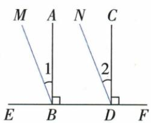
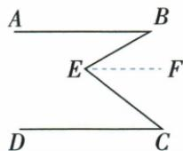
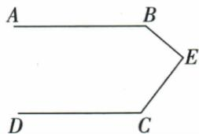
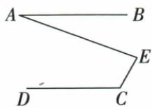
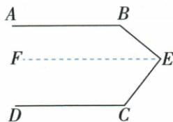
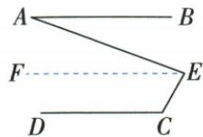

## 讲解

### 是什么

同一平面内，若两条不同直线都平行于同一条直线，则它们互相平行。若两条不同直线都垂直于同一条直线，则它们也互相平行。两个结论前提不同，不能把“都与某线有关系”作为笼统理由。

### 怎么来的

传递性由唯一性解释：设a∥c、b∥c，若不同a、b相交于P，P不在c上，则过P有a、b两条不同的c的平行线，与过线外点唯一性矛盾。因此它们不相交，故平行。共同垂线则把共线方向的对应角都写为90°，同位角相等，所以两被截线平行。原AB、CD共同垂直EF题的ABE、CDE都是90°；原折线题辅助EF∥AB、原AB∥CD，由传递性得到EF∥CD，才可沿CE换角。

### 什么时候能用

要求同一平面以及要比较的线不同。若a与b实际是同一条线，只能说重合，不能在“不同平行线”意义下写结论。共同垂直结论必须确实垂直同一条线；分别垂直两条不相关线，不保证两线平行。应用传递性时先把原线和辅助线写成两条真实平行已知，不能把待证关系当其中一条。

## 例题

### 共同垂线与等余角建立两组平行

> 来源ID Q17-16；第17章相交线与平行线；201-250/full.md 第663–665行。原答案与解析定位：201-250/full.md 第667–682行。

例1 如图, $AB \perp EF$ 于 $B, CD \perp EF$ 于 $D, \angle 1 = \angle 2$ .

(1)请说明 $AB \parallel CD$ 的理由。(2)试问 BM 与 DN 是否平行？为什么？

**原资料答案与解析：**

解析（1）因为 $AB \perp EF, CD \perp EF$ ，所以 $AB \parallel CD$ （同一平面内，垂直于同一条直线的两条直线平行）.

(2) $BM \parallel DN$ . 理由: 因为 $AB \perp EF, CD \perp EF$ , 所以 $\angle ABE = \angle CDE = 90^\circ$ .

又因为 $\angle 1 = \angle 2$ ，所以 $\angle ABE - \angle 1 = \angle CDE - \angle 2$ （等式的性质），即 $\angle MBE = \angle NDE$ 所以 $BM / / DN$ （同位角相等，两直线平行）.

**展开解析（依据原详解补足理由与步骤）：**

（1）EF为共同截线，AB⊥EF、CD⊥EF给ABE=CDE=90°，它们是同位角，故AB∥CD。这也说明共同垂线结论的来源，限定同一平面。（2）原图BM在ABE内部、DN在CDE内部。用角的和差：MBE=ABE−1=90°−1；NDE=CDE−2=90°−2。已知1=2，二者同余得MBE=NDE。EF截BM与DN，这是一对同位角，故BM∥DN。第一问的AB∥CD不能直接代替第二问的BM∥DN，必须使用额外等角条件。

### 折线拐点平行辅助线按区域分别求角

> 来源ID Q17-19；第17章相交线与平行线；201-250/full.md 第749–781行。原答案与解析定位：201-250/full.md 第783–819行。

例4 如图1, 直线 $AB \parallel CD$ , E 是 AB 与 CD 之间的一点, 连接 BE, CE, 可得 $\angle B + \angle C = \angle BEC$ .

证明过程: 过点 E 作 $EF \parallel AB, \because AB \parallel DC, EF \parallel AB, \therefore EF \parallel DC \therefore \angle C = \angle CEF.$

$$
\because E F \parallel A B, \therefore \angle B = \angle B E F \therefore \angle B + \angle C = \angle B E F + \angle C E F = \angle B E C.
$$

(1) 如果点 E 运动到图 2 所示的位置, 其他条件不变, $\angle B, \angle C, \angle BEC$ 又有什么关系? 并证明你的结论.

(2) 如图 3, $AB \parallel DC$ , $\angle C = 120^{\circ}$ , $\angle AEC = 80^{\circ}$ , 则 $\angle A =$ \_\_\_\_ $^{\circ}$ .

  
图 1

图 2

  
图 3

**原资料答案与解析：**

解析（1） $\angle B + \angle C + \angle BEC = 360^{\circ}.$

证明:如图1,过点E作 $EF\parallel AB,\because AB\parallel DC,EF\parallel AB,$

∴ $EF \parallel DC$ (平行于同一条直线的两直线平行), ∴ $\angle C + \angle CEF = 180^{\circ}$ ,

$$
\because A B \parallel E F, \therefore \angle B + \angle B E F = 1 8 0 ^ {\circ}, \therefore \angle B + \angle C + \angle B E C = 3 6 0 ^ {\circ}.
$$

(2)如图2,过点E作EF//AB,∵AB//DC,EF//AB,

∴ $EF \parallel DC$ (平行于同一条直线的两直线平行), ∴ $\angle C + \angle CEF = 180^{\circ}$ ,

$$
\because A B \parallel E F, \therefore \angle A = \angle A E F, \because \angle C = 1 2 0 ^ {\circ}, \therefore \angle C E F = 1 8 0 ^ {\circ} - 1 2 0 ^ {\circ} = 6 0 ^ {\circ},
$$

又∵ $\angle AEC=80^{\circ},\therefore \angle AEF=80^{\circ}-60^{\circ}=20^{\circ},\therefore \angle A=\angle AEF=20^{\circ}$ . 故答案为 20.

图1

  
图 2

**展开解析（依据原详解补足理由与步骤）：**

原基础图E在两平行线之间：过E向右作EF∥AB，由AB∥CD和传递性得EF∥CD。BE作截线，B=BEF；CE作截线，C=CEF。EF位于BEC内部，所以B+C=BEF+CEF=BEC。

（1）原图2的拐点E移到右侧，过E向左作EF∥AB。此时B与BEF是同旁内角，和180°；C与CEF也是同旁内角，和180°。且EF仍在BEC内部，故把两式相加：

$$\angle B+\angle C+\angle BEF+\angle CEF=360^\circ\Rightarrow\angle B+\angle C+\angle BEC=360^\circ.$$

（2）原图3过E向左作EF∥AB∥DC。C+CEF=180°，C=120°，故CEF=60°。EF在AEC内部，AEF=AEC−CEF=80°−60°=20°；AE作截线使A=AEF（内错角），所以A=20°。辅助射线方向与拐点位置决定用相等、补角或整体差，基础图的B+C=BEC不能无条件搬到图2。

## 易错

原共同垂线题第一问AB∥CD不意味着BM∥DN，第二问仍需1=2转成同位角相等。原折线图2需要重新检查补角关系，传递性只确定线的关系，不替你确定角的内外位置。
