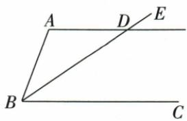

## 讲解

### 是什么

两被截线已经平行，被同一第三条直线所截，则同位角相等、内错角相等、同旁内角互补。方向是由线到角。平行已知可以来自题干，也可由前一步证明，但必须具体写出哪两条线平行和本步截线是谁。

### 怎么来的

同位角性质可借判据与唯一性说明：在第二交点作一条与截线形成对应等角的候选线，由同位相等判据知候选线与第一被截线平行；第二原被截线也过同一点且与第一线平行，唯一性使两线重合，故原同位角相等。再把一角换成对顶角得内错相等；把内错的一角换成邻补角，得到同旁内角和180°。推导依次依靠同位判据、平行唯一、对顶相等、邻补和180°，没有用待证性质去证明自身。原资料性质2提取残缺，实际分段PDF第8页明确∠2=∠3，已据原页恢复。

### 什么时候能用

原题只给“两直线被第三线截”时不能用这些数量关系，平行条件不可省。平行线与多条截线组成多套角关系，需要在每一步重新确定截线；不能把不同截线上的角强凑相等。图中直线交点次序改变后，按实际位置重识同位内错和同旁，不能靠编号永久匹配。

## 例题

### 未给平行时四条角关系辨析

> 来源ID Q17-15；第17章相交线与平行线；201-250/full.md 第610–615行。原答案与解析定位：201-250/full.md 第617–621行。

例2 如图, 直线 a, b 被直线 c 所截, 下列正确的是 \_\_\_\_.

①∠1=∠2;   
②∠1=∠3;   
③∠2=∠3;   
④ $\angle3+\angle4=180^{\circ}$ .

**原资料答案与解析：**

答案 ①

注意 没有平行线这个前提，同位角相等、内错角相等、同旁内角互补均不一定成立.

**展开解析（依据原详解补足理由与步骤）：**

①角1与角2是在a、c同一交点的对顶角，不需a∥b，恒相等，正确。②1与3是a、b被c截的同位角，没有平行已知，不保证相等。③2与3是同一三线系统的内错角，也无平行前提。④3与4是同旁内角，仍需a∥b才保证和180°。故只①。不能用图示两条线近似平行作为已知。②③④若额外给满足关系，可分别用于反过来判定平行；本题并未给。

### 平行同旁补角与平分线求35度

> 来源ID Q17-17；第17章相交线与平行线；201-250/full.md 第688–688行。原答案与解析定位：201-250/full.md 第690–706行。

例2 如图所示,已知 $AD \parallel BC$ , BE 平分 $\angle ABC$ , $\angle A = 110^{\circ}$ . 求 $\angle ADB$ 的度数.

**原资料答案与解析：**

解析 $\because AD \parallel BC, \therefore \angle A + \angle ABC = 180^{\circ}, \angle ADB = \angle CBD,$

又∵ $\angle A=110^{\circ},\therefore \angle ABC=180^{\circ}-110^{\circ}=70^{\circ},$

∵ BE 平分 $\angle ABC, \therefore \angle CBD = \frac{1}{2} \angle ABC = \frac{1}{2} \times 70^{\circ} = 35^{\circ}, \therefore \angle ADB = 35^{\circ}.$

**展开解析（依据原详解补足理由与步骤）：**

AD∥BC，AB为截线，A与ABC同旁内角，所以ABC=180°−110°=70°。原图B、D、E在同一射线上，BE平分ABC，故CBD=70°÷2=35°。再用BD作截线，ADB与DBC为内错角，AD∥BC给ADB=DBC=35°。两次用平行线性质截线不同，先由AB求整个角，再由BD把半角移到目标。没有平分线便不能除2。

### 由角到线再由线到角证明AD垂直BC

> 来源ID Q17-18；第17章相交线与平行线；201-250/full.md 第712–712行。原答案与解析定位：201-250/full.md 第714–743行。

例3 如图,已知 $EF \perp BC, \angle1 = \angle C, \angle2 + \angle3 = 180^{\circ}$ . 求证: $\angle ADC = 90^{\circ}$ .

**原资料答案与解析：**

证明 $\because \angle 1 = \angle C, \therefore GD \parallel AC$ (同位角相等,两直线平行),

∴ $\angle2=\angle DAC$ (两直线平行, 内错角相等),

又∵ $\angle2+\angle3=180^{\circ},\therefore\angle DAC+\angle3=180^{\circ}$ （等量代换），

∴ $AD \parallel EF$ (同旁内角互补,两直线平行),

∴ $\angle ADC = \angle EFC$ (两直线平行, 同位角相等),

$$
\because E F \perp B C, \therefore \angle E F C = 9 0 ^ {\circ}, \therefore \angle A D C = 9 0 ^ {\circ}.
$$

**展开解析（依据原详解补足理由与步骤）：**

①BC截GD、AC，原1为BDG，C为BCA，是同位角。1=C给GD∥AC。

②AD截GD、AC，原2为GDA，与DAC内错，故2=DAC。

③已知2+3=180°，把2替换为DAC；原3为AEF，E在AC上，AC截AD、EF，DAC与AEF同旁内角互补，故AD∥EF。

④BC截AD、EF，ADC与EFC同位，故ADC=EFC。EF⊥BC给EFC=90°，最终ADC=90°。每一步写清依据和本步的线组；不能第一步就把目标AD∥EF当已知，也不能把两组平行混在同一理由中。

### 先由130度判平行再由另一截线求105度

> 来源ID Q17-20；第17章相交线与平行线；201-250/full.md 第825–844行。原答案与解析定位：201-250/full.md 第848–850行。

例（2024 内蒙古呼和浩特）如图，直线 $l_{1}$ 和 $l_{2}$ 被直线 $l_{3}$ 和 $l_{4}$ 所截， $\angle1=\angle2=130^{\circ},\angle3=75^{\circ}$ ，则 $\angle4$ 的度数为（）

A. $75^{\circ}$

B. $105^{\circ}$

C. $115^{\circ}$

D. $130^{\circ}$

**原资料答案与解析：**

例 解析 $\because \angle 1 = \angle 2 = 130^{\circ}$ $\therefore l_{1} / / l_{2},\therefore$ 易得 $\angle 3 + \angle 4 = 180^{\circ}$ $\therefore \angle 4 = 180^{\circ} - 75^{\circ} = 105^{\circ}.$

答案 B

**展开解析（依据原详解补足理由与步骤）：**

l₃是第一次截线，1与2同位且同为130°，所以l₁∥l₂。再把l₄作为截线，3的对顶角在上交点内侧右方，等于75°；它与4同旁内角，和180°，故4=180°−75°=105°。也可先将3移成下交点的对应角，再取邻补。A75°是把跨交点的3、4直接误当相等；B105°正确；C115°无依据地把130°参与差值，不能沿不同截线混算；D130°来自l₃形成的角，不是l₄上的目标。选B。第一次等角是判据，第二次已知平行才允许用性质。

## 易错

原四句辨析只有同一交点的对顶角1=2不需平行，其他三句都欠前提；原110°题分两次换截线，并在两次之间使用平分线求半角，不能从110°一步跳到35°不解释来源。
