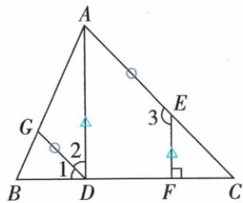
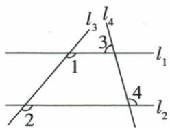

## 讲解

### 判据

给定角关系、目标角或垂直，且图中可能产生多组平行，沿“角→线→角→线→目标”建立链。

### 流程

1.列已知角关系并找首个合法三线系统，以判定建立第一组平行。2.在第一组中换截线，用性质生成目标所需中间等角。3.等量代换把原另一已知角关系改写成第二组判定条件。4.判第二组平行，再用性质移到已有直角。5.每行写角名、线对、截线、判定或性质，避免相同标号跨系统混用。6.选择题逐项区分中间角与目标，不把第一次给的130°移到第二截线。

## 例题

### 由角到线再由线到角证明AD垂直BC

> 来源ID Q17-18；第17章相交线与平行线；201-250/full.md 第712–712行。原答案与解析定位：201-250/full.md 第714–743行。

例3 如图,已知 $EF \perp BC, \angle1 = \angle C, \angle2 + \angle3 = 180^{\circ}$ . 求证: $\angle ADC = 90^{\circ}$ .

**原资料答案与解析：**

证明 $\because \angle 1 = \angle C, \therefore GD \parallel AC$ (同位角相等,两直线平行),

∴ $\angle2=\angle DAC$ (两直线平行, 内错角相等),

又∵ $\angle2+\angle3=180^{\circ},\therefore\angle DAC+\angle3=180^{\circ}$ （等量代换），

∴ $AD \parallel EF$ (同旁内角互补,两直线平行),

∴ $\angle ADC = \angle EFC$ (两直线平行, 同位角相等),

$$
\because E F \perp B C, \therefore \angle E F C = 9 0 ^ {\circ}, \therefore \angle A D C = 9 0 ^ {\circ}.
$$

**展开解析（依据原详解补足理由与步骤）：**

①BC截GD、AC，原1为BDG，C为BCA，是同位角。1=C给GD∥AC。

②AD截GD、AC，原2为GDA，与DAC内错，故2=DAC。

③已知2+3=180°，把2替换为DAC；原3为AEF，E在AC上，AC截AD、EF，DAC与AEF同旁内角互补，故AD∥EF。

④BC截AD、EF，ADC与EFC同位，故ADC=EFC。EF⊥BC给EFC=90°，最终ADC=90°。每一步写清依据和本步的线组；不能第一步就把目标AD∥EF当已知，也不能把两组平行混在同一理由中。

### 先由130度判平行再由另一截线求105度

> 来源ID Q17-20；第17章相交线与平行线；201-250/full.md 第825–844行。原答案与解析定位：201-250/full.md 第848–850行。

例（2024 内蒙古呼和浩特）如图，直线 $l_{1}$ 和 $l_{2}$ 被直线 $l_{3}$ 和 $l_{4}$ 所截， $\angle1=\angle2=130^{\circ},\angle3=75^{\circ}$ ，则 $\angle4$ 的度数为（）

A. $75^{\circ}$

B. $105^{\circ}$

C. $115^{\circ}$

D. $130^{\circ}$

**原资料答案与解析：**

例 解析 $\because \angle 1 = \angle 2 = 130^{\circ}$ $\therefore l_{1} / / l_{2},\therefore$ 易得 $\angle 3 + \angle 4 = 180^{\circ}$ $\therefore \angle 4 = 180^{\circ} - 75^{\circ} = 105^{\circ}.$

答案 B

**展开解析（依据原详解补足理由与步骤）：**

l₃是第一次截线，1与2同位且同为130°，所以l₁∥l₂。再把l₄作为截线，3的对顶角在上交点内侧右方，等于75°；它与4同旁内角，和180°，故4=180°−75°=105°。也可先将3移成下交点的对应角，再取邻补。A75°是把跨交点的3、4直接误当相等；B105°正确；C115°无依据地把130°参与差值，不能沿不同截线混算；D130°来自l₃形成的角，不是l₄上的目标。选B。第一次等角是判据，第二次已知平行才允许用性质。

## 易错

原AD垂直题必须先GD∥AC，再AD∥EF，最后ADC=EFC90°；原130°题先l₁∥l₂再用l₄补角105°。
