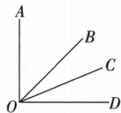

## 讲解

### 判据

看到垂直、倍数或平分线同时出现，先寻找被完整划分的90°角，不把未知的小角直接当直角的一半。

### 流程

1.把垂直翻译为具体90°整体角，标明两边。2.按图中的射线顺序写内部各部分相加；设有倍数的最小部分为x，把相应其他部分表达成倍数。3.解整角方程，每步同加减或除非零数交代依据。4.再把平分线作用的另一个整体角表达成两倍半角，最后用目标的真实内部和差求值。5.用原直角及比例同时回代，而非只验一个数值。

## 例题

### 直角内部比例与平分线求角

> 来源ID Q17-01；第17章相交线与平行线；201-250/full.md 第118–118行。原答案与解析定位：201-250/full.md 第120–126行。

例1 如图, $OA \perp OD$ , $\angle AOC = 3\angle COD$ , $OC$ 平分 $\angle BOD$ , 求 $\angle AOB$ 的度数.

**原资料答案与解析：**

解析 因为 $OA \perp OD$ ，所以 $\angle AOD = 90^{\circ}$ ，所以 $\angle AOC + \angle COD = 90^{\circ}$ .

因为 $\angle AOC = 3 \angle COD$ ，所以 $\angle COD = 22.5^{\circ}$ ，

因为 OC 平分 $\angle BOD$ ，所以 $\angle BOD = 2\angle COD = 45^{\circ}$ ，所以 $\angle AOB = \angle AOD - \angle BOD = 45^{\circ}$ .

**展开解析（依据原详解补足理由与步骤）：**

先由垂直得到直角，再按原图确认OC、OB均在直角内部。设∠COD=x，则∠AOC=3x，二者拼成∠AOD。

$$3x+x=90^\circ\Rightarrow4x=90^\circ\Rightarrow x=22.5^\circ.$$

OC是∠BOD的内部平分线，故∠BOD=2x=45°。OB在∠AOD内部，目标∠AOB是直角扣除∠BOD，故90°−45°=45°。比例条件和半角条件作用于不同的整体角，不能把∠AOB直接当成x。

## 易错

倍数条件与平分线常对应不同整体；原22.5°是COD，BOD45°，AOB才45°，不能中途停在第一未知。
