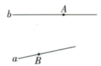
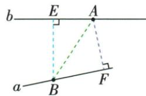

## 讲解

### 判据

问最近且有车站、码头、河流或铁路，先把允许终点写成一个固定点或一整条直线。

### 流程

1.固定两端时连接两点，选线段最短。2.一点固定另一端在直线上自由选时，过固定点向该直线作垂线，选垂线段最短。3.画出垂足并标其属于哪条目标线，先核目标不是图中的另一条线。4.分别给每条路线的起点、终点、依据，若原题无数字只给对象，不补编距离。5.检查现实词语是否只是直线模型；原资料未给障碍，不增设弯路情境。

## 例题

### 车站码头铁路河流分别选择两种最短

> 来源ID Q17-03；第17章相交线与平行线；201-250/full.md 第157–161行。原答案与解析定位：201-250/full.md 第163–184行。

例3 如图所示,火车站、码头分别位于 A、B 两点,直线 a 和 b 分别表示河流与铁路.

(1)从火车站到码头怎样走最近？画图并说明理由.   
(2)从码头到铁路怎样走最近？画图并说明理由.   
(3)从火车站到河流怎样走最近？画图并说明理由.

**原资料答案与解析：**

解析（1）连接AB，沿线段AB走.理由：两点之间，线段最短.

(2) 过点 B 作 b 的垂线 BE, 垂足为 E, 沿线段 BE 走.

理由: 垂线段最短.

(3) 过点 A 作 a 的垂线 AF, 垂足为 F, 沿线段 AF 走. 理由: 垂线段最短.

**展开解析（依据原详解补足理由与步骤）：**

（1）A与B都是固定地点，两端都固定，直接连接AB，线段AB最短，依据两点之间线段最短。（2）B固定，到铁路b的落点可以选择；过B作BE⊥b，E在b上，沿BE走。（3）A固定，到河流a的落点可以选择；过A作AF⊥a，F在a上，沿AF走。后两问依据点到直线的垂线段最短。必须先区分终点是已给点还是直线上的任意点，不能三问统一作垂线，也不能把任意斜线叫距离。原题按直线模型讨论距离，不另加实际道路、河岸通行条件。

## 易错

原三问第一问AB两固定点，后两问BE、AF终点可变；三问都用“垂线最短”会把两点问题解释错。
