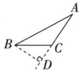
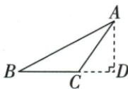
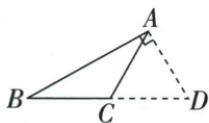
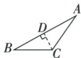

## 讲解

### 判据

图上有多个直角与延长线，选某点到某直线的距离时，逐项核三个对象。

### 流程

1.确定指定点，候选垂线段必须从它出发。2.确定指定整条直线，可延长其示意，候选另一端必须在这条线上。3.看直角记号实际夹在哪两条线之间，要求候选段所在直线垂直目标线。4.三项全合格才读候选长度为距离；垂足在线段外不使它到整直线的距离失效。5.逐项指出错误是起点、所属线还是垂直对象错，不能只答“不是垂线”。

## 例题

### 点到BC所在直线距离逐图辨认

> 来源ID Q17-04；第17章相交线与平行线；201-250/full.md 第190–202行。原答案与解析定位：201-250/full.md 第204–206行。

例4 下列作图能表示点 A 到 BC 的距离的是 ( )

  
A

  
B

  
C

  
D

**原资料答案与解析：**

解析 由题意知垂足在直线 BC 上, 观察可知只有 B 选项符合题意.

答案 B

**展开解析（依据原详解补足理由与步骤）：**

选B。A图垂足D在AC的延长线上，BD代表B到直线AC的距离，不是A到BC；B图AD从A出发且AD⊥BC所在直线，D在BC延长线上仍合法；C图直角在A，表示AD⊥AB，AD终点D虽在BC延长线上，但不垂直BC，错；D图CD⊥AB，表示C到AB的距离，起点也不是A。距离是AD的长度，AD是垂线段，AD所在直线是垂线，三者对象不同。垂足不要求落在线段BC内部。

## 易错

原C有90°却垂直AB，原D起点C；原B垂足在BC延长线上，仍是唯一正确。
