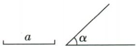
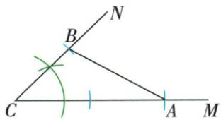

## 讲解

### 是什么

尺规作图使用无刻度直尺作直线方向、圆规复制给定长度，不用刻度读数直接计算后量出。作a+b沿同一射线首尾顺接两段；作a−b先截a，再从其远端向内部截b，剩余为差，非退化差要求a>b>0。

### 怎么来的

圆规开口取给定线段长，移动圆规不改开口，等于将该长度搬到新起点。原和作图先射线AF，截AB=a，再在AB延长方向截BC=b，A、B、C顺序给AC=AB+BC=a+b。原差先AB=a，以B为圆心、开口b在BA方向与AB相交为D，A、D、B顺序给AB=AD+DB、AD=a−b。证明作图正确的核心是等长来自同开口，和差来自位置；画得像长度相加不足以替代证明。直尺只固定共线方向，圆规弧与射线的交点固定端点，辅助痕迹可保留供核作图过程。

### 什么时候能用

原资料差文未显写a>b，但“D在AB内部、AD为正线段”要求它。a=b退为零、D=A；a<b不能在AB内部完成这一步，若只求绝对差需改用较长段为先，不能仍写原a−b正。画射线或足够长直线须给明确截取方向，和作到正向、差作回向；给定长度和角的复制也要按工具许可，不能借量角器替代尺规。

无刻度直尺只画连接线，给a作2a必须圆规保持同开口在同一射线上连续截两次。原边a、2a夹角α的三角形，以复制角及对应射线截距保证两边，不用刻度读数。复制全等三角形SSS两弧半径分别是原另外两边，SAS和ASA也用圆规复制真实尺寸，不按纸面缩放。

## 例题

### 原作图过程用圆规顺次截取两线段之和

> 来源ID Q16-14；第16章图形的初步认识；151-200/full.md 第3283–3296行。原答案与解析定位：151-200/full.md 第3283–3283行。

用直尺画直线 $AF$ ，在直线 $AF$ 上用圆规截取线段 $AB = a$ ，再在 $AB$ 的延长线上用圆规截取线段 $BC = b$ ，线段 $AC$ 就是 $a$ 与 $b$ 的和，记作 $AC = a + b$ 如图1.

图1

**原资料答案与解析：**

用直尺画直线 $AF$ ，在直线 $AF$ 上用圆规截取线段 $AB = a$ ，再在 $AB$ 的延长线上用圆规截取线段 $BC = b$ ，线段 $AC$ 就是 $a$ 与 $b$ 的和，记作 $AC = a + b$ 如图1.

**展开解析（依据原详解补足理由与步骤）：**

这是原资料给定线段a、b的作图过程，没有新增数值题。先用无刻度直尺作射线AF，以圆规取开口a从A截到B；再保持射线正向，从B取开口b截到C。A、B、C按序共线，AB=a、BC=b，所以AC=AB+BC=a+b。每次截取依据是圆规保持给定长度，不读直尺刻度。两段都是正长度，C在B的前进方向而非反向，才能作和。

### 原作图过程向已作长段内部截取差

> 来源ID Q16-15；第16章图形的初步认识；151-200/full.md 第3303–3303行。原答案与解析定位：151-200/full.md 第3303–3303行。

用直尺画直线 $AF$ ，在直线 $AF$ 上用圆规截取线段 $AB = a$ ，再在 $AB$ 上用圆规截取线段 $BD = b$ ，那么线段 $AD$ 就是 $a$ 与 $b$ 的差，记作 $AD = a - b.$ 如图2.

**原资料答案与解析：**

用直尺画直线 $AF$ ，在直线 $AF$ 上用圆规截取线段 $AB = a$ ，再在 $AB$ 上用圆规截取线段 $BD = b$ ，那么线段 $AD$ 就是 $a$ 与 $b$ 的差，记作 $AD = a - b.$ 如图2.

**展开解析（依据原详解补足理由与步骤）：**

这是原资料的线段差作图。先作射线AF，从A截AB=a；以B为起点、向A所在一侧，用圆规截BD=b并令D在AB内。因此A、D、B按序，AB=AD+DB，AD=a−b。要得到正线段需a>b；a=b时D=A、差0而退化，a<b无法在AB内部截够b。原文未写a>b，操作“在AB上截取BD=b”隐含b≤a，应将非退化条件明确。不能向B外侧取点，再仍称AD是差。

### 给a二倍a和夹角尺规作三角形

> 来源ID Q20-27；第20章全等三角形；201-250/full.md 第3551–3553行。原答案与解析定位：201-250/full.md 第3555–3566行。

例1 如图所示,已知线段 a 和 $\angle\alpha$ , 求作一个 $\triangle ABC$ , 使 BC=a, AC=2a, $\angle BCA=\angle\alpha$ . (尺规作图,保留作图痕迹)

**原资料答案与解析：**

解析（1）作 $\angle MCN = \angle \alpha$

(2) 在射线 CM 上截取 CA = 2a，在射线 CN 上截取 CB = a.  
(3) 连接 AB, 则 $\triangle ABC$ 即为所求作的三角形, 如图所示.

**展开解析（依据原详解补足理由与步骤）：**

先复制原角α成MCN，0°<α<180°来自原非退化角图。射线CM用圆规连续截取两次a得CA=2a，射线CN截CB=a，再连AB。BC=a、AC=2a、BCA=α分别由截距与复制角保证，两给边及夹角固定形状大小，SAS说明合格结果都全等。2a要连续移同开口而不是用无刻度尺读倍数；若α为0或180只得共线段，不构成原要求三角形。

### 作原全等三角形SAS SSS ASA三法完整核条件

> 来源ID Q20-28；第20章全等三角形；201-250/full.md 第3572–3574行。原答案与解析定位：201-250/full.md 第3576–3619行。

例2 如图,已知 $\triangle ABC$ ,求作 $\triangle A^{\prime}B^{\prime}C^{\prime}$ ,使 $\triangle A^{\prime}B^{\prime}C^{\prime}\cong\triangle ABC$ . (尺规作图,保留作图痕迹)

**原资料答案与解析：**

解析 作法一(应用 SAS):(1)作线段 $A'B' = AB$ ; (2)作 $\angle MA'B' = \angle A$ ; (3)在射线 $A'M$ 上截取 $A'C' = AC$ ; (4)连接 $B'C'$ , 则 $\triangle A'B'C'$ 就是所求作的三角形, 如图 1.

作法二(应用 SSS):(1)作线段 $A^{\prime}B^{\prime}=AB$ ;(2)以点 $A^{\prime}$ 为圆心,AC 的长为半径画弧;(3)以点 $B^{\prime}$ 为圆心,BC 的长为半径画弧,交前弧于点 $C^{\prime}$ ;(4)连接 $A^{\prime}C^{\prime}$ 、 $B^{\prime}C^{\prime}$ ,则 $\triangle A^{\prime}B^{\prime}C^{\prime}$ 就是所求作的三角形,如图 2.

作法三(应用 ASA):(1)作线段 $A^{\prime}B^{\prime}=AB$ ;(2)作 $\angle MA^{\prime}B^{\prime}=\angle A$ ;(3)在 $A^{\prime}B^{\prime}$ 的同侧,作 $\angle NB^{\prime}A^{\prime}=\angle B$ ,射线 $A^{\prime}M,B^{\prime}N$ 相交于点 $C^{\prime}$ ,则 $\triangle A^{\prime}B^{\prime}C^{\prime}$ 即为所求作的三角形,如图 3.

图 1

图 2

图 3

**展开解析（依据原详解补足理由与步骤）：**

原法一：截A′B′=AB，复制A角到A′，同侧射线取A′C′=AC，再连B′C′，两边夹角对应相等，SAS。原法二：以已作A′、B′为圆心分别取AC、BC半径，两弧交C′，三边对应相等，SSS；第三点在基边上、下两侧得到镜像，也仍全等。原法三：已作A′B′=AB，在其同侧复制A、B两端角，两射线交C′，夹边与两角对应，ASA；选同侧确保射线相遇形成原非退化三角形，不是一条延长线的错误交点。三法均需保圆规等距或复制角痕迹，不凭相似外观缩放。

## 易错

从B向外取D会得到a+b不是差；把数值求出来再刻度尺量不满足严格尺规的作法。本文只采用原a、b两作图过程，无新增数值练习。
