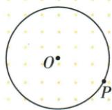
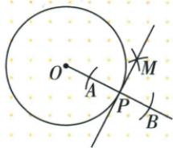
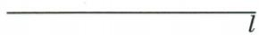
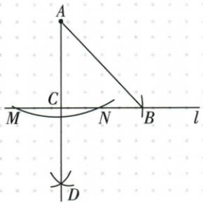

## 讲解

### 是什么

过线上点作垂线，可先在该点两侧截等距点，再作其垂直平分线，相当于平角平分；过线外点作垂线，先以该点圆心取足够大半径弧交直线两点，再对这两点作中垂线，原点也在该中垂线上。直尺不带刻度。

### 怎么来的

线上点C取CD=CE，C为DE中点；DE两端等半径弧交F，CF为DE中垂线，90°给所求。线外点C先取直线另一侧一点K，CK长严格大于C到线的垂距，C圆与线交D/E两点，CD=CE；再D/E同半径弧取线另一侧交点F≠C，CF连接两个等距点，因此是DE中垂线，垂原线。选择F与C不同防止“直线CC”无法确定。原圆上一点切线在半径上取PA=PB，按第一种作垂线；等腰直角三角题先按第二种求垂足。

### 什么时候能用

外点弧半径必须大于到线距离才有两个交点，原取对侧K提供这个保证。两端再作弧同半径>DE/2，并取与原点不同交点。原有限线段若太短可按所求整直线延长；需要高脚落在有限范围的题另核条件。

## 例题

### 圆上一点作半径垂线为切线

> 来源ID Q20-25；第20章全等三角形；201-250/full.md 第3481–3483行。原答案与解析定位：201-250/full.md 第3485–3503行。

例2 如图,已知 $\odot O$ 和 $\odot O$ 上一点P,请过点P作 $\odot O$ 的切线.(尺规作图,保留作图痕迹)

**原资料答案与解析：**

解析（1）作射线 $OP$

(2)以点P为圆心,小于OP的长为半径作弧,交射线OP于A、B两点;

(3) 分别以点 A、B 为圆心, 大于 $\frac{1}{2}AB$ 的长为半径作弧, 两弧交于点 M;

(4) 过点 M、P 作直线 MP, 直线 MP 即为所求, 如图.

**展开解析（依据原详解补足理由与步骤）：**

作射线OP；以P为圆心取小于OP的正半径s，两交点A、B在射线OP上并夹P，PA=PB=s。s<OP保证A仍在射线内、非越过O的负向位置。以A、B圆心同半径>AB/2取交点M，PM垂直平分AB（P已为中点）。AB在OP上，故PM⊥OP。P在原圆，OP为过P半径，由切线判据PM是切线。证明不是仅“看见作弧所以切线”，而是同半径→中垂→垂直半径→圆上切线。

### 线外A作等腰直角三角形原解直角在C

> 来源ID Q20-31；第20章全等三角形；201-250/full.md 第3709–3713行。原答案与解析定位：201-250/full.md 第3690–3701行。

例1（2024陕西）如图，已知直线 $l$ 和 $l$ 外一点 $A$ . 请用尺规作图法，求作一个等腰直角 $\triangle ABC$ ，使得顶点 $B$ 和顶点 $C$ 都在直线 $l$ 上。（作出符合题意的一个等腰直角三角形即可，保留作图痕迹，不写作法）

A

**原资料答案与解析：**

例1 解析 如图, $\triangle ABC$ 即为所求(作法不唯一).

**展开解析（依据原详解补足理由与步骤）：**

原解选直角C在l。过A作l垂线，垂足C；以C圆心CA长半径作弧，交l于B（取一侧即可）。AC⊥CB给C90°，CB=CA由同半径，故ABC等腰直角。原图M、N是作过A垂线的两线交点，C是垂足，D为对侧辅助等距弧交点，不把D也选作三角形顶点。题没有规定直角在A，所以这一构造已满足；若另作A为直角顶点需不同构造，原不要求枚举，本文不补新原题。

## 易错

线上点与外点步骤不一样，不能把外点直接叫两交点的中点。原圆上P首取半径小于OP，是为在射线OP上夹P取到两点，不等同于线外第一弧的“大于垂距”。
