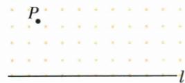
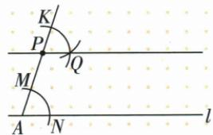

## 讲解

### 判据

过线外点P作平行，选原截线AP复制同位角，选支与射线方向保证本对角是同位。

### 流程

1.l取A，作AP，在A同半径弧取截线点M与l点N。2.P同半径弧取AP过P继续方向K。3.K圆心MN半径交P圆于Q，选原图正确侧。4.列AM=PK、AN=PQ、MN=KQ，SSS得MAN=KPQ。5.二角同位推出l∥PQ，明确另一K或Q支需重新识内外角而非照旧。6.保圆规痕迹，无刻度尺仅画线。

## 例题

### 复制同位角尺规过线外点作平行

> 来源ID Q20-24；第20章全等三角形；201-250/full.md 第3408–3410行。原答案与解析定位：201-250/full.md 第3412–3432行。

例1 如图,已知直线 l 与直线 l 外一点 P,请过点 P 作直线 l 的平行线.(尺规作图,保留作图痕迹)

**原资料答案与解析：**

解析（1）在直线 l 上任取一点 A，
作射线 AP;

(2)以点A为圆心,适当长为半径作弧,分别交射线AP、直线l于点M、N;   
(3)以点P为圆心,AM长为半径作弧,交射线AP于点K;   
(4)以点 K 为圆心, MN 长为半径作弧, 交上一步骤中所作弧于点 Q;  
(5) 过点 P、Q 作直线 PQ，直线 PQ 即为所求，如图.

**展开解析（依据原详解补足理由与步骤）：**

在l取A，以射线AP作截线。原示意选0<AM<AP，让M位于A、P之间，A圆心半径r=AM取l上的N。以P为圆心同r作弧，K选在AP越过P的同向射线上（不是取回A方向的另一交点），使PK=AM=AN。再K圆心用MN长作弧与P圆交Q，选原l同侧对应方向，PQ=AN、KQ=MN，所以△PKQ与△AMN三边对应相等，SSS使KPQ=MAN。这是以AP截l、PQ的一对同位角，相等推出PQ∥l。原仅说交射线AP有交点选择歧义，按实际图K在P外明确取支，不凭目测水平作线。

## 易错

原“交射线AP于K”可能有两点，按原图K在P外；取反向点仍用同位判据会差180方向。
