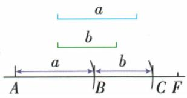
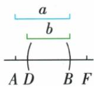

## 讲解

### 判据

原给a、b两线段并要求尺规作和或差，无刻度直尺只作方向、圆规取给定开口搬长度，过程和正确性一起说明。

### 流程

1. 作射线AF，用圆规开口a从A截B，使AB=a。
2. 作和：向原射线正向从B用开口b截C，A、B、C按序，BC=b，AC=a+b。
3. 作差：先核a>b>0，从B向A方向在AB内部截D使BD=b，A、D、B按序，AD=AB−DB=a−b。
4. 说明同开口保证复制等长，直线方向保证共线，点顺序保证和差；不以看图像正确代证明。
5. a=b退化零、a<b无法在内部截原b，原正线段差不成立。若工具被限定，不能计算后用刻度尺读长度替代。

## 例题

### 原作图过程用圆规顺次截取两线段之和

> 来源ID Q16-14；第16章图形的初步认识；151-200/full.md 第3283–3296行。原答案与解析定位：151-200/full.md 第3283–3283行。

用直尺画直线 $AF$ ，在直线 $AF$ 上用圆规截取线段 $AB = a$ ，再在 $AB$ 的延长线上用圆规截取线段 $BC = b$ ，线段 $AC$ 就是 $a$ 与 $b$ 的和，记作 $AC = a + b$ 如图1.

图1

**原资料答案与解析：**

用直尺画直线 $AF$ ，在直线 $AF$ 上用圆规截取线段 $AB = a$ ，再在 $AB$ 的延长线上用圆规截取线段 $BC = b$ ，线段 $AC$ 就是 $a$ 与 $b$ 的和，记作 $AC = a + b$ 如图1.

**展开解析（依据原详解补足理由与步骤）：**

这是原资料给定线段a、b的作图过程，没有新增数值题。先用无刻度直尺作射线AF，以圆规取开口a从A截到B；再保持射线正向，从B取开口b截到C。A、B、C按序共线，AB=a、BC=b，所以AC=AB+BC=a+b。每次截取依据是圆规保持给定长度，不读直尺刻度。两段都是正长度，C在B的前进方向而非反向，才能作和。

### 原作图过程向已作长段内部截取差

> 来源ID Q16-15；第16章图形的初步认识；151-200/full.md 第3303–3303行。原答案与解析定位：151-200/full.md 第3303–3303行。

用直尺画直线 $AF$ ，在直线 $AF$ 上用圆规截取线段 $AB = a$ ，再在 $AB$ 上用圆规截取线段 $BD = b$ ，那么线段 $AD$ 就是 $a$ 与 $b$ 的差，记作 $AD = a - b.$ 如图2.

**原资料答案与解析：**

用直尺画直线 $AF$ ，在直线 $AF$ 上用圆规截取线段 $AB = a$ ，再在 $AB$ 上用圆规截取线段 $BD = b$ ，那么线段 $AD$ 就是 $a$ 与 $b$ 的差，记作 $AD = a - b.$ 如图2.

**展开解析（依据原详解补足理由与步骤）：**

这是原资料的线段差作图。先作射线AF，从A截AB=a；以B为起点、向A所在一侧，用圆规截BD=b并令D在AB内。因此A、D、B按序，AB=AD+DB，AD=a−b。要得到正线段需a>b；a=b时D=A、差0而退化，a<b无法在AB内部截够b。原文未写a>b，操作“在AB上截取BD=b”隐含b≤a，应将非退化条件明确。不能向B外侧取点，再仍称AD是差。

## 易错

差向外截得到和；作图线延伸方向可用射线名称明确，辅助弧与交点保留方便核过程。本文原例是两个已有作图演算，无新增数字题。
