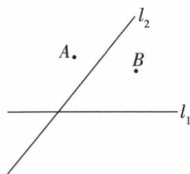
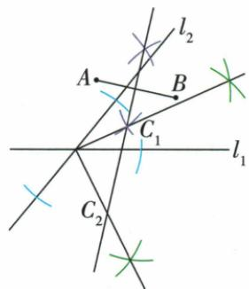

## 讲解

### 判据

要求距两固定点相等且距两相交直线相等，分别作两类轨迹再求交集，注意第二类有两条。

### 流程

1.两城镇AB等距转AB中垂线。2.两完整公路直线等距转两夹角平分所在直线，包括内外两方向。3.按尺规作出，分别与中垂相交，原图得到C₁/C₂。4.每点同时回验两端距离等与两垂距等，不因在其中一轨迹上便满足双条件。5.数目依实际图，原两点都收；特殊平行重合布局另判，不能定恒2。

## 例题

### 两城镇两公路等距交两条角平分轨迹得两点

> 来源ID Q20-29；第20章全等三角形；201-250/full.md 第3625–3636行。原答案与解析定位：201-250/full.md 第3638–3653行。

例3 两个城镇 A, B 与两条公路 $l_{1}$ 、 $l_{2}$ 的位置如图所示, 电信部门需在 C 处修建一座信号发射塔, 要求发射塔到两个城镇 A、B 的距离必须相等, 到两条公路 $l_{1}$ 、 $l_{2}$ 的距离也必须相等, 那么点 C 应选在何处? 请在图中找出所有符合条件的点 C. (尺规作图, 不写作法, 保留作图痕迹)

**原资料答案与解析：**

解析 到城镇 A、B 距离相等的点在线段 AB 的垂直平分线上, 到两条公路距离相等

的点在两条公路夹角的平分线上,分别作出线段AB的垂直平分线与两条公路夹角的平分线,它们的交点即为所求作的点C.如图,符合要求的点C有2个.

**展开解析（依据原详解补足理由与步骤）：**

到城镇A、B等距的点在线段AB中垂线，到两条相交公路所在直线等距的点在其两个夹角平分直线上（包括内外两组，互相垂直）。分别尺规作这条中垂线和两条角平分线，原图中垂线与它们各交C₁、C₂，两点都符合双条件。逐点回验C₁A=C₁B、C₂A=C₂B，且各到l₁、l₂垂距等。不能只取图中锐角内部一支漏第二点。原实际两点由原图一般位置确定；其他布局若轨迹平行、重合或交于同点，数目会变，不推广任何图恒有2。原按整直线距离模型，若限定有限公路段需另判最近点，题未给该限制。

## 易错

只作锐夹角内部一条平分线会漏C₂；点到道路是垂距不是到路交点的距离。
