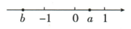

## 讲解

### 判据

含(√A)²时，先查A≥0再还原A；含√(A²)时先还原为|A|，再由题给区间、数轴或其他根式的隐含范围决定去绝对值方向。

### 流程

1. 找指数是在根号外还是根号内，区分先开方后平方与先平方后开方。原六个填空按这一步确定是否需要绝对值。
2. 对√(A²)把A视为完整对象，改成|A|，不是分别对里面各项取绝对值。
3. 查整个A正负。数轴给b<0<a<1，故a−b正、b负、a−1负；另一题√(x−2)存在给x≥2，使x+2正。
4. 按符号代换：A≥0用A，A≤0用−A；负分支的整体加括号，外侧再有减号时继续处理。
5. 题给化简结果时反推符号。|x−2|=2−x=−(x−2)要求x−2≤0，得到x≤2，等号允许。
6. 合并最后的普通代数项，并保留最初有效范围。原2x的结果仍来自x≥2的原表达式。

## 例题

### 六个开方与平方的对象

> 来源ID Q03-02；第3章二次根式；1-50/full.md 第4872–4876行。原答案与解析定位：1-50/full.md 第4878–4878行。

例2 计算： $\sqrt{3^{2}}=$ \_\_\_\_；

$(\sqrt{3})^2 = \underline{\quad};\sqrt{(-3)^2} = \underline{\quad};\sqrt{(a - 3)^2} = \underline{\quad};$

$\left(\sqrt{a-3}\right)^{2}=\underline{\hspace{2cm}};\sqrt{(3-a)^{2}}=$ \_\_\_\_.

**原资料答案与解析：**

答案 3;3;3; $|a-3|$ ;a-3; $|3-a|$

**展开解析（依据原详解补足理由与步骤）：**

依次：√(3²)=|3|=3；(√3)²=3；√((−3)²)=|−3|=3；√((a−3)²)=|a−3|；(√(a−3))²=a−3，但这个原式先要求a≥3；√((3−a)²)=|3−a|。第4、第6项的括号是整个被平方对象，不知道它的符号时停在绝对值。第5项不写绝对值，是因原根式有意义已保证a−3≥0；不能由化简结果看似对所有a都有意义，倒推原式也对所有a都有意义。

### 隐含范围决定绝对值去法

> 来源ID Q03-03；第3章二次根式；1-50/full.md 第4882–4882行。原答案与解析定位：1-50/full.md 第4884–4888行。

例3 化简: $\sqrt{(x+2)^{2}} + (\sqrt{x-2})^{2} =$ \_\_\_\_.

**原资料答案与解析：**

解析 根据被开方数为非负数可得 $x-2 \geqslant 0$ ，所以 $x+2 > 0$ ，

所以原式= $|x+2|+x-2=x+2+x-2=2x.$

答案 $2x$

**展开解析（依据原详解补足理由与步骤）：**

第二项中的√(x−2)先要存在，给出x−2≥0，即x≥2。第一项化为|x+2|；由x≥2得x+2≥4>0，故|x+2|=x+2。第二项按算术平方根定义，(√(x−2))²=x−2。两项相加：x+2+x−2=2x，结果附带原条件x≥2。不能只把第一项的平方开掉而不判断符号。

### 数轴定位后逐项去绝对值

> 来源ID Q03-05；第3章二次根式；51-100/full.md 第24–28行。原答案与解析定位：51-100/full.md 第30–30行。

例2 已知实数 a, b 在数轴上对应的点的位置如图所示, 试化简 $\sqrt{(a-b)^{2}} - \sqrt{b^{2}} + \sqrt{(a-1)^{2}}$ .

**原资料答案与解析：**

解析 原式 $= |a - b| - |b| + |a - 1| = a - b - (-b) - (a - 1) = a - b + b - a + 1 = 1.$

**展开解析（依据原详解补足理由与步骤）：**

原图给b<−1<0<a<1。因此a−b>0，b<0，a−1<0。先把三根式改成绝对值：|a−b|−|b|+|a−1|。逐个按整体符号代换，成为(a−b)−(−b)−(a−1)。去括号得a−b+b−a+1；a与−a、−b与b分别抵消，结果1。最后一项因a−1负，必须取其相反数；图的位置比OCR数组可靠。

### 从开方后的结果反推符号

> 来源ID Q03-06；第3章二次根式；51-100/full.md 第36–36行。原答案与解析定位：51-100/full.md 第38–38行。

例3 已知 $\sqrt{x^{2}-4x+4}=2-x$ ，求 x 的取值范围.

**原资料答案与解析：**

解析 $\because \sqrt{x^2 - 4x + 4} = \sqrt{(x - 2)^2} = |x - 2| = 2 - x, \therefore x - 2 \leqslant 0$ ，解得 $x \leqslant 2$ .

**展开解析（依据原详解补足理由与步骤）：**

x²−4x+4=(x−2)²，因为(x−2)(x−2)=x²−2x−2x+4。根式等于|x−2|，题给结果2−x=−(x−2)，所以|x−2|=−(x−2)。绝对值取整体相反数的条件是x−2≤0，故x≤2。等号也允许：x=2时两边都是0。x>2则右边2−x负，与非负根式不相等。

### 指定区间内化简根式与绝对值

> 来源ID Q03-08；第3章二次根式；51-100/full.md 第61–69行。原答案与解析定位：51-100/full.md 第77–79行。

例2 (2024 四川乐山) 已知 $1 < x < 2$ , 化简 $\sqrt{(x - 1)^2} + |x - 2|$ 的结果为 ( )

A.-1

B.1

C.2x-3

D.3-2x

**原资料答案与解析：**

例2 解析 原式 $= |x - 1| + 2 - x =$ $x - 1 + 2 - x = 1.$

答案 B

**展开解析（依据原详解补足理由与步骤）：**

1<x<2使x−1正、x−2负。√((x−1)²)=|x−1|=x−1，|x−2|=−(x−2)=2−x，两项和1，选B。A的−1不是非负项之和；C的2x−3把第二项负整体直接去括号；D的3−2x把第一项错误取相反数。C、D在端点可能碰巧为1，但本题x严格在1与2之间，不能用端点碰巧相等来支持错误化简。

## 易错

- 不能看见平方和根号就无条件“抵消”。
- a−1整体为负时变成1−a，不是单改a的符号。
- 从根式非负可判断给定结果非负，但仍应核对其他原条件。
