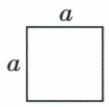
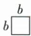
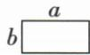
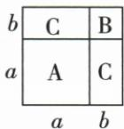

## 讲解

### 是什么

多项式与多项式相乘，用一个多项式的每项分别乘另一个多项式的每项，把所有乘积相加，再合并同类项。含r项与s项时，合并前有r×s个配对乘积；合并后项数可能减少。

### 怎么来的

先将第二个多项式作为整体，对第一个的各项用分配律；每一块再对第二个各项分配。两次分配给(a+b)(m+n)=am+an+bm+bn，不仅有首首、尾尾，交叉配对也不可缺。

原(y+2)(y−4)四个积为y²、−4y、2y、−8，中间两项合−2y，结果y²−2y−8。原(x+2)(x²−2x+4)有2×3=6个配对，x²与x交叉项抵消后仅剩x³+8，说明合并前项数与最终项数不是同一计数。平方只是同一个多项式与自身相乘，交叉项一样存在。

### 什么时候能用

每个项包含它自己的符号，乘积符号先按带符号系数判断。按固定行列顺序覆盖所有配对，既不漏也不重复；最终不能留下可合并的同类项。

特殊二项式可用乘法公式缩短，但公式仍来自这一规则。不能在结构不匹配时硬套平方差或完全平方；遇多项整体先明确哪两块同号、哪两块异号，再选择公式。

## 例题

### 两个二项式相乘的四个配对

> 来源ID Q05-17；第5章整式的乘除与因式分解；51-100/full.md 第1235–1235行。原答案与解析定位：51-100/full.md 第1237–1245行。

例3 计算: $(y+2)(y-4)$ .

**原资料答案与解析：**

解析 $(y + 2)(y - 4)$

$$
= y ^ {2} - 4 y + 2 y - 8
$$

$$
= y ^ {2} - 2 y - 8.
$$

**展开解析（依据原详解补足理由与步骤）：**

(y+2)(y−4)中，每个左项乘每个右项，共四次：y·y=y²，y·(−4)=−4y，2·y=2y，2·(−4)=−8。先相加y²−4y+2y−8，再合y项系数−4+2=−2，得y²−2y−8。漏交叉项就无法得到正确的一次项。

### 多项式乘法三类完整展开

> 来源ID Q05-20；第5章整式的乘除与因式分解；51-100/full.md 第1326–1326行。原答案与解析定位：51-100/full.md 第1328–1331行。

例1 计算：(1) $(3x - 1)(2x + 1)$ . (2) $(x + 2)(x^2 - 2x + 4)$ . (3) $(3m - 2n)^2$ .

**原资料答案与解析：**

解析 (1) $(3x - 1)(2x + 1) = 3x \cdot 2x + 3x \cdot 1 + (-1) \times 2x + (-1) \times 1 = 6x^2 + 3x - 2x - 1 = 6x^2 + x - 1.$

(2) $(x + 2)(x^{2} - 2x + 4) = x\cdot x^{2} + x\cdot (-2x) + x\cdot 4 + 2x^{2} + 2\times (-2x) + 2\times 4 = x^{3} - 2x^{2} + 4x + 2x^{2} - 4x + 8 = x^{3} + 8.$   
(3) $(3m - 2n)^{2} = (3m - 2n)(3m - 2n) = 3m\cdot 3m + 3m\cdot (-2n) + (-2n)\cdot 3m + (-2n)\cdot (-2n) = 9m^{2} - 6mn-$ $6mn + 4n^{2} = 9m^{2} - 12mn + 4n^{2}$

**展开解析（依据原详解补足理由与步骤）：**

（1）3x与2x、1相乘为6x²、3x；−1与2x、1相乘为−2x、−1。合一次项3x−2x=x，得6x²+x−1。

（2）x分别乘x²、−2x、4得到x³、−2x²、4x；2分别乘这三项得到2x²、−4x、8。六项相加后x²与x项分别抵消，余x³+8。

（3）平方表示同一括号乘两次，四个配对为9m²、−6mn、−6mn、4n²；中间两项合成−12mn，结果9m²−12mn+4n²。不能把平方当作每项平方之和。

### 拼图面积各类项对应纸片数量

> 来源ID Q05-23；第5章整式的乘除与因式分解；51-100/full.md 第1383–1401行。原答案与解析定位：51-100/full.md 第1409–1417行。

例1 (2023 湖北随州) 设有边长分别为 $a$ 和 $b (a > b)$ 的 A 类和 B 类正方形纸片、长为 $a$ 宽为 $b$ 的 C 类矩形纸片若干张. 如图所示, 要拼一个边长为 $a + b$ 的正方形, 需要 1 张 A 类纸片、1 张 B 类纸片和 2 张 C 类纸片. 若要拼一个长为 $3a + b$ 、宽为 $2a + 2b$ 的矩形, 则需要 C 类纸片的张数为

( )

  
A

  
B

  
C

  

A.6　B.7　C.8　D.9

**原资料答案与解析：**

例1 解析 $(3a + b)(2a + 2b)$

$$
\begin{array}{l} = 3 a \cdot 2 a + 3 a \cdot 2 b + b \cdot 2 a + b \cdot 2 b \\ = 6 a ^ {2} + 6 a b + 2 a b + 2 b ^ {2} \\ = 6 a ^ {2} + 8 a b + 2 b ^ {2}, \\ \end{array}
$$

∴需要C类纸片的张数为8.

答案 C

**展开解析（依据原详解补足理由与步骤）：**

A、B、C面积分别a²、b²、ab。目标矩形面积(3a+b)(2a+2b)，四个配对为6a²、6ab、2ab、2b²，合为6a²+8ab+2b²。

按原图a、b长度分割的统一拼法：长方向为a、a、a、b，宽方向为a、a、b、b；a×a块6张A，b×b块2张B，两种方向的a×b块共3×2+1×2=8张C。因此选C。A的6漏掉b列与两a行的2张；B的7少1张、D的9多1张，均不对应完整分割的8块ab。这里通过结构分割支持面积整式系数计数，不能只靠某一次a、b的数值面积断言任何拼法都唯一。

## 易错

- 只乘首项和末项会漏交叉项。
- 两个二项式合并前4个配对，不表示结果一定4项。
- 同一个括号平方也有交叉乘积，不能逐项平方。
