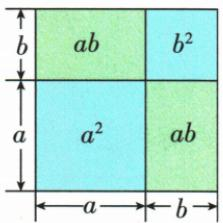
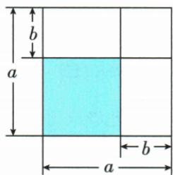

## 讲解

### 是什么

(A+B)²=A²+2AB+B²，(A−B)²=A²−2AB+B²。两个首尾整体分别平方，中间是两者乘积的2倍，和或差决定中项符号；尾平方始终以加法形式出现。A、B可为数或完整多项式。

### 怎么来的

把平方写成同一括号乘两次，和的四个配对为A²、AB、AB、B²，两中项合2AB。差的两交叉积都是−AB，合−2AB，而(−B)(−B)=B²仍正。这是多项式乘法，不能用积的乘方逐项拆掉和。

原(−a−2b)²的两项都负，交叉积2·(−a)(−2b)=4ab，得到a²+4ab+4b²；末项不是负4b²。面积图把边长a+b的正方形拆成a²、两个ab和b²；差的面积图从a²减去两块ab，但交叠的b²被减了两次，需加回一次。

### 什么时候能用

代数公式不限定两整体正，面积解释按正长度与适当大小进行。逆向分解三项式时，除两端是平方外，中项必须恰为两对应整体乘积的正或负2倍。

移项可求A²+B²=(A−B)²+2AB等组合；若得到差平方，只确定差的正负候选，不能无条件选正。原给平方和25、和7得到积12与差±1。原“知二求二”口号须理解为求相应值、平方或候选，不保证带符号量总唯一。

## 例题

### 两个负项平方仍有正交叉项

> 来源ID Q05-27；第5章整式的乘除与因式分解；51-100/full.md 第1469–1469行。原答案与解析定位：51-100/full.md 第1471–1473行。

例3 计算: $(-a-2b)^{2}$ .

**原资料答案与解析：**

解析 原式 $= (-a)^{2} + 2 \cdot (-a) \cdot (-2b) + (-2b)^{2} = a^{2} + 4ab + 4b^{2}$ .

注意 对于完全平方公式 $(a \pm b)^{2} = a^{2} \pm 2ab + b^{2}$ ，首先要注意“2ab”中的因数2，其次要注意“ $b^{2}$ ”前为“+”，与公式左侧“b”前的符号无关。实际上， $(-a - b)^{2} = (a + b)^{2}$ 。

**展开解析（依据原详解补足理由与步骤）：**

(−a−2b)²先看作(−a)+(−2b)的平方。两首尾平方为a²和4b²；中项2·(−a)·(−2b)=+4ab，因为负×负为正。结果a²+4ab+4b²。也可先整体提−1，平方使(−1)²=1，得到(a+2b)²；不能写成a²−4ab−4b²。

### 完全平方乘积二倍与分数平方

> 来源ID Q05-28；第5章整式的乘除与因式分解；51-100/full.md 第1636–1638行。原答案与解析定位：51-100/full.md 第1640–1658行。

例4 计算: $(1)(4-3m)^{2}$ .

(2) $\left(-\frac{1}{3}x-2y\right)^{2}.$

**原资料答案与解析：**

解析 (1) $(4 - 3m)^{2}$

$$
= 4 ^ {2} - 2 \times 4 \times 3 m + (3 m) ^ {2}
$$

$$
= 1 6 - 2 4 m + 9 m ^ {2}.
$$

(2) $\left(-\frac{1}{3} x - 2y\right)^2 = \left(-\frac{1}{3} x\right)^2 + 2 \times$

$$
\left(- \frac {1}{3} x\right) \times (- 2 y) + (- 2 y) ^ {2} = \frac {1}{9} x ^ {2} +
$$

$$
\frac {4}{3} x y + 4 y ^ {2}.
$$

**展开解析（依据原详解补足理由与步骤）：**

（1）4与3m的差平方：4²=16，中项−2·4·3m=−24m，末项(3m)²=9m²，得16−24m+9m²。

（2）把两项看作−x/3与−2y，首平方x²/9，交叉项2·(−x/3)·(−2y)=4xy/3，尾平方4y²，合为x²/9+4xy/3+4y²。中项的2和两个负号都来自公式，不能只给外系数乘2却不平方。

### 由平方和与和求积及差的两种符号

> 来源ID Q05-33；第5章整式的乘除与因式分解；51-100/full.md 第1704–1704行。原答案与解析定位：51-100/full.md 第1706–1710行。

例3 已知实数 $x, y$ 满足 $x^{2} + y^{2} = 25, x + y = 7$ , 求 $xy$ 和 $x - y$ 的值.

**原资料答案与解析：**

解析 $\because x^{2} + y^{2} = (x + y)^{2} - 2xy, \therefore 25 = 7^{2} - 2xy, \therefore xy = 12,$

$$
\therefore (x - y) ^ {2} = x ^ {2} + y ^ {2} - 2 x y = 2 5 - 2 \times 1 2 = 1, \therefore x - y = \pm 1.
$$

**展开解析（依据原详解补足理由与步骤）：**

(x+y)²=x²+y²+2xy，代已知得49=25+2xy，两边减25得2xy=24、xy=12。差平方(x−y)²=x²+y²−2xy=25−24=1。因此x−y=1或−1，两者都应保留，题目没有x≥y或先后大小来筛选。

原x+y=7再配差±1，分别可得(x,y)=(4,3)或(3,4)，两组平方和均25、积均12，说明正负差确实各自可实现。“知两个关系”能求某些平方或候选，不保证另外两个带符号量唯一。

### 相邻整体的平方和由差与积确定

> 来源ID Q05-34；第5章整式的乘除与因式分解；51-100/full.md 第1712–1712行。原答案与解析定位：51-100/full.md 第1714–1718行。

例4 若 a 满足 $(a+2\ 026)(a+2\ 025)=5$ ，求 $(a+2\ 026)^{2}+(a+2\ 025)^{2}$ 的值.

**原资料答案与解析：**

解析（换元法）设 $a + 2026 = m, a + 2025 = n, \therefore mn = 5, m - n = 1$

$$
\therefore (a + 2 0 2 6) ^ {2} + (a + 2 0 2 5) ^ {2} = m ^ {2} + n ^ {2} = (m - n) ^ {2} + 2 m n = 1 + 2 \times 5 = 1 1.
$$

**展开解析（依据原详解补足理由与步骤）：**

把长表达式a+2026记M，a+2025记N，原条件MN=5。两整体相减，a抵消，M−N=1。由差平方(M−N)²=M²+N²−2MN，两边加2MN得到M²+N²=(M−N)²+2MN。代1及5，得1²+2×5=11。不必求a，也不能把M、N分别写成5；条件是乘积5而非每项5。

### 已知差与积求平方和

> 来源ID Q05-41；第5章整式的乘除与因式分解；51-100/full.md 第1790–1790行。原答案与解析定位：51-100/full.md 第1806–1808行。

例3（2024四川乐山）已知 $a - b = 3, ab = 10$ ，则 $a^2 + b^2 =$ \_\_\_\_.

**原资料答案与解析：**

例3 解析 $a^2 + b^2 = (a - b)^2 + 2ab = 3^2 + 2 \times 10 = 29$ .

答案 29

**展开解析（依据原详解补足理由与步骤）：**

差平方(a−b)²=a²+b²−2ab，两边加2ab，得a²+b²=(a−b)²+2ab。代差3及积10，得3²+2×10=9+20=29。要加回乘积两倍，不是只加一次10，也不用分别求a、b。

## 易错

- 中项不能漏，系数2来自两次交叉配对。
- 尾平方符号不随括号中的减号变负。
- 逆向识别须核中项，不只看两个平方端。
