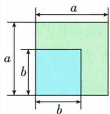
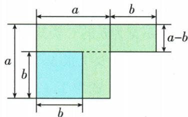

## 讲解

### 是什么

两个整体的和与差相乘，(A+B)(A−B)=A²−B²。A在两括号中完全同号，B一正一负；A、B可为数、单项式或多项式。先根据符号匹配整体，不根据原书写的先后位置。

### 怎么来的

按每项乘每项展开，四个积为A²、−AB、+AB、−B²；中间两项相反而抵消，留下A²−B²。这解释为何只有两项，以及为什么是减去异号整体的平方。

原(3−2a)(−3−2a)重排为(−2a+3)(−2a−3)，A=−2a、B=3，结果4a²−9。若把第一个位置3认成A，会把平方差方向写反。几何上在a>b>0时，边长a的正方形去掉边长b的小正方形，再移动剩余一块，拼成边长a+b与a−b的矩形；面积守恒给同一公式。

### 什么时候能用

代数恒等式对各整体有效取值成立，不需A≥B或A、B均正；面积说明才有正长度及大小条件。逆向可将两个整式平方之差分解为和与差的积。

两括号只有大小相近而没有完全相同的同号、异号整体时，不能套公式。多项整体先添合适括号，异号整体中原有负号也要保留；求和或差时若除以一个已知整体，另外查它是否非零。

## 例题

### 平方差对应同号整体而非位置

> 来源ID Q05-25；第5章整式的乘除与因式分解；51-100/full.md 第1451–1451行。原答案与解析定位：51-100/full.md 第1453–1455行。

例1 计算: $(3-2a)(-3-2a)$ .

**原资料答案与解析：**

解析 原式 $= (-2a + 3)(-2a - 3) =$ $(-2a)^{2} - 3^{2} = 4a^{2} - 9.$

注意 在应用平方差公式 $(a+b)(a-b)=a^{2}-b^{2}$ 时，不能根据先后顺序确定 a、b，要根据它们前面的符号确定，如本题中，“3”虽然在前，但两个括号中的“3”前面的符号一个为正一个为负，则“3”应该对应公式中的“b”.

**展开解析（依据原详解补足理由与步骤）：**

把两括号按同号部分对齐：(−2a+3)(−2a−3)。同号整体为−2a，异号整体为3，对应平方差(−2a)²−3²=4a²−9。3虽在原首位置，却在两括号中一正一负，是被减的平方部分；−2a虽为负，但两括号完全同号。不能按“第一个字”机械认公式位置。

### 分数整体代入平方差

> 来源ID Q05-26；第5章整式的乘除与因式分解；51-100/full.md 第1459–1459行。原答案与解析定位：51-100/full.md 第1461–1465行。

例2 计算： $\left(-\frac{1}{2}x+y\right)\left(-y-\frac{1}{2}x\right)$ .

**原资料答案与解析：**

$$
\begin{array}{l} = \left(- \frac {1}{2} x + y\right) \left(- \frac {1}{2} x - y\right) \\ = \left(- \frac {1}{2} x\right) ^ {2} - y ^ {2} = \frac {1}{4} x ^ {2} - y ^ {2}. \\ \end{array}
$$

解析 $\left(-\frac{1}{2} x + y\right)\left(-y - \frac{1}{2} x\right)$

**展开解析（依据原详解补足理由与步骤）：**

第二括号重排为−x/2−y，两括号共同同号部分−x/2，异号部分y；故积=(−x/2)²−y²=x²/4−y²。平方同时作用于系数−1/2与x，系数平方为1/4。原提取把解析标题放在公式后面，正文按原公式顺序保留并说明，原提取不改。

### 多项整体对应乘法公式

> 来源ID Q05-31；第5章整式的乘除与因式分解；51-100/full.md 第1683–1683行。原答案与解析定位：51-100/full.md 第1685–1687行。

例1 计算: (1) $(a-2b+3c)^{2}$ . (2) $(2a-3b+c)(2a+3b-c)$ . (3) $(x+2)^{2} \cdot (x-2)^{2}$ .

**原资料答案与解析：**

解析 (1) $(a - 2b + 3c)^2 = [(a - 2b) + 3c]^2 = (a - 2b)^2 + 2(a - 2b) \cdot 3c + (3c)^2 = a^2 - 4ab + 4b^2 + 6ac - 12bc + 9c^2.$   
(2) $(2a - 3b + c)(2a + 3b - c) = [2a - (3b - c)]\cdot [2a + (3b - c)] = (2a)^{2} - (3b - c)^{2} = 4a^{2} - (9b^{2} - 6bc + c^{2}) = 4a^{2} - 9b^{2} + 6bc - c^{2}.$   
(3) $(x + 2)^{2} \cdot (x - 2)^{2} = [(x + 2)(x - 2)]^{2} = (x^{2} - 4)^{2} = x^{4} - 8x^{2} + 16.$

**展开解析（依据原详解补足理由与步骤）：**

（1）先把a−2b作为一个整体，与3c应用和的平方：(a−2b)²+6c(a−2b)+9c²。第一个平方展开a²−4ab+4b²，中间乘积展开6ac−12bc，合为a²−4ab+4b²+6ac−12bc+9c²。

（2）两括号同号整体2a，异号整体3b−c；原积为(2a)²−(3b−c)²。内平方=9b²−6bc+c²，外减号逐项变号，得4a²−9b²+6bc−c²。

（3）逆用积的乘方把两个平方合为[(x+2)(x−2)]²，内用平方差=x²−4；再差的平方得x⁴−8x²+16。中项是−2·x²·4，不是简单x⁴+16。

### 平方差与已知差反求和

> 来源ID Q05-39；第5章整式的乘除与因式分解；51-100/full.md 第1776–1776行。原答案与解析定位：51-100/full.md 第1798–1800行。

例1 (2024 四川凉山州)已知 $a^2 - b^2 = 12$ ，且 $a - b = -2$ ，则 $a + b =$ \_\_\_\_.

**原资料答案与解析：**

例1 解析 $a + b = (a^2 - b^2) \div (a - b) = 12 \div (-2) = -6.$

答案 -6

**展开解析（依据原详解补足理由与步骤）：**

a²−b²=(a−b)(a+b)=12，已知差−2非零，可以两边除以它。a+b=12/(−2)=−6。不是用12−(−2)求和，也不将已知差当a或b其中一个。非零条件保证可以除；若题给差0而平方差12，则条件冲突，应先检查而不能零除。

## 易错

- A、B按符号结构确定，不按第一个出现的位置。
- A为分数或单项式时完整平方，系数也平方。
- 平方和不是平方差，不能借此写成同一乘积。
