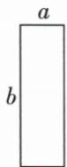
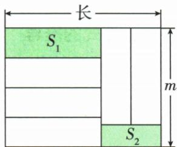

## 讲解

### 判据

“不含ab项”要求合并后的ab系数为0；“与x取值无关”要求合并后所有含x的项消失。它是对允许变量取值都成立的结构条件，不是某个代入数值使项碰巧为0。

### 流程

1. 先按带符号乘数展开，再合并到清晰项结构。原第一题成4a²−(10+m)ab+6b²。
2. 指定ab项系数为−(10+m)，列−(10+m)=0，解得m=−10；不改变变化变量a、b。
3. 第二题成(1−n)x²+(m+2)x+4y−3，所有含x项有x²和x两个，不漏任何一个。
4. 分别列1−n=0、m+2=0，得n=1、m=−2，再求m+n=−1。
5. 代参数回表达式验证第一题ab项为0、第二题剩4y−3确实不含x。
6. 此判据针对题给多项式和一般变量范围；若变量已被固定成一个值，“无关”的文字需要另读，不能将单点取值误当结构消项。

### 乘积展开与面积表达式中的同一消项判据

原(2x−m)(x²+3x−n)先完整展开，x²系数6−m、x系数−2n−3m；两个指定项都消失，需要两系数同时为0，得到m=6、n=−9。

阴影题先依原图得S1=b(m−3a)、S2=2a(m−b)，组合化为(b−4a)m+ab。m在图形有效范围可变而值保持，需要m的系数0，故b=4a；不能把m选成某个固定数来代替无关条件。图中长宽与阴影存在的条件仍保留。

## 例题

### 不含指定项使其系数为零

> 来源ID Q04-26；第4章整式的加减；51-100/full.md 第886–886行。原答案与解析定位：51-100/full.md 第888–890行。

例4 若关于 a、b 的多项式 $5(a^{2}-2ab+b^{2})-(a^{2}+mab-b^{2})$ 中不含 ab 项, 求 m 的值.

**原资料答案与解析：**

解析 原式 $= 5a^{2} - 10ab + 5b^{2} - a^{2} - mab + b^{2} = 4a^{2} - (10 + m)ab + 6b^{2}$

∵ 不含 ab 项, ∴ $-(10+m)=0$ , ∴ m=-10.

**展开解析（依据原详解补足理由与步骤）：**

第一个括号乘5得5a²−10ab+5b²；减第二个整体得到−a²−mab+b²。合并a²系数4、ab系数−10−m、b²系数6，成为4a²−(10+m)ab+6b²。关于a、b的多项式“不含ab项”指该项的系数恒为0，不是给a或b取0；列−10−m=0，加10得−m=10，m=−10。代入后ab系数−10−(−10)=0，验证。

### 与一个字母取值无关须消掉全部相关项

> 来源ID Q04-27；第4章整式的加减；51-100/full.md 第892–892行。原答案与解析定位：51-100/full.md 第894–900行。

例5 若代数式 $x^{2}+mx+8y-(nx^{2}-2x+4y+3)$ 的值与 x 的取值无关, 求 $m+n$ 的值.

**原资料答案与解析：**

解析 原式 $= x^{2} + mx + 8y - nx^{2} + 2x - 4y - 3 = (1 - n)x^{2} + (m + 2)x + 4y - 3$

由题意得 1-n=0, $m+2=0$ ,

$$
\therefore n = 1, m = - 2, \therefore m + n = - 2 + 1 = - 1.
$$

**展开解析（依据原详解补足理由与步骤）：**

先减去整个括号，得x²+mx+8y−nx²+2x−4y−3。按字母项合并，成为(1−n)x²+(m+2)x+4y−3。“与x取值无关”要求x²和x两个系数都为0：1−n=0得n=1，m+2=0得m=−2。于是m+n=−1，剩余4y−3只与y有关。不是只消掉最高次数项，也不是把x=0代进去就叫无关。

### 展开乘积后相关系数均为零

> 来源ID Q05-21；第5章整式的乘除与因式分解；51-100/full.md 第1337–1337行。原答案与解析定位：51-100/full.md 第1339–1345行。

例2 若 2x-m 与 $x^{2}+3x-n$ 的乘积中不含 x 的一次项和 x 的二次项, 求 m, n 的值.

**原资料答案与解析：**

解析 $(2x - m)(x^{2} + 3x - n) = 2x^{3} + (6 - m)x^{2} + (-2n - 3m)x + mn.$

∵ 乘积中不含 x 的一次项和 x 的二次项，

$$
\therefore 6 - m = 0, - 2 n - 3 m = 0, \therefore m = 6, n = - 9.
$$

**展开解析（依据原详解补足理由与步骤）：**

逐项乘得2x³+6x²−2nx−mx²−3mx+mn。合并后x²系数6−m，x系数−2n−3m，常数mn。题给同时不含一次与二次项，列6−m=0及−2n−3m=0。前式得m=6，代后式−2n−18=0，两边加18得−2n=18、n=−9。代回两系数均0；不能只令某个x取值0代替结构消项。

### 面积表达式与变化宽度无关

> 来源ID Q05-22；第5章整式的乘除与因式分解；51-100/full.md 第1351–1367行。原答案与解析定位：51-100/full.md 第1369–1369行。

例3 把五个长为 b, 宽为 $a(b > a)$ 的小长方形(如图 1), 按如图 2 所示的方式放在一个宽为 m 的大长方形上(相邻的小长方形既无重叠, 又不留空隙). 图 2 中两块阴影部分的面积分别为 $S_{1}$ 和 $S_{2}$ , 当 m 的值发生变化时, $S_{1} - 2S_{2}$ 的值始终保持不变, 求 a, b 需满足的关系.

  
图 1

图 2

**原资料答案与解析：**

解析 $\because S_{1} - 2S_{2} = b(m - 3a) - 2\times 2a(m - b) = bm - 4am + ab = (b - 4a)m + ab$ ，当 $m$ 的值发生变化时， $S_{1} - 2S_{2}$ 的值始终保持不变， $\therefore b - 4a = 0,\therefore b = 4a.$

**展开解析（依据原详解补足理由与步骤）：**

图1的小矩形长b、宽a；图2左侧横放3块，每块竖高a，占3a，阴影S1横长b、竖高m−3a，故S1=b(m−3a)。右侧竖放2块，各横宽a、竖高b，阴影S2横宽2a、竖高m−b，故S2=2a(m−b)。图形存在要a>0、b>a，且m≥max(3a,b)，阴影有正面积时相应取严格大于。

S1−2S2=bm−3ab−4am+4ab=(b−4a)m+ab。m在有效范围变化而值始终不变，需要m系数b−4a=0，故b=4a；此时值ab不随m变。不是将m固定为一个恰巧值，也不是从图示像素长度猜比例。

## 易错

- 不含某项是系数0，不是主动令变量0。
- 与x无关要消所有x项，不能只消最高次。
- 参数代回后再确认实际项结构。
