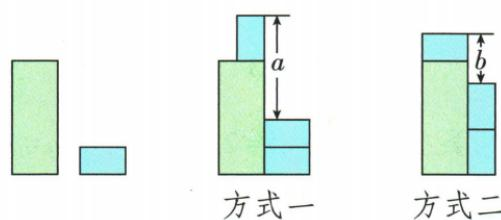

## 讲解

### 判据

同一大卡片和小卡片以不同方向摆放，总高度可从两侧表达且含共同长度时，按原图分别列等量关系，再相减消掉共有量，寻找题目所求的长宽差。

### 流程

1. 明确小卡片长x、宽y，大卡片长m，旋转后同一小卡片长宽并不变，但对应竖直边换了。
2. 原方式一同一总高度，左x+m，右a+2y，列a+2y=x+m。
3. 原方式二左y+m，右b+2x，列b+2x=y+m；a、b是图上空段，不是卡片的长或宽。
4. 将两等式按同一方向相减，共有m消去，得到a−b+2y−2x=x−y。
5. 两边加2x−2y，将x、y合成3x−3y=a−b；再提出3，所求x−y=(a−b)/3。
6. 回看长宽差应非负，题给图形应对应a≥b。无需先求所有辅助量，也不能从图片像素比例直接读出未标注数值。

## 例题

### 两种卡片摆法相减消掉共有长

> 来源ID Q04-28；第4章整式的加减；51-100/full.md 第906–908行。原答案与解析定位：51-100/full.md 第910–916行。

例6 现有 1 张大长方形卡片、3 张相同的小长方形卡片, 按如图所示的两种方式摆放, 求小长方形的长与宽的差. (用含 a、b 的代数式表示)

**原资料答案与解析：**

解析 设小长方形的长为 x、宽为 y，大长方形的长为 m，则 $a+2y=x+m, b+2x=y+m$ ，

$$
\therefore x = a + 2 y - m, y = b + 2 x - m, \therefore x - y = (a + 2 y - m) - (b + 2 x - m) = a - b + 2 y - 2 x \text {, 即} 3 x - 3 y = a - b,
$$

∴ $x-y=\frac{a-b}{3}$ ，即小长方形的长与宽的差为 $\frac{a-b}{3}$ .

**展开解析（依据原详解补足理由与步骤）：**

设小卡片长x、宽y，大卡片长m。方式一总竖直高度，左侧为x+m，右側按图为a+2y，所以a+2y=x+m。方式二总高度，左侧为y+m，右侧为b+2x，所以b+2x=y+m。a、b是原图标出的空段高度，不能直接当作小卡片边长。

把第一等式减第二等式：a−b+2y−2x=(x+m)−(y+m)=x−y，共有m消去。右边与左边的2y−2x移到同一边，相当于两边加2x−2y，得到a−b=3x−3y=3(x−y)。再除3，所求长宽差(x−y)=(a−b)/3。长度条件x≥y使此差非负，对应a≥b；无需分别求x、y或大卡片的宽。

## 易错

- 摆放方向变了，竖直边可能是长也可能是宽，逐侧读图。
- 作差要同一顺序，a−b与x−y的方向保持。
- 图形只是给关系，未标数值不靠画面量尺补造。
