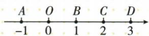

## 讲解

### 是什么

有理数与无理数统称实数。按定义分，两类不重叠且覆盖实数：有理数又分整数与分数，无理数分正无理、负无理。按正负性质分，则为正实数、0、负实数，正负实数各含相应有理与无理数。

不同层级不能并排重复计数。0是有理数、整数，也是非正非负的实数；它不是无理数，也不属于正实数或负实数。

### 怎么来的

整数、分数足以处理许多计算，却不能写出所有连续位置，例如√5表示的点不是整数比。将有理数和无理数合在一起，使数轴上每个点与一个实数对应，实数也各对应一个点。分类扩展了数的范围，正负、绝对值、相反数的方向或距离含义仍一致，并不另造一套定义。

两种分类的分界不同。定义分类问能否写成整数比，性质分类问与0的大小关系；一个负无理数同时属于负实数和无理数，是在不同维度归类。原分类图用两棵树分别展示这两种视角，不将零连到负有理数下。

实数运算继续沿用有理数运算律，但结果可以跨分类：两无理数的和若相互抵消可为0。分类用于描述原数，不能据此推定每次运算的结果必留在同一类。

### 什么时候能用

分类对象限定实数，负数的实数平方根等无意义写法不属于这棵分类树。数轴表示实数一一对应，若只说有理数对应全部点，则遗漏无理位置。

遇小数近似先区分书写数与被近似量。图中位置可通过夹逼确定，无须无限计算出全部小数；作精确比较时不随意把两数舍成相同小数后认作相等。

## 例题

### 实数中识别无理数

> 来源ID Q02-22；第2章实数；1-50/full.md 第4794–4802行。原答案与解析定位：1-50/full.md 第4828–4830行。

例1 (2024 山东烟台) 下列实数中的无理数是 ( )

A. $\frac{2}{3}$

B.3.14

C. $\sqrt{15}$

D. $\sqrt[3]{64}$

**原资料答案与解析：**

例1 解析 $\frac{2}{3}$ 、3.14、 $\sqrt[3]{64}$ ( $\sqrt[3]{64}=4$ ) 都是有理数.

答案 C

**展开解析（依据原详解补足理由与步骤）：**

A的2/3是整数之比，有理；B的3.14是有限小数=157/50，有理，它是某些情境里π的近似值但不等于π；C的√15，15不是整数完全平方数，平方根无法成为有理数，故无理；D的三次根号64=4，是整数，有理。选C，带根号不等于无理数，先看能否化为有理值。

### 根式在数轴上的区间定位

> 来源ID Q02-17；第2章实数；1-50/full.md 第4668–4678行。原答案与解析定位：1-50/full.md 第4680–4684行。

例2 如图, 数轴上的点 A, O, B, C, D 分别表示数 -1, 0, 1, 2, 3, 则表示数 $\sqrt{5}-1$ 的点 P 应落在（）

A. 线段 AO 上

B.线段 BO 上

C. 线段 $BC$ 上

D. 线段 $CD$ 上

**原资料答案与解析：**

解析 $\because 4 <   5 <   9,\therefore 2 <   \sqrt{5} <  3,$

∴ $1 < \sqrt{5} - 1 < 2$ , ∴ 表示数 $\sqrt{5} - 1$ 的点 P 应落在线段 BC 上.

答案 C

**展开解析（依据原详解补足理由与步骤）：**

4<5<9，两端非负且为2²和3²，故2<√5<3；整个不等式减1得1<√5−1<2，因此P在线段BC，选C。AO表示[−1,0]，BO表示[0,1]，CD表示[2,3]，均不含这个严格在1与2之间的数；端点1、2也不等于√5−1。不要先把√5估为整数2而把P放在B点。

## 易错

- 只把数轴点配给有理数：无理数也有对应点。
- 把正数负数作为定义分类的下一层而漏零：需按正确维度分层。
- −√2是负无理，√（−2）无实数意义，负号位置不同。
- 无理与无理相加必无理：相反数相加得0就是原资料警示的边界。
