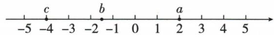

## 错法

把−|−3|直接写成+3，或把原式−|c|在c<0时写成−c。错在把绝对值内外的两个负号一并删掉，或者只计算了绝对值而漏执行外侧取相反数。

绝对值的结果非负，容易被误解成“整个含绝对值的项都非负”。实际外面还有减号：−|c|是绝对值的相反数，除c=0外反而非正。若绝对值内部还是差，外侧减号与去绝对值产生的括号又会叠加，最容易只变一项符号。

## 正解

把内外操作分成两步。先计算或化简|−3|=3，再执行外侧−，得到−3；不能将绝对值竖线当普通括号，用数负号次数代替计算。

符号题c<0时，先写|c|=−c，再代回−|c|=−（−c）=+c。c本身是负数，所以结果+c仍为负，与“负距离”相容。第二项−|2a−b|，若内部为正，先替换为−（2a−b），然后展开为−2a+b，不是−2a−b。

关键是每一步明确负号作用于哪一个整体。去掉绝对值只改变它包住的部分，不取消原式外部操作；去掉外侧负括号则要同时反转括号内各项符号。

## 例题

### 相反数和绝对值混合的五个符号化简

> 来源ID Q01-10；第1章有理数；1-50/full.md 第3086–3088行。原答案与解析定位：1-50/full.md 第3089–3093行。

例1 化简：①$-(-3)$；②$+(-3)$；③$-(+3)$；④$-|-3|$；⑤$-[-(-3)]$。（填写各式结果。）

第五式的最里层负号按PDF实际第30页恢复；原始OCR文本保存在证据记录中。

**原资料答案与解析：**

解析 ①表示-3的相反数,结果为3.②正号可以省略,结果为-3.  
③表示+3的相反数,结果为-3.④表示-3的绝对值的相反数,结果为-3.  
⑤表示-3的相反数的相反数,结果为-3.

答案 ①3 ②-3 ③-3 ④-3 ⑤-3

**展开解析（依据原详解补足理由与步骤）：**

每次先识别最里层操作，不把绝对值符号当作括号。

① $-(-3)=3$：取 −3 的相反数。② $+(-3)=-3$：前面的正号不改变数值。③ $-(+3)=-3$：取 +3 的相反数。④先算 $|-3|=3$，再取相反数，$-|-3|=-3$。⑤原页实际第30页为 $-[-(-3)]$，先算 $-(-3)=3$，再算 $-(3)=-3$；提取文本漏了最里层的负号，已据原页恢复，不能按错误提取的 $-[-(3)]$ 去套原答案。原答案依次为 3、−3、−3、−3、−3。

### 根据数轴顺序去掉复合绝对值

> 来源ID Q01-12；第1章有理数；1-50/full.md 第3109–3111行。原答案与解析定位：1-50/full.md 第3130–3138行。

例3 a, b, c 三个数在数轴上的对应点如图所示, 化简 $\left|b-a\right|-\left|2a-b\right|+\left|a-c\right|-\left|c\right|$ .

**原资料答案与解析：**

解析 根据数轴可得 c<b<0<a,

$$
\therefore b - a <   0, 2 a - b > 0, a - c > 0,
$$

$$
\therefore | b - a | - | 2 a - b | + | a - c | - | c | = a - b - (2 a - b) + a - c - (- c) = a - b - 2 a + b + a - c + c = 0.
$$

**展开解析（依据原详解补足理由与步骤）：**

原图可读出 $c<b<0<a$；本题只需这个顺序，不必把 b 估成某个小数。逐个判断绝对值内部的整体：b 为负、a 为正，所以 $b-a<0$；$2a>0$ 而 $-b>0$，所以 $2a-b>0$；$a>0,c<0$，故 $a-c>0$；c 本身为负。

因此 $|b-a|=-(b-a)=a-b$，$|2a-b|=2a-b$，$|a-c|=a-c$，$|c|=-c$。先保留各项前的运算符号，再代入：

$$
(a-b)-(2a-b)+(a-c)-(-c)
=a-b-2a+b+a-c+c=0.
$$

第二项前的减号要作用于整个 $2a-b$，于是成为 $-2a+b$；最后一项减的是 −c，成为 +c。a 项的系数为 $1-2+1=0$，b 项为 $-1+1=0$，c 项为 $-1+1=0$，故结果确为 0。
