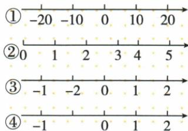

## 讲解

### 是什么

规定了原点、正方向和单位长度的直线叫数轴。原点表示0；一般取向右为正；单位长度规定数值每增加1，在直线上要走多远。同一条数轴上单位长度必须一致。

数轴不是一定要每格标一个整数，也不是每个刻度都必须画出数字。原图①每相邻标记相差10，仍能表示正确数轴，只要对应的长度统一。反之，画了箭头和0但刻度间距与数差不符，仍不是正确数轴。

### 怎么来的

把数的正负与大小对应到直线位置：从0向右按单位长度走出正数，向左走出负数。这样，一个数既有相对0的方向，又有离0的距离，便把“方向”和“大小”放进同一个图中。带分数和小数也能按单位长度分割定位，不仅整数能画在数轴上。

同一数轴上右边表示的数更大；由起点向右走d个单位，终点数值增加d，向左则减少d。两点间实际线段长度还要乘上该数轴的单位长度。因此比较两条不同数轴时，不能直接把它们的数值差看成相同的实际长度，要先看各自单位或已知对齐关系。

### 什么时候能用

用数轴判断大小、方向、距离时，先核对原点、正方向及单位长度。题图可能只画相关一段，只要三要素由图或题意明确，就不要求把整条无限直线画完。

示意图上的间距只能辅助判断。具体数值以刻度和条件为准，不能拿屏幕上的像素长度替代题给长度，也不能从一个点看似在中点的位置就推定其数值。数轴上的数值本身没有固定长度单位；实际距离需要题目另给尺度。

### 无理数对应的数轴位置

有理数不能占满数轴，实数与数轴上的点才一一对应。√5−1是无理数，但可由2<√5<3得到1<√5−1<2，从而确定它位于1与2之间。定位不需要写尽无限小数，也不能把图中的全部点限定为有理数。

## 例题

### 检查数轴的三个要素

> 来源ID Q01-04；第1章有理数；1-50/full.md 第2834–2847行。原答案与解析定位：1-50/full.md 第2848–2856行。

例 下图中能正确表示数轴的有（）

A.0 个 B.1 个 C.2 个 D.3 个

**原资料答案与解析：**

解析 ①满足数轴的三要素,能正确表示数轴.

②不是一条直线,且单位长度不统一.

③-1 和 -2 的位置不正确.

④单位长度不统一.

答案 B

**展开解析（依据原详解补足理由与步骤）：**

逐图检查直线、原点、正方向和单位长度，而不是只找数字 0。①是直线，标出原点和向右的正方向，−20、−10、0、10、20 的相邻数差都为 10，刻度间距相等；每一格表示 10 个单位也可以，所以①正确。

②承载各刻度的线弯曲，不满足数轴是一条直线。③向右依次写 −1、−2、0、1、2，其中 −2 比 −1 小，却放在 −1 右侧，顺序错误。④从 −1 到 0 的距离约为从 0 到 1 的两倍，但两段都应表示 1 个单位，单位长度不统一。只有①正确，共 1 条：A 的 0、C 的 2、D 的 3 都不符，B 正确。图中读数已对照原JPEG检查。

### 从负数位置向右平移

> 来源ID Q01-06；第1章有理数；1-50/full.md 第2942–2952行。原答案与解析定位：1-50/full.md 第2922–2924行。

例1 (2024 四川广元) 将 -1 在数轴上对应的点向右平移 2 个单位, 则此时该点对应的数是 ( )

A.-1

B.1

C.-3

D.3

**原资料答案与解析：**

例1 解析 $-1+2=1$ .

答案B

**展开解析（依据原详解补足理由与步骤）：**

看到起点 −1、向右 2 个单位，先写“终点 = 起点 + 向右移动的单位数”：$-1+2=1$，答案 B。

A 的 −1 是未移动的起点；C 的 −3 对应向左移动 2 个单位，方向与题意相反；D 的 3 把 −1 的负号丢掉后再加 2。只有 B 同时保留起点与方向。

### 根式在数轴上的区间定位

> 来源ID Q02-17；第2章实数；1-50/full.md 第4668–4678行。原答案与解析定位：1-50/full.md 第4680–4684行。

例2 如图, 数轴上的点 A, O, B, C, D 分别表示数 -1, 0, 1, 2, 3, 则表示数 $\sqrt{5}-1$ 的点 P 应落在（）

A. 线段 AO 上

B.线段 BO 上

C. 线段 $BC$ 上

D. 线段 $CD$ 上

**原资料答案与解析：**

解析 $\because 4 <   5 <   9,\therefore 2 <   \sqrt{5} <  3,$

∴ $1 < \sqrt{5} - 1 < 2$ , ∴ 表示数 $\sqrt{5} - 1$ 的点 P 应落在线段 BC 上.

答案 C

**展开解析（依据原详解补足理由与步骤）：**

4<5<9，两端非负且为2²和3²，故2<√5<3；整个不等式减1得1<√5−1<2，因此P在线段BC，选C。AO表示[−1,0]，BO表示[0,1]，CD表示[2,3]，均不含这个严格在1与2之间的数；端点1、2也不等于√5−1。不要先把√5估为整数2而把P放在B点。

## 易错

- 每格标10就判错误：10个数值单位也可以作为一段等长刻度，关键是比例统一。
- ③图中−2画在−1右侧：数向右应增大，这个顺序与数值相反。
- ④图把−1到0画成0到1的两倍：相同数差必须对应相同长度。
- 把曲线上标刻度也叫数轴：定义中的承载对象是直线。
