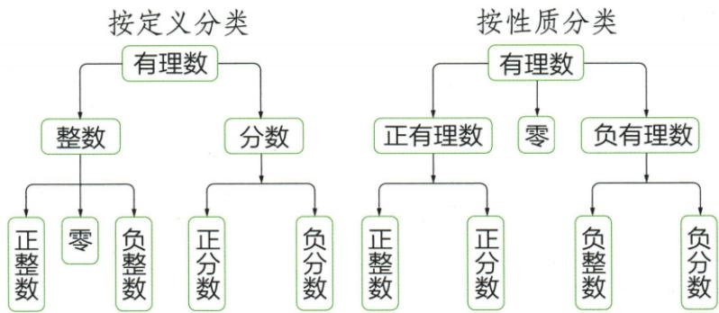

## 讲解

### 是什么

整数和分数统称有理数。这里“分数”指不属于整数的有理数，分类时与整数分开；更统一的表示是 $\frac pq$，其中p、q是整数，$q\ne0$。整数也可写成分母为1的形式，所以“能写成两个整数之比”包括整数。

按数的形式分：整数包括正整数、0、负整数；分数包括正分数、负分数。按性质分：正有理数、0、负有理数；正负有理数又各自可分为整数与分数。两种分法观察的是不同特征，不能把同一层的分类混用。

原分类图如下，使用原JPEG而不使用识别工具生成的错误图解：

### 怎么来的

有限小数能写成以10、100等为分母的整数之比，因而属于有理数。负有限小数同样如此，负号不改变“可写成整数之比”的性质。

分数转成小数就是做除法。分母固定后，除法每一步的余数只能取有限种值；余数变成0，小数终止；若一直不为0，某个余数终会重复，从那里开始商的数字按同样顺序重复，所以产生无限循环小数。这给出了“有限小数或无限循环小数”与有理数的联系。反过来，无限循环小数可以通过将循环节平移并相减化为分数；本章先掌握分类结论，不要求先学一般循环小数的代数转化。

按形式与按符号分类都要求不重不漏。0是整数，但既不是正有理数也不是负有理数，所以必须单列。

### 什么时候能用

判断是否有理数，必须能表示为两个整数之比；不能把任意对象除以1就称为有理数，分子也必须是整数。把小数化为分数应使用准确值，近似小数不等于它所近似的原数。

本章资料以π作为边界：π可用分数近似，却不是某个分数的准确值，不属于有理数；证明π不是有理数不在本章范围。无限不循环小数也不属于有理数。分类中的“正数、负数”须说明只限有理数，本条统一写“正有理数、负有理数”，以免把范围外的数混入。

## 例题

### 原资料对有理数分类的七条辨析

> 来源ID Q01-48；第1章有理数；1-50/full.md 第2679–2693行。原答案与解析定位：1-50/full.md 第2679–2693行。

原资料辨析（完整判据原文，非独立例题）：

1.有限小数和无限循环小数都可以化为分数. （√）

2. 分数都可以化为有限小数或无限循环小数. (√)

3. 小数等同于分数. (×)

4. $\pi$ 不是有理数. （√）

5.有理数可分为正数、负数和0.
(×)

6.非负数就是不是负数的数.
(√)

7.非负数就是正数. (×)

**原资料答案与解析：**

1.有限小数和无限循环小数都可以化为分数. （√）

2. 分数都可以化为有限小数或无限循环小数. (√)

3. 小数等同于分数. (×)

4. $\pi$ 不是有理数. （√）

5.有理数可分为正数、负数和0.
(×)

6.非负数就是不是负数的数.
(√)

7.非负数就是正数. (×)

**展开解析（依据原详解补足理由与步骤）：**

这是原资料的辨析段，**不是另一套自编练习**。原判据逐条保留在上方，解释如下。

1、2：有限小数和无限循环小数能表示成整数之比；反过来，分数作除法，余数只可能为有限种，最终余数为0则小数终止，否则余数重复则小数循环。3：小数还包括无限不循环小数，不能把所有小数都划到有理数中的分数一类。4：π不是整数之比，虽然能用分数近似，却不能与某个分数严格相等；这是原资料给出的分类边界，详细证明不在本章范围。

5：原文“有理数可分为正数、负数和0”标×，用词存在口径歧义。如果讨论范围已明确只限有理数，按正负和零划分本身成立；若“正数、负数”指所有此类数，则包含有理数范围外的数，名称不准确。规范分类写“正有理数、零、负有理数”，不把原标×理解为有理数不能按符号分类。6：非负数就是≥0的数，该说法成立。7：非负数还包括0，只说正数会漏0，原判×成立。

## 易错

- 把所有小数都叫分数：还存在无限不循环小数，要看是否终止或循环。
- 把−3等负整数放进分数类：按形式分时，它仍是整数，正负是另一分类维度。
- 把0放进正整数：0属于整数，却不是正整数。
- 把近似π的分数当成π本身：近似相等不能代替严格相等。
- 照抄自动分类图把负整数连到0下面：原JPEG明确把负整数连到整数类，0没有这些子类。
