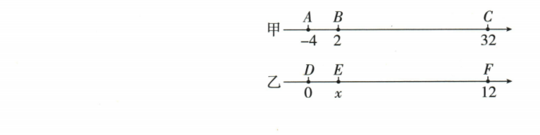

## 讲解

### 判据

两条数轴的点上下对齐，且要用一条轴上的已知坐标求另一轴未知坐标时，想到实际长度对应、单位可能不同。比较的是同轴线段的比例，不是把两个轴的坐标值强行视为相同。

### 流程

1. 在每条轴内部先标清点序及其数值。甲轴A、B、C为−4、2、32，B、C都在A右侧；乙轴D为0、F为12，E在二者之间。
2. 用同一轴上的数差求长度的数值份数：AB为2−（−4）=6个甲单位，AC为32−（−4）=36个甲单位。其比6/36=1/6不受甲轴每单位实际多长的影响。
3. 读对齐条件而非猜图比例。A对D、B对E、C对F，给出AB与DE、AC与DF的实际线段对应，因此DE/DF=AB/AC=1/6。
4. 在乙轴自己的尺度中，DF=12−0=12个乙单位。DE占它1/6，所以DE=2个乙单位；E在0右边，坐标为+2。
5. 检查所得数能使乙轴的局部长度比恢复成1/6，并位于D、F之间。若对齐的是不同端点，先重新确认对应关系，不把本例分式原封套用。

## 例题

### 双数轴对齐时用距离比例求未知数

> 来源ID Q01-07；第1章有理数；1-50/full.md 第2956–2963行。原答案与解析定位：1-50/full.md 第2926–2938行。

例2 新考法（2024 河北）如图，有甲、乙两条数轴。甲数轴上的三点 A, B, C 所对应的数依次为 -4, 2, 32，乙数轴上的三点 D, E, F 所对应的数依次为 0, x, 12。

(1) 计算 A, B, C 三点所对应的数的和, 并求 $\frac{AB}{AC}$ 的值.  
(2) 当点 A 与点 D 上下对齐时, 点 B, C 恰好分别与点 E, F 上下对齐, 求 x 的值.

**原资料答案与解析：**

例2 解析 (1) $A, B, C$ 三点所对应的数的和为 $-4 + 2 + 32 = 30$ ，

$$
\frac {A B}{A C} = \frac {2 - (- 4)}{3 2 - (- 4)} = \frac {6}{3 6} = \frac {1}{6}.
$$

(2)由题意得, $\frac{AB}{AC}=\frac{DE}{DF}$ ,

$$
\therefore \frac {1}{6} = \frac {x}{1 2},
$$

解得 x=2.

**展开解析（依据原详解补足理由与步骤）：**

（1）三数之和为 $-4+2+32=-2+32=30$。同一条甲数轴上，A 在 −4，B 在 2，C 在 32，故 $AB=2-(-4)=6$ 个甲单位，$AC=32-(-4)=36$ 个甲单位，$\frac{AB}{AC}=\frac6{36}=\frac16$。

（2）A 与 D、B 与 E、C 与 F 分别上下对齐，说明相应的实际线段长度相等，即 AB 对应 DE，AC 对应 DF。因此两轴上的长度比相等：$\frac{DE}{DF}=\frac{AB}{AC}=\frac16$。乙轴上 $DF=12-0=12$ 个乙单位，所以 $DE=12\times\frac16=2$ 个乙单位。E 在 D 右侧，D 为 0，故 $x=0+2=2$。

这里没有把“甲轴 6 个单位”直接当成“乙轴 6 个单位”。两轴的单位长度可以不同，保持的是对齐线段的实际长度及其比例。

## 易错

- 甲轴B的坐标2恰巧等于本题x，不代表“对齐点坐标相等”；甲轴A=−4与乙轴D=0就是反证。
- 用AB/BC代替AB/AC会改变所比较的整体，分母应与乙轴DF对应。
- 同轴长度比需正的距离，若坐标次序不明先取绝对值。
- 比例来自题给的对齐关系，示意图拉伸、缩放不会改变这个依据。
