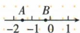
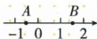
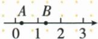
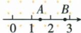

## 讲解

### 判据

出现括号前连续正负号、绝对值外的负号，或问两数互为相反数时，先识别操作对象。只有连续对同一个数取相反数时，才可用负号奇偶；绝对值是另一种操作，必须先求内部距离。

### 流程

1. 从内向外划出每一层。正号不改变值，负号对其后整个对象取相反数；若最内层是−3，它本身也已经是一个确定负数。
2. 对连续相反数，每两次取相反数回到原数，所以两次、四次等抵消为同向；只剩一次则取相反数。这是奇偶口诀的理由，不是对所有算式数负号。
3. 遇到绝对值先独立计算。例如−|−3|，最内层绝对值为3，外侧再取相反数得到−3；不能把内外两个负号直接抵消成正3。
4. 问两数是否互为相反数，先把两式都化成确定数，再检查和为0。除0外也可核对绝对值相同且符号相反；异号但大小不同不合格。
5. 如图问“线段内存在”，查看线段是否容纳原点两侧的等距点，而非只检查两个端点。
6. 解题后把结果代回操作含义复核。若OCR文本与原答案冲突，先查原符号，不靠答案倒猜题干。

## 例题

### 相反数和绝对值混合的五个符号化简

> 来源ID Q01-10；第1章有理数；1-50/full.md 第3086–3088行。原答案与解析定位：1-50/full.md 第3089–3093行。

例1 化简：①$-(-3)$；②$+(-3)$；③$-(+3)$；④$-|-3|$；⑤$-[-(-3)]$。（填写各式结果。）

第五式的最里层负号按PDF实际第30页恢复；原始OCR文本保存在证据记录中。

**原资料答案与解析：**

解析 ①表示-3的相反数,结果为3.②正号可以省略,结果为-3.  
③表示+3的相反数,结果为-3.④表示-3的绝对值的相反数,结果为-3.  
⑤表示-3的相反数的相反数,结果为-3.

答案 ①3 ②-3 ③-3 ④-3 ⑤-3

**展开解析（依据原详解补足理由与步骤）：**

每次先识别最里层操作，不把绝对值符号当作括号。

① $-(-3)=3$：取 −3 的相反数。② $+(-3)=-3$：前面的正号不改变数值。③ $-(+3)=-3$：取 +3 的相反数。④先算 $|-3|=3$，再取相反数，$-|-3|=-3$。⑤原页实际第30页为 $-[-(-3)]$，先算 $-(-3)=3$，再算 $-(3)=-3$；提取文本漏了最里层的负号，已据原页恢复，不能按错误提取的 $-[-(3)]$ 去套原答案。原答案依次为 3、−3、−3、−3、−3。

### 负数的相反数

> 来源ID Q01-18；第1章有理数；1-50/full.md 第3225–3225行。原答案与解析定位：1-50/full.md 第3211–3213行。

例1 (2024 湖南) 计算: $-(-2024)=$ \_\_\_\_.

**原资料答案与解析：**

例1 解析 负号有 2 个, 所以结果为正.

答案 2024

**展开解析（依据原详解补足理由与步骤）：**

最内层是 −2024，最外层负号表示取它的相反数。数轴上 −2024 在原点左侧，同样距离的对称点在右侧，数值为 +2024。因此 $-(-2024)=2024$。两个负号是两次改变符号的作用，不是“负数加负数”。

### 相反数与倒数辨别

> 来源ID Q01-19；第1章有理数；1-50/full.md 第3229–3237行。原答案与解析定位：1-50/full.md 第3215–3217行。

例2 (2024黑龙江大庆)下列各组数中,互为相反数的是 ( )

A. $|-2024|$ 和 $-2024$

B.2024和 $\frac{1}{2024}$

C. $|-2024|$ 和 2024

D.-2024和 $\frac{1}{2024}$

**原资料答案与解析：**

例2 解析 $\left|-2\ 024\right|=2\ 024$ ，所以 $\left|-2\ 024\right|$ 与 -2 024 互为相反数.

答案A

**展开解析（依据原详解补足理由与步骤）：**

先化简，再用“和为 0、绝对值相同而符号相反”核验。A 中 $|-2024|=2024$，与 −2024 的和为 0，正确。B 中 2024 与 $\frac1{2024}$ 都是正数，它们互为倒数，乘积为 1，却不是相反数。C 中 $|-2024|$ 与 2024 是同一个正数，和不是 0。D 中 −2024 与 $\frac1{2024}$ 虽异号，但绝对值不同，和也不是 0，仍不是相反数。答案 A。

### 线段内是否存在互为相反数的两个数

> 来源ID Q01-08；第1章有理数；1-50/full.md 第3031–3043行。原答案与解析定位：1-50/full.md 第3045–3047行。

例1 A, B 是数轴上两点, 下列线段 AB 上的点表示的数中, 存在互为相反数的是 ( )

  
A

  
B

  
C

  
D

**原资料答案与解析：**

解析 本题需注意不一定是点 A 与点 B 表示的两个数互为相反数. B 选项中, 点 A 在原点左侧, 点 B 在原点右侧, 所以线段 AB 上的点表示的数中存在互为相反数的数.

答案 B

**展开解析（依据原详解补足理由与步骤）：**

“线段 AB 上的点”包括线段内部的点，不只问两个端点。相反数在数轴上关于原点对称，因此要看线段能否同时容纳原点两侧、到原点距离相同的两个点。

A 图中 A、B 都在原点左侧，整段表示负数，无法同时包含一个正数和它的负相反数。B 图的 A 在原点左侧、B 在右侧，线段跨过原点；在两侧都靠近原点的同一距离处可以找到一对相反数，所以 B 正确。C 图的 A 已在原点右侧，整段为正数；D 图的两个端点也都在右侧，整段仍为正数，均不满足。原图中的 A、B 是点名，不应误认为必须由这两个端点互为相反数。答案 B。

## 易错

- 正负号奇偶只处理连续相反数，不处理加减项的负号或绝对值里的负号。
- 连续取相反数也包含0：无论次数多少，0仍是0。
- 互为倒数检验乘积为1，不能用它替代相反数的和为0。
- 原题第五式漏负号已据原页修复；答题参考必须使用恢复后的原题。
