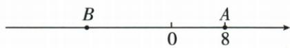

## 讲解

### 判据

已知两个点的位置数求距离，用两位置数之差的绝对值；已知一个点、另一个点距它d个单位而未给左右方向，要想到两个位置。出现“速度”“从原点向右”“运动时间大于0”，再把候选位置与运动约束结合。

### 流程

1. 确定所求是位置数还是非负距离。位置数可以为负，线段长度不能为负，所以 $AB=|a-b|$；两端次序互换不影响距离。
2. 已知距离反求点的位置，以已知点b为中心，候选为b+d与b−d。d>0时一般有两解；d=0时两式相同，只留一个；方向另给时按左右筛选。
3. 原题A在8，B在左侧且相距22，所以只留8−22=−14；不能把|8−b|=22的两解都交给题目，因为右侧解违反条件。
4. 动点先用距离条件求目标位置，再查轨迹。距8为2的点是6、10；从0向右运动可经过这两个点，均符合。
5. 使用“时间=路程÷速度”，这里从0向右到6或10，不返程，走过路程就是6或10个单位。分别除以每秒5单位得6/5秒与2秒，再检查t>0。
6. 在结论中分别写位置或时间，并保留所有合条件结果；原题只有距离条件、没有限制P在A哪侧，不能只留一个时间。

## 例题

### 数轴上距离与移动时间的多解

> 来源ID Q01-25；第1章有理数；1-50/full.md 第3475–3487行。原答案与解析定位：1-50/full.md 第3489–3501行。

例3 我们知道, $|a|$ 表示数 a 在数轴上对应的点到原点的距离,这是绝对值的几何意义.进一步地,数轴上两点 A,B 表示的数分别为 a,b,那么 A,B 两点之间的距离为 AB=|a-b|.利用此结论,回答以下问题:

(1)数轴上表示-3和-5的两点之间的距离是\_\_\_\_, 数轴上表示1和-4的两点之间的距离是\_\_\_\_.

(2)已知数轴上的两点A,B,其中点B表示的数是-3,如果AB=3,那么点A表示的数是\_\_\_\_.

(3)如图,已知数轴上点A表示的数为8,B是数轴上位于点A左侧一点,且AB=22.

①数轴上点 B 表示的数为 \_\_\_\_.

②动点 P 从原点出发,以每秒 5 个单位长度的速度沿数轴向右匀速运动,设运动时间为 $t(t>0)$ 秒,当 t= \_\_\_\_ 时,AP=2.

**原资料答案与解析：**

解析（1） $|-3-(-5)|=2,|1-(-4)|=5$ ，故答案为2；5.

(2) 设点 A 表示的数是 $x, \because AB = 3, \therefore |x - (-3)| = 3,$

$\therefore x+3=\pm3$ , 解得 x=0 或 x=-6, 故答案为 0 或 -6.

(3)①设点 B 表示的数为 b，由已知得 8-b=22，解得 b=-14，故答案为 -14.

②∵AP=2,∴点P表示的数为8+2=10或8-2=6,根据已知得5t=10或5t=6,

解得 t=2 或 $t=\frac{6}{5}$ ，故答案为 2 或 $\frac{6}{5}$ .

答案 (1)2;5 (2)0或-6 (3)①-14 ②2或 $\frac{6}{5}$

**展开解析（依据原详解补足理由与步骤）：**

（1）同侧的 −3 与 −5：$|-3-(-5)|=|-3+5|=|2|=2$；异侧的 1 与 −4：$|1-(-4)|=|1+4|=5$。

（2）距 −3 恰好 3 个单位，可以在它右侧也可以在它左侧，所以 A 表示 $-3+3=0$ 或 $-3-3=-6$；两位置都要保留。

（3）①B 在 A 左侧，A 表示 8，向左 22 个单位得到 $8-22=-14$。②P 距 A 的距离为 2，所以 P 可表示 $8+2=10$ 或 $8-2=6$。P 从 0 向右，每秒走 5 个单位；到 10 要 $10\div5=2$ 秒，到 6 要 $6\div5=\frac65$ 秒。这两个位置都在原点右侧，两个时间也都大于 0，符合题给方向和 $t>0$，都应保留。不能把“距离为 2”直接当作“在 A 右边 2”。

## 易错

- 未给方向时别把“距某点d”自动理解成在其右侧d。
- 从0向右的轨迹不能到负数位置，即使那个位置满足距离式也应舍去。
- 速度的单位长度要与数轴使用的单位一致，时间单位从速度中确定。
- 示意图中点P的位置若没固定，不能拿画图位置替代题干条件。
