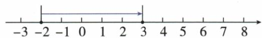
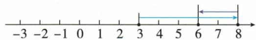
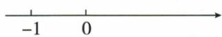

## 讲解

### 判据

看到“向左或向右移动若干单位”，想到有方向的位置变化；看到“移动前后到原点距离相等”，想到原点两侧的对称位置。移动不为0时，两位置不同，等距原点便说明它们互为相反数。

这种判断依赖方向、移动量和原点，不靠示意图画得是否居中。

### 流程

1. 把起点数值完整记录下来，连同负号保留。向右移动d个单位就在起点上加d，向左就在起点上减d；d指非负移动距离。
2. 多次移动先按实际顺序执行，每次以上一步终点作起点。原例从3右移5先到8，再左移2到6，第二次不是又从3出发。
3. 若起点未知但前后等距原点，先问两个位置是否可能相同。移动量明确非零，不能相同；于是左右对称，可把两个位置写为−x、x，x为距原点的正距离。
4. 结合移动方向确定哪一个是原位置。原例向右4单位，原位置在左侧，终位置在右侧；总距离是两份x，所以2x=4，原数为−2。
5. 复核方向与距离：终数减起数应等于带方向变化量，前后到0的距离应相等。选择题逐项识别“不移动”“反向移动”“丢起点负号”等错误对应。

## 例题

### 数轴上连续移动和原点对称

> 来源ID Q01-05；第1章有理数；1-50/full.md 第2862–2866行。原答案与解析定位：1-50/full.md 第2868–2904行。

例 回答下列问题：

(1) 点 A 在数轴上表示的数是 -2, 将 A 向右移动 5 个单位, 那么点 A 表示的新数是什么?  
(2) 点 B 在数轴上表示的数是 3, 将 B 向右移动 5 个单位, 再向左移动 2 个单位, 那么点 B 表示的新数是什么?  
(3) 点 C 在数轴上, 将它向右移动 4 个单位后, 如果新位置与原位置到原点的距离相等, 那么点 C 原来表示的数是什么?

**原资料答案与解析：**

解析（1）如图1，点 $A$ 表示的新数是3.

图1

图 2

(2)如图2,点B表示的新数是6.  
(3) 点 C 在数轴上, 将它向右移动 4 个单位, 则新位置与原位置之间的距离是 4, 因为新位置与原位置到原点的距离相等, 所以 C 点的原位置到原点的距离是 2. 由题意易知 C 点的原位置在原点的左边, 所以点 C 原来表示的数是 -2.

**展开解析（依据原详解补足理由与步骤）：**

（1）点 A 起点是 −2，向右移动 5 个单位是在原数上加 5，故 $-2+5=3$。

（2）点 B 从 3 出发，先向右 5 个单位，到 $3+5=8$；再向左 2 个单位，到 $8-2=6$。两段移动不能都加，移动方向决定加减。

（3）设原点右侧那个点对应的正数为 x。两点关于原点对称，左侧点为 −x。向右移动 4 个单位是从 −x 到 x，所以 $x-(-x)=4$，即 $2x=4$，得到 $x=2$。原来的 C 在左侧，对应 −2；也可直接把对称的总距离 4 平分，两点各距原点 2。

### 从负数位置向右平移

> 来源ID Q01-06；第1章有理数；1-50/full.md 第2942–2952行。原答案与解析定位：1-50/full.md 第2922–2924行。

例1 (2024 四川广元) 将 -1 在数轴上对应的点向右平移 2 个单位, 则此时该点对应的数是 ( )

A.-1

B.1

C.-3

D.3

**原资料答案与解析：**

例1 解析 $-1+2=1$ .

答案B

**展开解析（依据原详解补足理由与步骤）：**

看到起点 −1、向右 2 个单位，先写“终点 = 起点 + 向右移动的单位数”：$-1+2=1$，答案 B。

A 的 −1 是未移动的起点；C 的 −3 对应向左移动 2 个单位，方向与题意相反；D 的 3 把 −1 的负号丢掉后再加 2。只有 B 同时保留起点与方向。

## 易错

- 起点是负数，向右不是把绝对值继续增大，而是数值增加，可能跨过0。
- 等距但不移动时可以仍在原位置，不能直接要求互为相反数；本章对应题移动4单位，已排除重合。
- 向左向右用题图规定的正方向核对；本章原图都取向右为正。
- 多次移动求终点，不是求总路程；总路程另须把每段移动距离相加。
