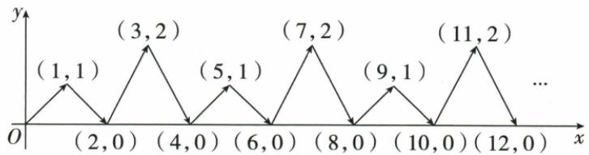

## 讲解

### 判据

要求很大正整数次幂的个位，题目提供前几项或结果呈循环时，想到只追踪末位而不求整个巨大整数。观察周期后还要说明循环为什么会继续，再用项号除周期长度定位。

### 流程

1. 明确追踪对象。原题追踪 $3^n+1$ 的末位，不是仅 $3^n$；先看幂的个位，再处理“+1”的个位进位。
2. 观察一整轮，并验证从轮末回到轮首的机制。乘3时，新个位只由旧个位乘3的个位决定，十位以上贡献都还是整十数，不影响个位。原幂的个位3、9、7、1再乘3回到3，所以循环会持续。
3. 幂再加1，依次得到4、0、8、2；9加1是10，个位为0。于是目标序列周期长度为4，轮内第1至4位对应这四个数。
4. 用所求指数2025除以4，得到506余1，即506个完整周期后再走1项，选第1位4。
5. 若项号恰能整除周期长度，余0表示刚好走完一整轮，应选本轮最后一位，不能选不存在的“第0位”，也不能自动选下一轮首位。这是一般流程说明，不是新增练习。
6. 检查题目是否从n=1开始；若编号或起点不同，先按实际第一项计数，不能仅凭数字余数就套。

### 坐标运动的分量周期补充

第12章横坐标k累计增长，纵坐标按1、0、2、0循环，余数仅定位纵分量。先标哪一量循环，原点P₀不计已走一步；2023=4×505+3给纵2，横仍2023。有限点列不能唯一决定无限规律，原“按这样的运动规律”与图的重复箭头提供持续规则；不擅推广无题设的点列。

## 例题

### 幂的个位周期及第2025项

> 来源ID Q01-39；第1章有理数；1-50/full.md 第4005–4013行。原答案与解析定位：1-50/full.md 第4015–4017行。

例2 $3^{1}+1=4,3^{2}+1=10,3^{3}+1=28,3^{4}+1=82,3^{5}+1=244,\cdots$ ，归纳各算式计算结果的末位数字的变化规律，猜测 $3^{2025}+1$ 的结果的末位数字是（）

A.0

B.2

C.4

D.8

**原资料答案与解析：**

解析 所给算式的结果以 4 个为一组, 其末位数字依次按 4,0,8,2 循环出现, 而 $2025 \div 4 = 506 \cdots 1$ , 则 $3^{2025} + 1$ 的结果的末位数字与 $3^{1} + 1$ 的结果的末位数字相同, 为 4.

答案 C

**展开解析（依据原详解补足理由与步骤）：**

题给前几项结果的末位为 4、0、8、2、4……，提示每 4 项一轮。但不能只凭“看起来像”就用周期，要检查继续乘 3 时为什么会重现。

$3^n$ 的个位依次为 3、9、7、1：个位为 3 的数再乘 3，个位是 9；个位 9 再乘 3 得个位 7；个位 7 再乘 3 得个位 1；个位 1 再乘 3 又得 3，所以这一循环会持续。再加 1，就依次得 4、0、8、2，其中 9 加 1 向十位进位，个位变为 0。

$2025=4\times506+1$，前 506 轮共 2024 项，所求是下一轮第 1 项，个位为 4。A 的 0 对应一轮第2项，B 的 2 对应第4项，D 的 8 对应第3项，都不是第1项；C 的 4 正确。

### 横坐标按次数增长纵坐标四步循环

> 来源ID Q12-14；第12章平面直角坐标系；101-150/full.md 第3246–3276行。原答案与解析定位：101-150/full.md 第3278–3292行。

例4 如图,动点 P 在平面直角坐标系中按图中箭头所示方向运动,第 1 次从原点运动到点 $(1,1)$ , 第 2 次运动到点 $(2,0)$ , 第 3 次运动到点 $(3,2)$ , ……, 按这样的运动规律, 经过第 2023 次运动, 动点 P 的坐标是 ()

A.(2 023,1)

B.(2 023,2)

C.(2 023,0)

D.(2 024,0)

**原资料答案与解析：**

解析 设第 n 次运动后点 P 运动到点 $P_{n}$ (n 为自然数)，其中 $P_{0}$ 为初始位置.

观察,发现规律: $P_{0}(0,0)$ , $P_{1}(1,1)$ , $P_{2}(2,0)$ , $P_{3}(3,2)$ , $P_{4}(4,0)$ , $P_{5}(5,1)$ , $\cdots$ ,

$$
\therefore P _ {4 n} (4 n, 0), P _ {4 n + 1} (4 n + 1, 1), P _ {4 n + 2} (4 n + 2, 0), P _ {4 n + 3} (4 n + 3, 2).
$$

$$
\because 2 0 2 3 = 4 \times 5 0 5 + 3,
$$

∴ 点 $P_{2023}$ 的坐标为 $(2023,2)$ .

答案 B

**展开解析（依据原详解补足理由与步骤）：**

原图每次向右1单位，所以第k次横坐标k，不循环。纵坐标按第1至4次1、0、2、0，每4步重复；原图箭头与原解析共同给“按这样的规律”持续运动，不能只凭任意前三点猜唯一规律。2023=4×505+3，纵处轮内第3位为2，横仍2023，B正确。A的1是余1位，非余3；C的0是余0或2位；D的2024把次数加1且给错误0。初始P₀(0,0)不计第1次，不能因此把项号全偏一。

## 易错

- 前几项相同间隔出现只提示周期，需证明末位演变返回原状态，才可用于大指数。
- 本题结果的个位是4、0、8、2，不是幂的3、9、7、1。
- 余0对应周期末项，余1对应首项，两种不能混。
- 方法用于有确定重复规则的序列，不凭任意数列的少数项编一个周期。
