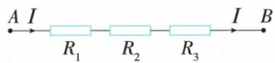

## 讲解

### 判据

相加出现相反数、同分母、可凑整的小数时，先考虑加法重排；乘法出现接近整十整百的乘数，或多项共有一个乘数时，考虑正用或逆用分配律。简算的入口是式子的结构，不是把运算步骤省去。

### 流程

1. 先确认允许使用哪条运算律。加法要把减法先化成加相反数；乘法中的除法先转成乘倒数；没有转换就重排减数、除数，不受运算律保证。
2. 全是加数时，看哪组能直接变0、整数或同分母。把相反数配成0、同类形式配在一起，每项连同符号搬动，保证原加数各出现一次。
3. 带分数拆整数部分和分数部分时，整体负号作用于两部分。原−23又1/3应拆成−23−1/3，不能拆成−23+1/3。
4. 一个乘数接近整千时，把它拆成便于乘的和差。原999=1000−1，乘−15后，后一项是减一个负积，所以得到−15000+15。
5. 多项有共同乘数时，逆用分配律提取，再算括号。三项共有999，把正、负及减号一起带入括号，括号得到100后再乘。
6. 代入公式的三项共有I，先提I，再让20.3+31.9+47.8凑100。每次写明所用交换、结合或分配关系，最后复查括号内各原项未丢失。

### 用已证明的乘法公式及因式分解缩短数值计算

原103×97将两因子看作100两侧±3，用平方差得9991；999²用(1000−1)²保留二倍积，得998001。原2025²−2024×2026先将乘积改为2025²−1，大项抵消得1。

逆向也可提数值公因子或完整平方：206的三个倍数合成206×10；202²+202×196+98²中196=2×98，恰合(202+98)²=90000。每次先核完整公式结构，再作准确计算，不能看到凑整数就略过交叉项。

## 例题

### 用相反数和同分母分组求和

> 来源ID Q01-21；第1章有理数；1-50/full.md 第3391–3391行。原答案与解析定位：1-50/full.md 第3393–3393行。

例1 计算： $(+3) + \left(+\frac{1}{4}\right) +$ $(-3.3) + (-3) + (+0.3) +$ $\left(-6\frac{1}{4}\right).$

**原资料答案与解析：**

解析 原式 $= [(+3) + (-3)] + [(-3.3) + (+0.3)] + \left[(+\frac{1}{4}) + (-6\frac{1}{4})\right] = 0 + (-3) + (-6) = -9.$

**展开解析（依据原详解补足理由与步骤）：**

六项全是加数，可用加法交换律和结合律重新分组，但要连同各数的符号移动。把 +3 和 −3 配对，$3+(-3)=0$；把 −3.3 和 +0.3 配对，$-3.3+0.3=-3$；把 $+\frac14$ 和 $-6\frac14$ 配对，后者是 $-(6+\frac14)$，故 $\frac14+(-6\frac14)=\frac14-6-\frac14=-6$。于是总和 $0+(-3)+(-6)=-9$。每个原加数都恰好使用一次，负号没有跟丢。

### 五种加法简算的依据与过程

> 来源ID Q01-23；第1章有理数；1-50/full.md 第3433–3437行。原答案与解析定位：1-50/full.md 第3439–3447行。

例1 计算：

（1）$(+26)+(-14)+(-16)+(+18)$。

（2）$\left(+12\frac56\right)+\left(-23\frac13\right)$。

（3）$4.1+\left(+\frac12\right)+\left(-\frac14\right)+(-10.1)+7$。

（4）$0.75+\left(-2\frac34\right)+0.125+\left(-12\frac57\right)+\left(-4\frac18\right)$。

（5）$18.56+(-5.16)+(-1.44)+(+5.16)+(-18.56)$。

**原资料答案与解析：**

解析（1）（同号结合法）原式 $= [(+26) + (+18)] + [(-14) + (-16)] = (+44) + (-30) = 14.$

(2)(拆分法、同形结合法)原式 $= 12 + \frac{5}{6} +(-23) + \left(-\frac{1}{3}\right) = [12 + (-23)] + \left[\frac{5}{6} +\left(-\frac{1}{3}\right)\right] = (-11) + \frac{1}{2} =$ $-10\frac{1}{2}.$

(3)(凑整法、同形结合法)原式 $= [4.1 + (-10.1) + 7] + \left[\left(+\frac{1}{2}\right) + \left(-\frac{1}{4}\right)\right] = 1 + \frac{1}{4} = 1\frac{1}{4}.$

(4)(同分母结合法)原式= $\left[\frac{3}{4}+\left(-2\frac{3}{4}\right)\right]+\left[\frac{1}{8}+\left(-4\frac{1}{8}\right)\right]+\left(-12\frac{5}{7}\right)=(-2)+(-4)+\left(-12\frac{5}{7}\right)=-18\frac{5}{7}.$

(5)(相反数结合法)原式= $\left[18.56+(-18.56)\right]+\left[(-5.16)+(+5.16)\right]+(-1.44)=0+0+(-1.44)=-1.44.$

**展开解析（依据原详解补足理由与步骤）：**

（1）同号分组：$26+18=44$，$-14+(-16)=-30$，所以 $44+(-30)=14$；分组用交换律、结合律。

（2）负带分数前的负号作用于整个数：$-23\frac13=-23-\frac13$。整数部分 $12+(-23)=-11$，分数部分 $\frac56-\frac13=\frac56-\frac26=\frac36=\frac12$；故 $-11+\frac12=-\frac{22}{2}+\frac12=-\frac{21}{2}=-10\frac12$。

（3）先配小数和整数：$4.1-10.1+7=-6+7=1$；分数 $\frac12-\frac14=\frac24-\frac14=\frac14$；总和 $1+\frac14=1\frac14$。

（4）把 $0.75=\frac34$、$0.125=\frac18$，并把带分数分开：$\frac34-2\frac34=-2$，$\frac18-4\frac18=-4$；再加 $-12\frac57$，得 $-2-4-12\frac57=-18\frac57$。

（5）$18.56+(-18.56)=0$，$-5.16+5.16=0$，剩下 −1.44，故结果为 −1.44。每次改变的只是加数排列和分组，不是数本身或符号。

### 分配律的正用与逆用

> 来源ID Q01-32；第1章有理数；1-50/full.md 第3766–3772；3776–3778行。原答案与解析定位：1-50/full.md 第3780–3790行。

例2

利用运算律有时能进行简便计算.

例如： $98 \times 12 = (100 - 2) \times 12 = 1200 - 24 = 1176;$

$-16\times233+17\times233=(-16+17)\times233=233.$

请你参考上面的讲解,利用运算律简便计算:

(1) $999 \times (-15)$ . (2) $999 \times 118 \frac{4}{5} + 999 \times \left(-\frac{1}{5}\right) - 999 \times 18 \frac{3}{5}$ .

**原资料答案与解析：**

解析 (1) $999 \times (-15) = (1000 - 1) \times (-15) = 1000 \times (-15) + 15 = -15000 + 15 = -14985.$

拆分

(2) $999 \times 118 \frac{4}{5} + 999 \times \left(-\frac{1}{5}\right) - 999 \times 18 \frac{3}{5}$

提取

$$
= 9 9 9 \times \left(1 1 8 \frac {4}{5} - \frac {1}{5} - 1 8 \frac {3}{5}\right) = 9 9 9 \times 1 0 0 = 9 9 9 0 0.
$$

**展开解析（依据原详解补足理由与步骤）：**

题前示范把 $98=100-2$，并把有共同乘数 233 的两项合并。本题照着结构选方法。

（1）999 接近 1000，写为 $1000-1$。分配到两项：$(1000-1)\times(-15)=1000\times(-15)-1\times(-15)=-15000-(-15)=-15000+15=-14985$。减去一个负积成为加 15，不能写成 −15015。

（2）三项都含乘数 999，逆用分配律，连同各项的运算符号提取：$999\times(118\frac45-\frac15-18\frac35)$。括号内先分整数和分数：$(118-18)+(\frac45-\frac15-\frac35)=100+0=100$，所以积为 $999\times100=99900$。最后一项原本是减法，提取后仍是减 $18\frac35$。

### 给定串联公式中提取共同乘数

> 来源ID Q01-34；第1章有理数；1-50/full.md 第3826–3828行。原答案与解析定位：1-50/full.md 第3808–3810行。

例2（2024广东广州）如图，把 $R_{1}, R_{2}, R_{3}$ 三个电阻串联起来，线路 $AB$ 上的电流为 $I$ ，电压为 $U$ ，则 $U = IR_{1} + IR_{2} + IR_{3}$ . 当 $R_{1} = 20.3, R_{2} = 31.9, R_{3} = 47.8, I = 2.2$ 时， $U$ 的值为 \_\_\_\_.

**原资料答案与解析：**

例2 解析 $U = 2.2 \times 20.3 + 2.2 \times 31.9 + 2.2 \times 47.8 = 2.2 \times (20.3 + 31.9 + 47.8) = 2.2 \times 100 = 220.$

答案220

**展开解析（依据原详解补足理由与步骤）：**

本题已给公式 $U=IR_1+IR_2+IR_3$，只需执行数值代入，不必另外推导物理公式。三项都有共同乘数 I，逆用乘法分配律：$U=I(R_1+R_2+R_3)$。

先算括号，$20.3+31.9=52.2$，$52.2+47.8=100$；再乘电流给定的数值，$2.2\times100=220$。因此 U 的数值为 220。题目没有列明各数据单位，本条不擅自补造单位条件；它训练的是在给定公式中找共同乘数。

### 数值的凑整平方差与完全平方

> 来源ID Q05-32；第5章整式的乘除与因式分解；51-100/full.md 第1693–1693行。原答案与解析定位：51-100/full.md 第1695–1698行。

例2 计算:(1) $103\times97$ .(2) $999^{2}$ .(3) $2025^{2}-2024\times2026$ .

**原资料答案与解析：**

解析（1）原式 $= (100 + 3)\times (100 - 3) = 100^{2} - 3^{2} = 10000 - 9 = 9991.$

(2) 原式 $= (1000 - 1)^{2} = 1000^{2} - 2000 + 1 = 998001$ .  
(3) 原式 $= 2025^{2} - (2025 - 1) \times (2025 + 1) = 2025^{2} - (2025^{2} - 1) = 1.$

**展开解析（依据原详解补足理由与步骤）：**

（1）103=100+3，97=100−3，是同一个100两侧相差3。平方差得100²−3²=10000−9=9991。

（2）999=1000−1，差的平方为1000²−2·1000·1+1²=1000000−2000+1=998001。

（3）2024、2026分别2025−1、2025+1，乘积为2025²−1。原式2025²−(2025²−1)=1，外负号使−1变成+1。不用先算三个大数再相减，结构先让大项抵消。

### 数的分解凑整与公式逆用

> 来源ID Q05-55；第5章整式的乘除与因式分解；51-100/full.md 第2119–2121行。原答案与解析定位：51-100/full.md 第2123–2127行。

例7 用简便方法计算下列各式.

(1) $7.6 \times 206 + 4.3 \times 206 - 1.9 \times 206$ . (2) $202^{2} + 202 \times 196 + 98^{2}$ . (3) $147^{2} - 145^{2}$ .

**原资料答案与解析：**

解析（1）原式 $= 206 \times (7.6 + 4.3 - 1.9) = 206 \times 10 = 2060.$

(2) 原式 $= 202^{2} + 2 \times 202 \times 98 + 98^{2} = (202 + 98)^{2} = 300^{2} = 90000.$

(3) 原式 $= (147 + 145) \times (147 - 145) = 292 \times 2 = 584$ .

**展开解析（依据原详解补足理由与步骤）：**

（1）三项公因子206，提出后系数7.6+4.3−1.9=11.9−1.9=10，得2060。

（2）196=2×98，目标202²+2·202·98+98²正好完全平方，合(202+98)²=300²=90000。不是只看到两平方就忽略中项的二倍匹配。

（3）平方差147²−145²=(147+145)(147−145)=292×2=584，省去两个大平方分别计算。每个变形都保持原数值，不改变题给数。

## 易错

- 简算不是强制展开所有括号；原来括号内一算就很简单时，先算也可以。
- 共同乘数须每项都有，不能把只出现在两项的数从三项整体提走。
- 负号属于整个带符号项，移动或提取时必须保持。
- 分配律处理乘以和差，不处理除以和差；原Q01-28必须先求除数。
