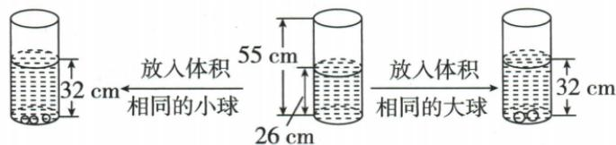

## 讲解

### 是什么

物体或水从一种形状转为另一种时，若无损失、无溢出、密度或体积未变，可用转变前后体积相等列式。直壁圆柱中体积=底面积×高度；底面积不变时，加入完全浸没物体排开的体积与水面升高成比例。

### 怎么来的

同一份水转移后占据的体积不变，两容器底面积不同就需水高相应改变。底面积S固定，水高差Δh形成新增占据体积SΔh，故相同小球每个排水量相同，可用总升高除球数求每个贡献。等体积不要求等高度；不同底面积之间只比较高度会漏掉决定体积的另一因子。

### 什么时候能用

适用于内底面积按题固定、水平放置、无漏水溢水且物体完全浸没。球露出水面、容器截面随高度变或转移损失都会改变方程。量纲须一致：平方厘米×厘米=立方厘米；问容积时不是只回水高。

## 例题

### 水量不变底面积与高度反向变化

> 来源ID Q07-27；第7章一元一次方程；51-100/full.md 第3481–3489行。原答案与解析定位：51-100/full.md 第3491–3495行。

例8 在水平桌面上有甲、乙两个内部呈圆柱形的容器, 内部底面积分别为 $80 \mathrm{~cm}^{2} 、 100 \mathrm{~cm}^{2}$ , 且甲容器装满水, 乙容器是空的. 若将甲容器中的水全部倒入乙容器中, 则乙容器中的水面高度比原先甲容器中的水面高度低了 $8 \mathrm{~cm}$ , 则甲容器的容积为 ( )

A. $1280 \mathrm{~cm}^{3}$

B. $2560 \mathrm{~cm}^{3}$

C.3 $200~\mathrm{cm}^3$

D. $4000 \mathrm{~cm}^{3}$

**原资料答案与解析：**

解析 设甲容器中的水面高度为 $x \mathrm{~cm}$ , 则乙容器中的水面高度为 $(x - 8) \mathrm{~cm}$ .

根据题意得 $80x = 100(x - 8)$ ，解得 $x = 40$ .所以甲容器的容积为 $80\times 40 = 3200(\mathrm{cm}^3)$

答案 C

**展开解析（依据原详解补足理由与步骤）：**

甲装满且全部转入乙，按原题水量不损失、未溢出。设甲水高x厘米，乙x−8厘米，x>8。圆柱水体体积=底面积×水高，所以80x=100(x−8)。展开80x=100x−800，两边减80x加800得20x=800，x=40。甲容积80×40=3200立方厘米，C正确。逐项用容积除甲底面积求甲高，再验乙水高差：A1280给甲16、乙12.8，差3.2；B2560给甲32、乙25.6，差6.4；C3200给40、32，差8；D4000给50、40，差10。只有C满足8厘米。原两容器底面积不同，所以水量相同不意味水高相同。

### 图中球数与水位差反推球体排水量

> 来源ID Q07-30；第7章一元一次方程；51-100/full.md 第3549–3570行。原答案与解析定位：51-100/full.md 第3572–3576行。

例11 如图所示,根据图中给出的信息,解决下列问题:

(1)放入一个小球水面升高 cm, 放入一个大球水面升高 cm.  
(2)如果在只有水的瓶(如图②所示)中放入10个球,要使水面上升到50 cm,应放入大球、小球各多少个?

图①  
图②  
图③

**原资料答案与解析：**

解析 (1)2;3.

详解: 放入 3 个小球水面升高 6 cm, 故放入 1 个小球水面升高 2 cm; 放入 2 个大球水面升高 6 cm, 故放入 1 个大球水面升高 3 cm.

(2)设放入大球x个,则放入小球 $(10-x)$ 个,根据题意,得 $3x+2(10-x)=50-26$ ,解得x=4.所以10-x=6.故应放入4个大球,6个小球.

**展开解析（依据原详解补足理由与步骤）：**

实际原图和PDF95页显示：空球时水高26厘米、瓶高55厘米；3个同体积小球使水面升至32，2个同体积大球也升至32。先扣初始水高，升高都是32−26=6，所以每小球升6/3=2厘米，每大球升6/2=3厘米。55是瓶高度，不是初始水位；目标50低于55，仍未到瓶口。

放10球设大球x个、小球10−x个。目标相对原水位升50−26=24厘米，列3x+2(10−x)=24。展开3x+20−2x=24，得x=4，小球6；升高12+12=24，最终50，球数4+6=10。原图按直壁等截面、球完全浸没且无溢水模型处理；若球露出或截面变化，升高不再简单逐球相加。不能把50直接作升高量。

## 易错

原图55厘米是瓶高，26才是初水位；目标50需升24而不是50。甲容积用甲底面积80乘甲水高40，不用乙底面积100乘甲水高。
