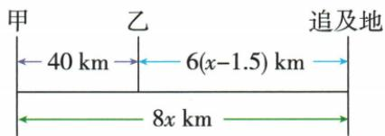
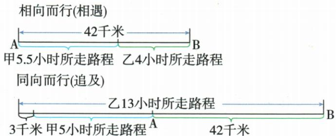

## 讲解

### 是什么

匀速模型中路程=速度×对应时间，单位要配套。同程往返使两段路程相等；相遇时两段路程和等于初距；同向追及时快者路程比慢者多初始领先距离。顺水或顺风地面速度按题为自身速度加流速或风速，逆向为差。

### 怎么来的

速度表示每单位时间的路程，恒速持续t单位时间就累计vt。追及时两人最终位置相同，从各自起点到终点的路程相差原起点距离，因而差程=初距。不同出发时刻使各自实际行驶时间不同；哪个字母代表从谁出发起计时必须清楚。往返同地点之间，虽速度不同但距离同值，这提供方程而非令速度相等。

### 什么时候能用

用于题设速度恒定、路线明确的行程。逆水实际速度须正；追及快者应具足够速度优势。圆周第一次追上一圈时差程是一圈周长，第一次相背相遇时合路程一圈，但多圈问题须另数圈；本章没有独立圆周例题，不能给原直线题添圈数。

### 二元模型补充

第8章两种行程情景共用甲、乙两速度，却各有自己的时间线。相遇给路程和42；同向B到A时乙领先3的最终位置还要连起原起点差42，乙路程=42+甲路程+3。方向与基准先定再列路程和差。

### 已知路程设速度时的时间表达

由s=vt且速度v>0，两边除v得t=s/v。速度设未知量时，时间落在分母，便形成分式方程；同程速度三倍，用时是原1/3。骑车先走半小时而同到达，是骑车时间−汽车时间=1/2小时，不是两时间相等。

### 第13章往返测距的总路程

原激光时间t包含去与返回两段，速度c固定，所求地月单程d。路程速度时间式用于实际整个计时过程，所以总路程2d=ct，再两边除2得d=ct/2。ct本身不能直接当单程，原选项中再次倍增和无依据速度倍数均不成立。要使c和t单位相容；若两段速率不同或计时含等待，不能仍将全过程等同两段同速运动。

## 例题

### 往返水路同程列式求水速

> 来源ID Q07-18；第7章一元一次方程；51-100/full.md 第3197–3197行。原答案与解析定位：51-100/full.md 第3199–3203行。

例1 一艘轮船从甲码头到乙码头顺流行驶用3小时,返程逆流行驶用4小时,已知轮船在静水中的速度为30千米/时,求水流的速度.

**原资料答案与解析：**

解析（直接设未知数）设水流的速度为 x 千米/时，则顺流行驶的速度为 $(x+30)$ 千米/时，逆流行驶的速度为 $(30-x)$ 千米/时，
依题意, 得 $3(x+30)=4(30-x)$ ,
解得 $x=\frac{30}{7}$ .

答:水流的速度为 $\frac{30}{7}$ 千米/时.

**展开解析（依据原详解补足理由与步骤）：**

设水流速度x千米/时，须0≤x<30使逆流仍能到达。顺流速度30+x、逆流30−x；同一码头往返路程相等，故3(30+x)=4(30−x)。展开90+3x=120−4x；两边加4x减90得7x=30，除7得x=30/7。该值介于0、30，合法。顺逆路程均720/7千米，答案水速30/7千米/时。时间不同，不可直接令两个速度相等。

### 间接设飞行时间避免倒数方程

> 来源ID Q07-19；第7章一元一次方程；51-100/full.md 第3207–3207行。原答案与解析定位：51-100/full.md 第3209–3211行。

例2 某架飞机的储油量最多够它在空中飞行 4.6 h, 飞机出航时顺风飞行, 在无风时的速度是 575 km/h, 风速为 25 km/h, 这架飞机最远飞出多少千米就应返回?

**原资料答案与解析：**

解析（间接设未知数）设飞机顺风飞行的时间为 t h. 根据题意得 $(575+25)t=(575-25)(4.6-t)$ ，解得 t=2.2，则 $(575+25)t=600\times2.2=1320$ .

答: 这架飞机最远飞出 1320 千米就应返回.

**展开解析（依据原详解补足理由与步骤）：**

题定总续航4.6小时，无风速575、风速25千米/时，按题意往返地面速度分别600、550。设顺风时间t小时，返程4.6−t小时；两段往返距离相同，600t=550(4.6−t)。右2530−550t，两边加550t得到1150t=2530，除1150得t=2.2；返程2.4小时。最远距离600×2.2=1320千米，也等于550×2.4。直接设距离会出现含倒数的表达，间接设时间保留一次方程。仅按原题恒定速度与固定续航模型解释，不外推真实飞行油耗。

### 追及中两人出发时间不同

> 来源ID Q07-21；第7章一元一次方程；51-100/full.md 第3361–3361行。原答案与解析定位：51-100/full.md 第3363–3380行。

例2 甲、乙两人相距 40 km, 甲先出发 1.5 h 后乙出发, 两人同向而行, 甲在后, 乙在前, 甲的速度是 8 km/h, 乙的速度是 6 km/h. 问: 甲出发几小时后追上乙?

**原资料答案与解析：**

解析 设甲出发 $x\mathrm{h}$ 后追上乙，如图，

由图可得 $8x-6(x-1.5)=40$ ，解得 x=15.5。

答:甲出发15.5 h后追上乙.

**展开解析（依据原详解补足理由与步骤）：**

设甲出发x小时后追上，x≥1.5。甲走8x千米，乙晚出发1.5小时，仅走6(x−1.5)千米；甲后乙前初距40，所以甲路程−乙路程=40。方程8x−6(x−1.5)=40展开8x−6x+9=40；两边减9得2x=31，x=15.5。此时乙走14小时、84千米，甲走124千米，差40；所求从甲出发计时，答案15.5小时。若设从乙出发计时，答案中间量14不能直接回作题问。

### 先行距离形成追及差程

> 来源ID Q07-32；第7章一元一次方程；51-100/full.md 第3636–3636行。原答案与解析定位：51-100/full.md 第3623–3626行。

例1（2024 江苏扬州）《九章算术》是中国古代的数学专著, 是《算经十书》中最重要的一部, 书中第八章内容“方程”里记载了一个有趣的追及问题, 可理解为: 速度快的人每分钟走 100 米, 速度慢的人每分钟走 60 米, 现在速度慢的人先走 100 米, 速度快的人去追他. 则速度快的人追上他需要 \_\_\_\_ 分钟.

**原资料答案与解析：**

例1 解析 设速度快的人需要 x 分钟才能追上速度慢的人，
根据题意可得 $100 + 60x = 100x$ ，解得 x = 2.5.

答案2.5

**展开解析（依据原详解补足理由与步骤）：**

快者开始追时慢者已领先100米。设追x分钟，此后快走100x、慢走60x，追上要求快的路程=先行100+慢随后路程，即100x=100+60x。两边减60x得40x=100，x=2.5分钟。快走250米，慢先行100再走150亦250米。先行100是距离，不要直接加成100分钟。

### 两种行程情景共用两速度建立独立关系

> 来源ID Q08-28；第8章二元一次方程（组）；101-150/full.md 第284–284行。原答案与解析定位：101-150/full.md 第286–306行。

例3 A、B两地相距42千米,甲、乙两人分别从两地相向而行,甲比乙早1.5小时出发,乙出发后,经过4小时,两人相遇;若同向而行(沿B→A方向走),乙比甲早8小时出发,甲出发后,经过5小时,乙超出甲3千米.试求甲、乙的速度.

**原资料答案与解析：**

解析 此题属于相遇和追及的综合题,因为数量关系较复杂,所以可画出示意图(如图所示)帮助理解题意,以便迅速而准确地找出等量关系.

设甲的速度为 $x$ 千米/时，乙的速度为 $y$ 千米/时，依题意，得 $\left\{ \begin{array}{l}5.5x + 4y = 42,\\ 3 + 5x + 42 = 13y, \end{array} \right.$ 解得 $\left\{ \begin{array}{l}x = 4,\\ y = 5. \end{array} \right.$

答:甲、乙的速度分别是4千米/时、5千米/时.

**展开解析（依据原详解补足理由与步骤）：**

设甲速x、乙速y千米/时，均正。相向情景：甲早1.5小时，至相遇甲走5.5小时、乙4小时，两路程和42，所以5.5x+4y=42。同向B到A情景：乙先8小时，甲后再5小时，乙共13小时；图中乙终点在甲前方3千米，乙路程=从B到A42+甲随后5x+额外3，所以13y=45+5x。

第一式乘2得11x+8y=84，第二写−5x+13y=45。前式乘5为55x+40y=420，后乘11为−55x+143y=495；相加183y=915，y=5。回第一式5.5x+20=42，5.5x=22，x=4。核验相遇22+20=42，同向乙65=42+20+3。乙更快而先走，其超前3不等于两人路程只差3；起点差42也要计。

### 同到达出发差对应路程除速度时间差

> 来源ID Q10-10；第10章分式方程；101-150/full.md 第1518–1518行。原答案与解析定位：101-150/full.md 第1520–1524行。

例2 某校组织学生去 9 km 外的郊区游玩,一部分学生骑自行车先走,半小时后,其他学生乘公共汽车出发,结果他们同时到达,已知乘公共汽车的速度是骑自行车速度的 3 倍,求骑自行车的速度和乘公共汽车的速度分别是多少.

**原资料答案与解析：**

解析 设骑自行车的速度为 $x \, km/h$ ，则乘公共汽车的速度为 $3x \, km/h$ ，

根据题意, 得 $\frac{9}{x}-\frac{9}{3x}=\frac{1}{2}$ , 解得 x=12, 经检验, x=12 是原分式方程的解且符合题意, 所以 3x=36.

答:骑自行车的速度是 $12 \, km/h$ , 乘公共汽车的速度是 $36 \, km/h$ .

**展开解析（依据原详解补足理由与步骤）：**

设自行车速度x千米/时，汽车3x，x>0。同路9千米，骑车时间9/x小时，车时间9/(3x)小时。骑车早出发半小时又同时到，所以骑车总时间比车多1/2小时：9/x−9/(3x)=1/2。右第二项化3/x，左6/x=1/2，乘非零2x得12=x。车速36。时间3/4小时与1/4小时，差1/2；速度与分母合法。半小时不能当0.5分钟，且两人的行驶时间并不相同。

### 两车速度三倍同程用时差

> 来源ID Q10-13；第10章分式方程；101-150/full.md 第1564–1564行。原答案与解析定位：101-150/full.md 第1572–1574行。

例1 (2024 云南)某旅行社组织游客从 A 地到 B 地的航天科技馆参观, 已知 A 地到 B 地的路程为 300 千米, 乘坐 C 型车比乘坐 D 型车少用 2 小时, C 型车的平均速度是 D 型车的平均速度的 3 倍, 求 D 型车的平均速度.

**原资料答案与解析：**

例1 解析 设 D 型车的平均速度为 x 千米/时, 则 C 型车的平均速度为 3x 千米/时, 根据题意得 $\frac{300}{3x} = \frac{300}{x} - 2$ , 解得 x = 100. 经检验, x = 100 是原分式方程的解, 且符合题意.

答:D型车的平均速度为100千米/时.

**展开解析（依据原详解补足理由与步骤）：**

设D速x千米/时、C速3x，x>0；两时300/x与300/(3x)=100/x，D比C多2小时，300/x−100/x=2，化200/x=2，两边乘x得200=2x、x=100。D100千米/时，C300，时间3小时与1小时相差2，原方程分母非零且实际合法。原资料标注地区年份照录但未外部认证。

### 激光往返时间必须折半路程

> 来源ID Q13-12；第13章一次函数；101-150/full.md 第3684–3692行。原答案与解析定位：101-150/full.md 第3732–3734行。

例2（2024 广西）激光测距仪 L 发出的激光束以 $3 \times 10^{5}$ km/s 的速度射向目标 M, t s 后测距仪 L 收到 M 反射回的激光束，则 L 到 M 的距离 d (km) 与时间 t (s) 的关系式为 （）

A. $d = \frac{3\times 10^{5}}{2} t$

B. $d = 3 \times 10^{5} t$

C. $d = 2 \times 3 \times 10^{5} t$

D. $d = 3 \times 10^{6} t$

**原资料答案与解析：**

例2 解析 根据 t s 后测距仪 L 收到 M 反射回的激光束可得 $2d = 3 \times 10^{5} t$ ，所以 $d = \frac{3 \times 10^{5}}{2} t$ .

答案 A

**展开解析（依据原详解补足理由与步骤）：**

光速c，测得时间t包括发射到月球与反射回来，两段各为距离d，总路程2d。路程=速度×时间给2d=ct，两边除2得到d=ct/2，A对。B的ct是往返总路程；C把往返又倍增，比例反；D的10c没有题定倍数依据。单位c若用米/秒，t必须秒，d才米；不能一边用分一边速度秒。

## 易错

甲先行1.5小时而乙晚行，时间x与x−1.5分别配其速度。先行距离100米不等于先行100分钟。水速不能大于等于静水船速仍假定船逆向到达。
