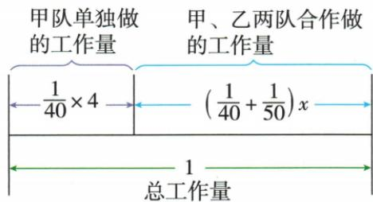

## 讲解

### 判据

工程题先统一总工作量为1，各阶段用各队效率乘实际工作天数。遇方案选择，先满足总量与工期，再比较同等工作量的成本；日费低但效率也低，单看日费不足以证明最优。

### 流程

1. 各独做天数取倒数得效率，合作效率相加。
2. 先做阶段算已做量，剩余=1−已做量，按后续实际效率列式。
3. 列清每队累计工作天数与日历工期，二者不能互换。
4. 费用=各队日费×各队工作天数再相加。
5. 最优问题用总量关系消去一个队天数，说明增加哪队投入会使同工作量费用如何变化。
6. 验所选方案确能排进限期、工程量恰1，再给总费。

## 例题

### 先独做后合做的工作量分块

> 来源ID Q07-22；第7章一元一次方程；51-100/full.md 第3382–3382行。原答案与解析定位：51-100/full.md 第3384–3401行。

例3 一项工程,甲队单独完成需要40天,乙队单独完成需要50天,现甲队单独做4天后两队合作.求甲、乙两队合作多少天才能完成该工程.

**原资料答案与解析：**

解析 设甲、乙两队合作 x 天才能完成该工程, 如图,

由图可得 $\frac{1}{40}\times4+\left(\frac{1}{40}+\frac{1}{50}\right)x=1$ ，解得x=20.

答:甲、乙两队合作20天才能完成该工程.

**展开解析（依据原详解补足理由与步骤）：**

总工程记为1，甲每天完成1/40、乙每天1/50。甲先做4天完成4/40=1/10；合作x天每天完成1/40+1/50=9/200，合作量9x/200。两阶段和1，$1/10+9x/200=1$。两边乘200得20+9x=200，再减20得9x=180，除9得x=20。合作量9/10与先做量1/10相加为1。问合作天数20；总历时24天是另一量。

### 工程方案既检工期又比较单位工作成本

> 来源ID Q07-31；第7章一元一次方程；51-100/full.md 第3582–3590行。原答案与解析定位：51-100/full.md 第3592–3613行。

例12 一项工程,若甲工程队单独做,需20天完成,共需费用3200元;若乙工程队单独做,需30天完成,共需费用3000元.

(1)若由甲、乙两个工程队合做6天后,剩余工程由乙工程队单独完成.

①求乙工程队单独完成剩余工程还要多少天.

②求完成工程所需的总费用是多少元.

(2)若工期要求不超过24天,如何安排施工,可使工程所需的总费用最少?最少是多少?

**原资料答案与解析：**

解析 (1) ① $\left(1 - 6 \times \frac{1}{20} - 6 \times \frac{1}{30}\right) \div \frac{1}{30} = 15$ (天).

答:乙工程队单独完成剩余工程还要15天.

②甲工程队每天的费用为 $\frac{3200}{20}=160$ （元），乙工程队每天的费用为 $\frac{3000}{30}=100$ （元），

$$
160 \times 6 + 100 \times (6 + 15) = 3060 (\text {   元   }).
$$

答: 完成工程所需的总费用是 3060 元.

(2)由(1)知,乙工程队每天费用比甲工程队低,要使完成工程所需的总费用少,则需让乙工程队多做,
当乙工程队做24天时,设甲工程队做x天,则 $\frac{1}{20}x+\frac{1}{30}\times24=1$ ,解得x=4,

∴ 甲工程队做 4 天, 乙工程队做 24 天,

此时费用为 $4 \times 160 + 24 \times 100 = 640 + 2400 = 3040$ （元），

由题易知甲工程队做2天完成的量等于乙工程队做3天完成的量,所以乙工程队做21天,甲工程队做6天也可完成工作,此时所需费用为 $3040-300+320=3060$ (元).

∵3060>3040,∴甲工程队做4天,乙工程队做24天可使工程所需的总费用最少,最少是3040元.

**展开解析（依据原详解补足理由与步骤）：**

（1）甲日效率1/20、乙1/30，合作6天量$6(1/20+1/30)=1/2$。余1/2由乙每天1/30完成，需(1/2)/(1/30)=15天。甲每日成本3200/20=160元、乙3000/30=100元；甲6天、乙6+15=21天，总费160×6+100×21=960+2100=3060元，总工期21天。

（2）原详解只比较一种邻近方案，不足以覆盖全部安排；补齐最优性依据。甲完成全部工程成本3200，乙完成同样总量成本3000，所以按同工作量乙较便宜，这比只比较日费更直接。设乙累计做t天，甲累计做u天，工作量$u/20+t/30=1$。两边乘20得$u+(2/3)t=20$，所以$u=20-(2/3)t$。总费$160u+100t=3200-(20/3)t$，t每增加一天费用少20/3元；工期不超过24天限制乙累计天数t≤24，因此要尽可能取t=24，u=4。可让两队同时做前4天，随后乙独做20天，实际历时24天，工作量4/20+24/30=1，总费640+2400=3040元。其他t≤24方案费用不会更低。工期是日历时间，不能把4+24当28天；按原题恒定效率、按工作天收费且两队可同时开工模型成立。

### 两人先后打扫共三小时

> 来源ID Q07-33；第7章一元一次方程；51-100/full.md 第3640–3640行。原答案与解析定位：51-100/full.md 第3628–3632行。

例2 (2024 陕西) 星期天, 妈妈做饭, 小峰和爸爸进行一次家庭卫生大扫除. 根据这次大扫除的任务量, 若小峰单独完成, 需 $4 \mathrm{~h}$ ; 若爸爸单独完成, 需 $2 \mathrm{~h}$ . 当天, 小峰先单独打扫了一段时间后, 去参加篮球训练, 接着由爸爸单独完成了剩余的打扫任务. 小峰和爸爸这次一共打扫了 $3 \mathrm{~h}$ , 求这次小峰打扫了多长时间.

**原资料答案与解析：**

例2 解析 设这次小峰打扫了 x h, 则爸爸打扫了 $(3-x)$ h, 根据题意得 $\frac{x}{4} + \frac{3-x}{2} = 1$ ,

解得 $x = 2$

答:这次小峰打扫了2 h.

**展开解析（依据原详解补足理由与步骤）：**

总任务记1，小峰效率1/4任务每小时、爸爸1/2。设小峰x小时，爸爸3−x小时，两人先后完成的量和1，列x/4+(3−x)/2=1。两边乘4得x+2(3−x)=4，展开x+6−2x=4，合−x=−2，x=2。爸爸1小时，各完成1/2，总和1；总历时2+1=3小时，符合0≤x≤3。不是两人合做3小时，不能直接用效率和乘3。

## 易错

原最优题仅比一个邻近方案不能排除其他方案；正文已补全部允许天数的成本方向。甲4天乙24天可以同时开工，日历不是28天。
