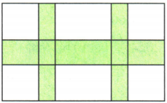
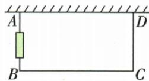

## 讲解

### 判据

矩形长宽都随同一未知量变化，面积常形成二次式；围栏题还要从周长关系表达另一边，彩条题优先用剩余面积。

### 流程

1. 看原图和条件确定未知边、单位、各段份数。
2. 从正边长、墙长、条宽等写允许范围。
3. 分别表示长宽；剪角每边去两端，门不耗网长度需补回。
4. 依据面积=长×宽列方程；条带并集用补集或明确扣重叠。
5. 完整展开移项求全部根，再按第2步范围筛。
6. 回查面积和原长度，答题问的边而非辅助边。

## 例题

### 剪角折盒按底面积列式筛长度

> 来源ID Q09-22；第9章一元二次方程；101-150/full.md 第1048–1048行。原答案与解析定位：101-150/full.md 第1050–1062行。

例 有一块长为 80 cm, 宽为 60 cm 的长方形薄钢片, 在四个角上截去四个相同的小正方形, 然后做成底面积为 $1500 \, cm^{2}$ 的无盖的长方体盒子, 求截去的小正方形的边长.

**原资料答案与解析：**

解析 设截去的小正方形的边长为 $x \mathrm{~cm}$ , 依题意,

得 $(80-2x)(60-2x)=1\ 500$ ,

整理, 得 $x^{2}-70x+825=0$ ,

解得 $x_{1}=55, x_{2}=15.$

当 x=55 时, 80-2x=-30<0, 60-2x=-50<0, 不符合题意, 舍去; 当 x=15 时, 80-2x=50>0, 60-2x=30>0, 符合题意, 所以 x=15.

答:截去的小正方形的边长为15 cm.

注意 本题易忽视长方体底面的长、宽均为正数这一实际情境的限制条件.

**展开解析（依据原详解补足理由与步骤）：**

设剪角边x厘米，也是盒高。沿80边两端各去x，底长80−2x；沿60边底宽60−2x。正底边要求x>0且x<30。底面积给(80−2x)(60−2x)=1500；分配律展开4800−160x−120x+4x²=1500，两边减1500得4x²−280x+3300=0，再除4得x²−70x+825=0。825=55×15且55+15=70，分解(x−55)(x−15)=0，根55或15。55使底宽负，排除；15给底50×30=1500，合法。答盒高15厘米。用的是底面积不是侧面积或体积。

### 彩条求宽用补集面积避免重叠

> 来源ID Q09-24；第9章一元二次方程；101-150/full.md 第1138–1140行。原答案与解析定位：101-150/full.md 第1142–1144行。

例2 如图,长 $20 \, m$ , 宽 $12 \, m$ 的图案中有一横两竖的彩条, 横彩条与竖彩条的宽度比为 3:2, 若这三条彩条覆盖的总面积是 $96 \, m^{2}$ , 求横、竖彩条的宽度.

**原资料答案与解析：**

解析 设横彩条的宽度是 $3x \, m$ ，则竖彩条的宽度是 $2x \, m$ ，根据题意得 $(20-2 \times 2x)(12-3x) = 20 \times 12 - 96$ ，整理得 $x^{2} - 9x + 8 = 0$ ，解得 $x_{1} = 1, x_{2} = 8$ （不符合题意，舍去），∴ $3x = 3 \times 1 = 3, 2x = 2 \times 1 = 2$ .

答:横彩条的宽度是3 m, 竖彩条的宽度是2 m.

**展开解析（依据原详解补足理由与步骤）：**

横竖宽比3:2，设横3x米、每竖2x米。原图一横两竖，扣除竖条总宽4x和横条高3x，剩余白区可平移拼成(20−4x)乘(12−3x)的长方形，总白面积240−96=144。等式展开240−60x−48x+12x²=144，减144得12x²−108x+96=0，除12得x²−9x+8=0，分解(x−1)(x−8)=0。必须x>0、20−4x>0、12−3x>0，合为0<x<4，故8非法，取1，横3米、竖2米。原彩条并集面积60+48−12=96，其中两交叉区总12不能计两遍。

### 靠墙围栏有门与墙长上限同时筛根

> 来源ID Q09-29；第9章一元二次方程；101-150/full.md 第1233–1243行。原答案与解析定位：101-150/full.md 第1195–1201行。

例3 (2024 内蒙古通辽) 如图, 小程的爸爸用一段 $10 \mathrm{~m}$ 长的铁丝网围成一个一边靠墙 (墙长 $5.5 \mathrm{~m}$ ) 的矩形鸭舍, 其面积为 $15 \mathrm{~m}^{2}$ , 在鸭舍侧面中间位置留一个 $1 \mathrm{~m}$ 宽的门 (由其他材料制成), 则 $BC$ 长为 ( )

A.5 m 或 6 m

B.2.5 m 或 3 m

C.5 m

D.3 m

**原资料答案与解析：**

例3 解析 设 BC 长为 $x \, m$ ，则 AB 的长为 $\frac{1}{2}(10+1-x) \, \text{m}$ ，

根据题意得 $\frac{1}{2}(10+1-x)x=15$ ,
解得 x=5 或 x=6>5.5(舍去).
∴ BC 长为 5 m.

答案C

**展开解析（依据原详解补足理由与步骤）：**

设靠墙方向BC=x米，与墙垂直AB=h米。网只围其余三边，门1米不用铁丝，故2h+x−1=10，得h=(11−x)/2。面积hx=15，代入x(11−x)/2=15；乘2移项x²−11x+30=0，分解(x−5)(x−6)=0。形式根5或6，但靠墙边不能超过墙长5.5米，6非法，5合法，h=3米，网2×3+5−1=10、面积15，选C。A保留越墙6；B的2.5、3不是BC，前者对应被舍6的另一边，后者是合法图的AB；D把AB=3答成BC，都错。

## 易错

剪角55虽然代面积乘积也1500，负边没有几何意义；墙长5.5限制靠墙6不能用。
