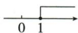
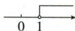
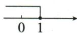
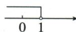

## 错法

范围求对，却把x≥1画空心向右或实心向左；组−1<x≤3画左实右空。只看线长和边界数忘符号语义。

## 正解

先拆三个核对：边界数字、允许等值否、比较方向。≥1含1并向右；−1<x≤3左排−1空、右收3实，取中间。分别读每个选项表示的实际范围再与原解对照，不靠图形外观猜。

## 例题

### 数轴单不等式四选项逐图核端点方向

> 来源ID Q11-13；第11章不等式（组）；101-150/full.md 第1998–2012行。原答案与解析定位：101-150/full.md 第1984–1988行。

例1 (2024 湖北) 不等式 $x + 1 \geqslant 2$ 的解集在数轴上表示正确的是

( )

  
A

  
B

  
C

  
D

**原资料答案与解析：**

例1 解析 $\because x+1\geqslant2,\therefore x\geqslant1.$ 解集在数轴上的表示如图所示.

答案A

**展开解析（依据原详解补足理由与步骤）：**

原x+1≥2两边减1得x≥1。A在1实心且向右，符合，选A；B在1空心向右表示x>1，漏等号；C在1实心向左表示x≤1，方向错；D在1空心向左表示x<1，既漏等号又反方向。边界数字、端点取舍、向左向右是三个独立检查。

### 两条范围的公共部分数轴逐图说明

> 来源ID Q11-17；第11章不等式（组）；101-150/full.md 第2111–2123行。原答案与解析定位：101-150/full.md 第2125–2129行。

例1 不等式组 $\left\{ \begin{array}{l} x + 1 > 0, \\ \frac{3x + 1}{2} \geqslant 2x - 1 \end{array} \right.$ 的解集在数轴上表示正确的是 ( )

  
A

  
B

  
C

  
D

**原资料答案与解析：**

解析 $\left\{\begin{aligned}x+1&>0①,\\ \frac{3x+1}{2}&\geqslant2x-1②,\end{aligned}\right.$ 由①得 x>-1，由②得 $x\leqslant3$ 。将不等式组的解集在数轴上表示，如图所示。

答案 B

**展开解析（依据原详解补足理由与步骤）：**

第一x+1>0给x>−1。第二(3x+1)/2≥2x−1乘正2得3x+1≥4x−2，移项3≥x，即x≤3。交集−1<x≤3，左空右实，选B。A绿色从3向右，错误取同大右段；C绿色在−1至3但左实右空，两个端点取舍反；D绿色在−1左侧，错误取小段。B完整表达大于−1且不大于3。

### 解集二到三四图逐项判断

> 来源ID Q11-22；第11章不等式（组）；101-150/full.md 第2220–2232行。原答案与解析定位：101-150/full.md 第2202–2204行。

例1（2024四川遂宁）不等式组 $\left\{ \begin{array}{l}3x - 2 <   2x + 1,\\ x\geqslant 2 \end{array} \right.$ 的解集在数轴上表示为 （）

  
A

  
B

  
C

  
D

**原资料答案与解析：**

例1 解析 不等式组的解集为 2 $\leqslant x<3$ , 观察选项, 只有 B 符合.

答案B

**展开解析（依据原详解补足理由与步骤）：**

首3x−2<2x+1移项得x<3，次x≥2，交集2≤x<3。A绿色在1到2实心表示1≤x≤2，下界、上界均不符；B在2实心3空心且绿色中间，正确；C绿色在3右侧，且3空，表示x>3方向错；D绿色在2空3实中间，表示2<x≤3，端点反。故B。图上长线各代表单条范围，绿色共同部分才是组解。
