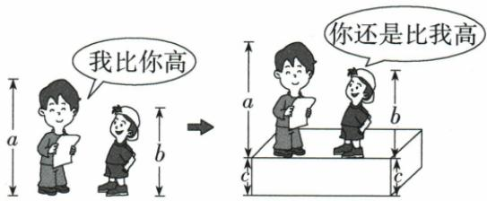
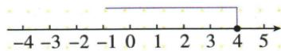

## 讲解

### 是什么

两边同加减一个数或有定义的相同式，方向不变；同乘或除同一正数方向不变，同乘或除同一负数方向反。除数不能0，同乘0只能得到两边同0，严格大小信息消失。交换左右时也要将>写<，描述的是同一比较。

### 怎么来的

a>b说明差a−b>0。加相同c后差(a+c)−(b+c)=a−b仍正，所以同加减保方向。乘c后差ac−bc=c(a−b)：c正乘正仍正，保>；c负乘正为负，反<。除c是乘1/c，倒数同号，适用同一理由但先须c≠0。等式相等两边乘负仍相等，没有方向问题，不可机械把等式步骤套来。

### 什么时候能用

乘除字母表达必须知道正负和零情况，未给时从前提提取或分情况。原ac²>bc²已经排c=0，使c²正；但只知a<b并未排c=0，乘c²只能普遍保非严格≤。不等式传递性a>b、b>c给a>c，来自数轴左右次序。

## 例题

### 同加同减正除与负乘的方向

> 来源ID Q11-03；第11章不等式（组）；101-150/full.md 第1706–1711行。原答案与解析定位：101-150/full.md 第1713–1715行。

例2 设a>b，用“<”或“>”填空：（1）a+2 ___ b+2；（2）a−3 ___ b−3；（3）−4a ___ −4b；（4）a/2 ___ b/2。

**原资料答案与解析：**

答案 (1) > (2) > (3) <

(4) >

**展开解析（依据原详解补足理由与步骤）：**

（1）两边同加2，保持>，a+2>b+2。（2）同减3，仍a−3>b−3。原提取中两待比较式之间被识别为乘点，正文按原填空与答案恢复为比较空。（3）乘负4需反向，−4a<−4b。（4）除正2保持，a/2>b/2。只有乘除负数引起反向；加减负数仍是平移不改大小。

### 字母乘除先查隐含零与正负条件

> 来源ID Q11-06；第11章不等式（组）；101-150/full.md 第1759–1764行。原答案与解析定位：101-150/full.md 第1766–1770行。

# 例3 判断正误.

(1) 若 $ac^2 > bc^2$ ，则 $a > b$ .  
(2) 若 $ab > c$ ，则 $a > \frac{c}{b}$ .  
(3) 若 $a - b > a$ ，则 $b > 0$ .  
(4) 若 $a < b$ ，则 $ac^2 < bc^2$ .

**原资料答案与解析：**

解析（1）此题易知 $c \neq 0$ ，则 $c^2 > 0$ ，正确。（2）当 $b < 0$ 时， $a < \frac{c}{b}$ ，所以不正确。

(3)不等式两边同时减 $a$ , 得 $-b > 0$ , 再令不等式两边同乘-1, 不等号的方向改变, 即 $b < 0$ , 所以不正确. (4)当 $c = 0$ 时, $ac^2 = bc^2$ , 所以不正确.

答案 (1)√ (2)× (3)× (4)×

**展开解析（依据原详解补足理由与步骤）：**

（1）ac²>bc²的前提若c=0便成0>0不成立，因此前提已排c=0；于是c²>0，可除正c²推出a>b，正确。（2）ab>c未给b符号，b>0才推出a>c/b；b<0反为a<c/b，b=0还不能除，所以原无条件结论错。（3）a−b>a两边减a得−b>0，乘−1反向b<0，原b>0错。（4）a<b未排c=0，乘c²可为0，得到ac²=bc²而非严格小于；只能普遍推出ac²≤bc²，c≠0才严格<，故原结论错。

### 弱下界不能推出更强的大小关系

> 来源ID Q11-07；第11章不等式（组）；101-150/full.md 第1790–1798行。原答案与解析定位：101-150/full.md 第1780–1782行。

例1 (2024 江苏苏州) 若 a > b - 1，则下列结论一定正确的是（）

A. $a+1<b$

B.a-1<b

C.a>b

D. $a+1>b$

**原资料答案与解析：**

例1 解析 a > b - 1, 不等式两边同时加 1 可得 $a + 1 > b$ , 故 A 不合题意, D 符合题意, 根据 a > b - 1, 得不到 a - 1 < b, a > b, 故 B、C 不符合题意, 故选 D.

答案 D

**展开解析（依据原详解补足理由与步骤）：**

前提a>b−1两边加1得a+1>b，D一定对，A与此相反必错。B的a−1<b等价a<b+1，是上界，而前提仅下界，没限制a不能更大，不能保证。C的a>b要求比b−1更强的下界，前提允许b−1<a≤b，所以不能保证。选D。判断“一定”必须对所有满足前提的值成立，不能把常见情形当必然。

### 身高同上台阶的数学原理各项区分

> 来源ID Q11-08；第11章不等式（组）；101-150/full.md 第1800–1824行。原答案与解析定位：101-150/full.md 第1784–1786行。

例2 (2024 吉林长春)不等关系在生活中广泛存在.如图,a、b 分别表示两位同学的身高,c 表示台阶的高度.图中两人的对话体现的数学原理是 ( )

A. 若 $a > b$ ，则 $a + c > b + c$

B. 若 $a > b, b > c$ ，则 $a > c$

C. 若 $a > b, c > 0$ ，则 $ac > bc$

D. 若 $a > b, c > 0$ ，则 $\frac{a}{c} > \frac{b}{c}$

**原资料答案与解析：**

例2 解析 由题意得 a > b, $a + c > b + c$ , ∴ 图中两人的对话体现的数学原理是若 a > b, 则 $a + c > b + c$ .

答案A

**展开解析（依据原详解补足理由与步骤）：**

原图较高者a>较矮者b，两人同上高c的台阶，新高度a+c与b+c，差仍a−b，所以A同加c保持>正确。B传递性涉及第三个要比较的高度，与图“同加台阶”不是对应关系；C同乘c、D同除c是比例缩放而非抬高同量，也不对应。B、C、D在各自所列条件下是成立的性质，但本题问图体现哪条，不能把正确性质一概当正确选项。

### 解含常数分母一次不等式并画闭端点

> 来源ID Q11-09；第11章不等式（组）；101-150/full.md 第1892–1893行。原答案与解析定位：101-150/full.md 第1895–1897行。

例 解不等式 $\frac{3x-2}{5}\geqslant\frac{2x+1}{3}-1$ ，并
把解集在数轴上表示出来.

**原资料答案与解析：**

解析 去分母, 得 $3(3x-2) \geqslant 5(2x+1) - 15$ . 去括号, 得 $9x-6 \geqslant 10x+5 - 15$ . 移项, 得 $9x-10x \geqslant 5-15+6$ . 合并同类项, 得 $-x \geqslant -4$ . 系数化为 1, 得 $x \leqslant 4$ . 这个不等式的解集在数轴上的表示如图所示:

**展开解析（依据原详解补足理由与步骤）：**

分母5、3固定正，取正公倍数15两边同乘，不变方向：3(3x−2)≥5(2x+1)−15。按分配律9x−6≥10x+5−15=10x−10；减10x并加6得−x≥−4。除负1方向反为x≤4。数轴4画实心表示含4，向左表示更小。去分母右常数−1也乘15，不能仍写−1。

## 易错

负数**加减**不反向，只有负数乘除反；a−b>a先减a再除−1，结论b<0。不能未查符号就从ab>c除b。
