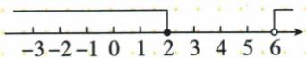
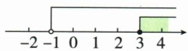
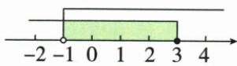
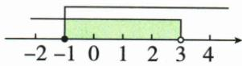
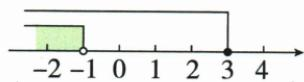
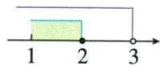
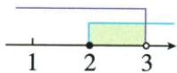
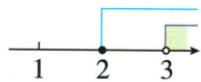
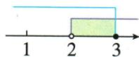

## 讲解

### 判据

两条或多条同一未知量范围要求同时成立，先各自解，再按公共范围判断。上下界次序与端点严格性都影响是否有解。

### 流程

1. 每条按一次不等式解法独立解，不能交叉移项把两式混成一式。
2. 将每条范围标数轴不同高度或写清上下界。
3. 同下界取更大，同上界取更小，异向看能否夹中间。
4. 相同端点要分别检查是否均允许，只有都闭才可留单点。
5. 写公共解集，必要时整数再筛；空交集明确无解。

## 例题

### 两条解集不相交故整组无解

> 来源ID Q11-16；第11章不等式（组）；101-150/full.md 第2083–2087行。原答案与解析定位：101-150/full.md 第2089–2097行。

例 解不等式组：

$$
\left\{ \begin{array}{l} 2 x + 3 <   3 (x - 1), \\ 1 \geqslant \frac {x + 1}{3}. \end{array} \right. \tag {①}
$$

**原资料答案与解析：**

解析 解不等式①, 得 x > 6;

解不等式②, 得 $x \leqslant 2$ .

把不等式①②的解集在数轴上表示出来,如图所示.

这两个不等式的解集没有公共部分,所以原不等式组无解.

**展开解析（依据原详解补足理由与步骤）：**

第一式2x+3<3(x−1)=3x−3，减2x再加3得6<x即x>6。第二式1≥(x+1)/3乘正3得3≥x+1，即x≤2。公共值需同时>6又≤2，矛盾，不存在。数轴两段无重叠，原组无解；不是任选一段或把两段合并为解。

### 两条范围的公共部分数轴逐图说明

> 来源ID Q11-17；第11章不等式（组）；101-150/full.md 第2111–2123行。原答案与解析定位：101-150/full.md 第2125–2129行。

例1 不等式组 $\left\{ \begin{array}{l} x + 1 > 0, \\ \frac{3x + 1}{2} \geqslant 2x - 1 \end{array} \right.$ 的解集在数轴上表示正确的是 ( )

  
A

  
B

  
C

  
D

**原资料答案与解析：**

解析 $\left\{\begin{aligned}x+1&>0①,\\ \frac{3x+1}{2}&\geqslant2x-1②,\end{aligned}\right.$ 由①得 x>-1，由②得 $x\leqslant3$ 。将不等式组的解集在数轴上表示，如图所示。

答案 B

**展开解析（依据原详解补足理由与步骤）：**

第一x+1>0给x>−1。第二(3x+1)/2≥2x−1乘正2得3x+1≥4x−2，移项3≥x，即x≤3。交集−1<x≤3，左空右实，选B。A绿色从3向右，错误取同大右段；C绿色在−1至3但左实右空，两个端点取舍反；D绿色在−1左侧，错误取小段。B完整表达大于−1且不大于3。

### 解集二到三四图逐项判断

> 来源ID Q11-22；第11章不等式（组）；101-150/full.md 第2220–2232行。原答案与解析定位：101-150/full.md 第2202–2204行。

例1（2024四川遂宁）不等式组 $\left\{ \begin{array}{l}3x - 2 <   2x + 1,\\ x\geqslant 2 \end{array} \right.$ 的解集在数轴上表示为 （）

  
A

  
B

  
C

  
D

**原资料答案与解析：**

例1 解析 不等式组的解集为 2 $\leqslant x<3$ , 观察选项, 只有 B 符合.

答案B

**展开解析（依据原详解补足理由与步骤）：**

首3x−2<2x+1移项得x<3，次x≥2，交集2≤x<3。A绿色在1到2实心表示1≤x≤2，下界、上界均不符；B在2实心3空心且绿色中间，正确；C绿色在3右侧，且3空，表示x>3方向错；D绿色在2空3实中间，表示2<x≤3，端点反。故B。图上长线各代表单条范围，绿色共同部分才是组解。

### 不等式组所有整数解与求和

> 来源ID Q11-24；第11章不等式（组）；101-150/full.md 第2248–2248行。原答案与解析定位：101-150/full.md 第2216–2216行。

例3（2024江苏扬州）解不等式组 $\left\{ \begin{array}{l} 2x - 6 \leqslant 0, \\ x < \frac{4x - 1}{2}, \end{array} \right.$ 并求出它的所有整数解的和.

**原资料答案与解析：**

例3 解析 解不等式 $2x-6 \leqslant 0$ ，得 $x \leqslant 3$ ，解不等式 $x < \frac{4x-1}{2}$ ，得 $x > \frac{1}{2}$ ，则不等式组的解集为 $\frac{1}{2} < x \leqslant 3$ ，∴ 不等式组的所有整数解为 1，2,3，所有整数解的和为 $1+2+3=6$ .

**展开解析（依据原详解补足理由与步骤）：**

首2x−6≤0得x≤3；第二x<(4x−1)/2乘正2得2x<4x−1，移项1<2x，除2得x>1/2。交集1/2<x≤3，整数1、2、3，全都原两条成立，求和6。0不大于1/2、4超过3均不允许；题求所有整数，不再额外限制正，但此范围恰全部为正。

## 易错

x>6且x≤2无解，不取两段的并集；2≤x<3是有解但只有整数2，空实不能忽略。
