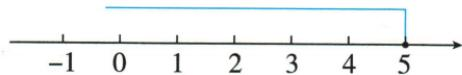

## 讲解

### 判据

问正整数、非负整数、全部整数及求和，先解完整实数范围，再和指定整数类别取交。范围有限时按端点逐一列齐。

### 流程

1. 解不等式或每条组式，保留严格符号。
2. 求公共区间；额外整数限定再加入。
3. 正整数从1起，非负从0起，全部整数含负。
4. 在区间内完整列出整数，端点整数按开闭收舍。
5. 用首末候选与邻近排除值核边界，再按题计数或求和。

## 例题

### 全部解集与正整数筛选分两步

> 来源ID Q11-11；第11章不等式（组）；101-150/full.md 第1952–1952行。原答案与解析定位：101-150/full.md 第1954–1960行。

例2 求不等式 $\frac{1 + x}{2} \geqslant \frac{2x - 1}{3}$ 的正整数解.

**原资料答案与解析：**

解析 去分母, 得 $3(1+x) \geqslant 2(2x-1)$ . 去括号, 得 $3+3x \geqslant 4x-2$ .

移项, 得 $3x - 4x \geqslant -2 - 3$ . 合并同类项, 得 $-x \geqslant -5$ . 系数化为 1, 得 $x \leqslant 5$ .

将解集表示在数轴上,如图所示,由图可以看出,该不等式的正整数解为1,2,3,4,5.

**展开解析（依据原详解补足理由与步骤）：**

乘正6得3(1+x)≥2(2x−1)，展开3+3x≥4x−2，减4x再减3得−x≥−5，除负1反向得x≤5。正整数限定x为1、2、3……，与≤5取交得1、2、3、4、5。0和负数虽然也满足原不等式，却不是正整数，不收；5满足等号应收。

### 正整数解原上界为二

> 来源ID Q11-14；第11章不等式（组）；101-150/full.md 第2016–2016行。原答案与解析定位：101-150/full.md 第1990–1990行。

例2 (2024 江苏盐城) 求不等式 $\frac{1 + x}{3} \geqslant x - 1$ 的正整数解.

**原资料答案与解析：**

例2 解析 去分母, 得 $1 + x \geqslant 3(x - 1)$ , 去括号, 得 $1 + x \geqslant 3x - 3$ , 移项, 得 $x - 3x \geqslant -3 - 1$ , 合并同类项, 得 $-2x \geqslant -4$ , 系数化为 1, 得 $x \leqslant 2$ , ∴ 不等式的正整数解为 1, 2.

**展开解析（依据原详解补足理由与步骤）：**

原(1+x)/3≥x−1乘正3得1+x≥3x−3；减3x减1得−2x≥−4；除负2方向反，x≤2。正整数只有1、2，1代原左2/3≥0，2代左1≥1，均成立。0满足不等式但不属正整数；3原左4/3不≥2，排。

### 固定题数两种分值与获奖整数范围

> 来源ID Q11-19；第11章不等式（组）；101-150/full.md 第2155–2158行。原答案与解析定位：101-150/full.md 第2160–2168行。

例3 在某市举行的中学生安全知识竞赛中共有 20 道题,答对一题得 5 分,答错或不答都扣 3 分.

(1) 小李得了 60 分, 那么小李答对了多少道题?  
(2) 小王获得二等奖 (75\~85 分, 包括 75 和 85), 请你算算小王答对了几道题.

**原资料答案与解析：**

解析（1）设小李答对了 $x$ 道题，由题意得 $5x - 3(20 - x) = 60$ ，解得 $x = 15$

答: 小李答对了 15 道题.

(2)设小王答对了 $y$ 道题,由题意得 $75 \leqslant 5y - 3(20 - y) \leqslant 85$ , 解得 $16\frac{7}{8} \leqslant y \leqslant 18\frac{1}{8}$ ,

因为 y 为非负整数, 所以 y 取 17 或 18.

答: 小王答对了 17 道题或 18 道题.

**展开解析（依据原详解补足理由与步骤）：**

（1）答对x道，其他20−x道都扣3，无需区分错与不答。总分5x−3(20−x)=8x−60=60，得8x=120、x=15，错或空5道，分75−15=60。（2）答对y道，75≤8y−60≤85；三段加60得135≤8y≤145，除正8得135/8≤y≤145/8，即16又7/8到18又1/8。y整数且0≤y≤20，只17或18，对应分76或84，均在75到85含端点范围。

### 不等式组所有整数解与求和

> 来源ID Q11-24；第11章不等式（组）；101-150/full.md 第2248–2248行。原答案与解析定位：101-150/full.md 第2216–2216行。

例3（2024江苏扬州）解不等式组 $\left\{ \begin{array}{l} 2x - 6 \leqslant 0, \\ x < \frac{4x - 1}{2}, \end{array} \right.$ 并求出它的所有整数解的和.

**原资料答案与解析：**

例3 解析 解不等式 $2x-6 \leqslant 0$ ，得 $x \leqslant 3$ ，解不等式 $x < \frac{4x-1}{2}$ ，得 $x > \frac{1}{2}$ ，则不等式组的解集为 $\frac{1}{2} < x \leqslant 3$ ，∴ 不等式组的所有整数解为 1，2,3，所有整数解的和为 $1+2+3=6$ .

**展开解析（依据原详解补足理由与步骤）：**

首2x−6≤0得x≤3；第二x<(4x−1)/2乘正2得2x<4x−1，移项1<2x，除2得x>1/2。交集1/2<x≤3，整数1、2、3，全都原两条成立，求和6。0不大于1/2、4超过3均不允许；题求所有整数，不再额外限制正，但此范围恰全部为正。

## 易错

x≤5的正整数不含0；1/2<x≤3仅1、2、3，求和6，不能把上界外4也加。
