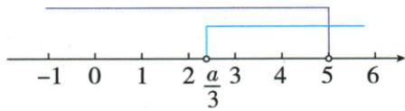

## 讲解

### 判据

上界固定、下界含参数且恰几个整数，先定最大整数，往下数要求保住的最后一个，再排紧邻的下一整数。两项条件的等号由原开闭端决定。

### 流程

1. 解到参数下界<x<固定上界等范围。
2. 确定最大整数并数出恰定个数的整数名单。
3. 保最后一个合法整数，按严格下界写其必须大于下界。
4. 排更小邻整数，写它必须不大于下界。
5. 取两条件交集，逐个核参数边界的实际整数名单。
6. 至少几个只要求保足数量，恰几个还须排额外整数。

## 例题

### 恰两个整数解参数端点严格程度

> 来源ID Q11-21；第11章不等式（组）；101-150/full.md 第2182–2182行。原答案与解析定位：101-150/full.md 第2184–2198行。

例5 如果关于 x 的不等式组 $\left\{\begin{aligned}\frac{2x-1}{3}<3①,\\3x-a>0②\end{aligned}\right.$ 只有两个整数解, 求 a 的取值范围.

**原资料答案与解析：**

解析 解不等式①, 得 x<5, 解不等式②, 得 $x>\frac{a}{3}$ , 所以不等式组的解集是 $\frac{a}{3}<x<5$ .

因为不等式组只有两个整数解,所以这两个整数解为3和4.

不等式组的解集在数轴上的表示如图所示.

所以 $\left\{\begin{aligned}\frac{a}{3}&\geqslant2,\\ \frac{a}{3}&<3,\end{aligned}\right.$ 解得 $6\leqslant a<9.$

**展开解析（依据原详解补足理由与步骤）：**

第一(2x−1)/3<3乘正3得2x−1<9，移除得x<5；第二3x−a>0得x>a/3。整数上界最大4，恰两个意味着4、3允许，2不允许。3允许要求a/3<3；2不允许因x>a/3为严格下界，要求2≤a/3。合2≤a/3<3，乘正3得6≤a<9。a=6时下界2被排，正好3、4；a=9时3被排只4，不能收。

## 易错

原两整数3、4要求2≤a/3<3，a=6收、a=9不收；把两端都严格会漏6。
