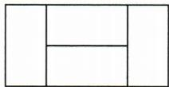

## 讲解

### 判据

图中同样小长方形横竖拼接，设小长宽，先找同一整边由不同数量的小边拼成的关系；题给外周长再构造另一条关系。外周长沿外轮廓，不把内部线当边。

### 流程

1. 原图确认同形同大、方向和块数；设小宽x、长y并写正数条件。
2. 用共同高或共同宽的两种分段求相等边长关系。
3. 读出大图的一横边与一竖边，和等给定半周长。
4. 联立求小长宽，回核大图周长与拼接边。
5. 题问小周长则用2(x+y)，不是两变量本身或大周长。

## 例题

### 拼接图边长等式与半周长

> 来源ID Q08-30；第8章二元一次方程（组）；101-150/full.md 第330–332行。原答案与解析定位：101-150/full.md 第334–338行。

例5 如图, 四个形状、大小一样的小长方形拼成一个大长方形, 如果大长方形的周长为 12 cm, 求小长方形的周长.

**原资料答案与解析：**

解析 设小长方形的宽为 $x \mathrm{~cm}$ , 长为 $y \mathrm{~cm}$ ,

由题意得 $\left\{\begin{aligned}&2x=y,\\ &y+y+2x=12\div2,\end{aligned}\right.$ 解得 $\left\{\begin{aligned}&x=1,\\ &y=2.\end{aligned}\right.$ 则小长方形的周长为 $2+1+2+1=6(\text{cm})$ .

答: 小长方形的周长为 $6 \, cm$ .

**展开解析（依据原详解补足理由与步骤）：**

原图四个同样小长方形，两侧竖放，中间两个横放叠起。设小宽x、长y厘米且y>x>0；整块竖高两侧为y，中间叠两个宽为2x，必须2x=y。整块横长两侧各x加中间y，为y+2x；高y，周长2[(y+2x)+y]=12，所以y+y+2x=6。代y=2x得2x+2x+2x=6，x=1、y=2，小周长2(x+y)=6厘米。核验大图宽4、高2，周长12。周长不是四块小周长之和，内拼接边不算外轮廓。

## 易错

中间叠两宽，竖高是2x不是2y。外周长不等四个小周长之和；算出x=1、y=2后仍需回小周长6厘米。
