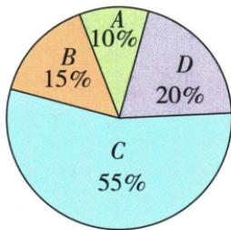

## 错法

两班不同人数仍(78+82)/2，四水价直接均2.75，篮球90/80等权85或倒权84。

## 正解

以真实记录份数或原评分权为依据：班总7180除90约79.8，销售份额平均2.25，评分60/40综合86。每个乘项与权一一对应，权和正并核合数，平均偏向权较大值。

## 例题

### 两班五十人七十八四十人八十二合平均七九点八

> 来源ID Q30-01；第30章数据的分析；351-377/full.md 第853–855行。原答案与解析定位：351-377/full.md 第857–859行。

例1 在一次数学测验中,八年级

(1)(2)两班的平均成绩分别为78分、82分,其中(1)班有50人,(2)班有40人,问:两班的平均成绩是多少?

**原资料答案与解析：**

解析 两班的平均成绩是 $\frac{78\times50+82\times40}{50+40}=\frac{7180}{90}\approx79.8$ (分).

注意 因为（1）班的人数是50，（2）班的人数是40，所以两班的平均成绩不等于78分和82分的算术平均数，要用加权平均数计算.

**展开解析（依据原详解补足理由与步骤）：**

合班总人数50+40=90；(1)班总分78×50=3900，(2)班82×40=3280，总7180。合平均7180/90=718/9≈79.8分。直接(78+82)/2=80把两班当相同人数，忽略人数更多且均分更低的一班所占比重。检查79.8在78与82之间且略低80，符合权重。

### 矿泉水四单价按销售占比权平均二点二五逐项C

> 来源ID Q30-04；第30章数据的分析；351-377/full.md 第955–963行。原答案与解析定位：351-377/full.md 第965–980行。

例1 某超市销售 A, B, C, D 四种矿泉水, 它们的单价依次是 5 元、3 元、2 元、1 元. 某天的销售情况如图所示, 则这天销售的矿泉水的平均单价是 ( )

A.1.95元

B.2.15 元

C.2.25元

D.2.75元

**原资料答案与解析：**

解析 这天销售的矿泉水的平均单价为 $\frac{5\times 10\% + 3\times 15\% + 2\times 55\% + 1\times 20\%}{10\% + 15\% + 55\% + 20\%} = 2.25$ （元）.

答案 C

**展开解析（依据原详解补足理由与步骤）：**

四类销售量占比原图10%、15%、55%、20%。总占比1，平均单价=5×0.10+3×0.15+2×0.55+1×0.20=0.5+0.45+1.10+0.20=2.25元，C。D2.75是四品种单价直接平均(5+3+2+1)/4，不考虑销售数；A1.95、B2.15与各项贡献和不符。价格为值、销量份额为权，不能取营业收入占比替代销量占比。

### 篮球九十六成八十四成权平均八十六逐项B

> 来源ID Q30-11；第30章数据的分析；351-377/full.md 第1164–1172行。原答案与解析定位：351-377/full.md 第1108–1110行。

例4 (2024 四川南充)学校举行篮球技能大赛,评委从控球技能和投球技能两方面为选手打分,各项成绩均按百分制计,然后再按控球技能占60%,投球技能占40%计算选手的综合成绩(百分制).选手李林控球技能得90分,投球技能得80分.李林综合成绩为()

A.170 分

B.86 分

C.85分

D.84 分

**原资料答案与解析：**

例4 解析 $90 \times 60\% + 80 \times 40\% = 86$ (分).

答案B

**展开解析（依据原详解补足理由与步骤）：**

权60%、40%和1，综合90×0.6+80×0.4=54+32=86分，B。A170把两项直接加而非百分制综合；C85等权平均，忽略控球权更大；D84把两项权交换，90×0.4+80×0.6。86落80与90之间，且高于等权85，符合90占比更多。
