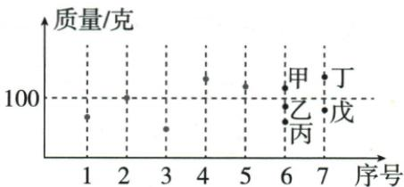

## 讲解

### 是什么

中位数是非空数值数据排序后的中心代表。奇数n取第(n+1)/2位，偶数n取第n/2与第n/2+1两值平均。序号是位置，统计值是该位置的数据；原输入列表顺序不决定中位。

### 怎么来的

由小到大排后，奇数中心两侧恰同条数；偶数无单一中心记录，定义以中间两数平均代表。频数表不必展开几十条，先累计每个值占据的序号范围：投篮20人，0第1、1第2–9、2第10–15，中心10/11都2。公司15个中心第8，累计1.2/1.4/1.6共7条，下一1.9才中心，不用第8类（总只有7类）。

### 什么时候能用

原中位较不受极端值影响是相对平均而言；改变边缘值且不跨中心排序可保持中位，改变数据导致中心位置值改变仍会变。非空、同指标排序；类别没有自然大小时不能套数值中位。获奖排名同分需规则，等于中位不自动确定是否前22。

## 例题

### 五数先排序一二三四五中位三

> 来源ID Q30-02；第30章数据的分析；351-377/full.md 第919–919行。原答案与解析定位：351-377/full.md 第921–923行。

例2 数据 1,2,4,5,3 的中位数是 \_\_\_\_.

**原资料答案与解析：**

答案3

注意 不能把中位数直接理解成中间位置的数.

**展开解析（依据原详解补足理由与步骤）：**

原记录顺序1、2、4、5、3只是列出顺序。由小到大排1、2、3、4、5，共5个奇数，中间序号(5+1)/2=3，第3个为3。原列出第3位4不是中位数，定义先排序，不能跳。

### 二十女生投篮众一中二均一点九

> 来源ID Q30-05；第30章数据的分析；351-377/full.md 第986–990行。原答案与解析定位：351-377/full.md 第992–992行。

例2 某中学为了解七年级女同学定点投篮水平,从中随机抽取20名女同学进行测试,每人定点投篮5次,进球数统计如下表:

| 进球数 | 0 | 1 | 2 | 3 | 4 | 5 |
| --- | --- | --- | --- | --- | --- | --- |
| 人数 | 1 | 8 | 6 | 3 | 1 | 1 |

求被抽取的 20 名女同学进球数的众数、中位数、平均数.

**原资料答案与解析：**

解析 进球数为 1 的人数最多, 所以众数为 1; 将 20 名女同学的进球数按从小到大排序后, 第 10、11 位的进球数均为 2, 所以中位数为 2; 平均数为 $\frac{0 \times 1 + 1 \times 8 + 2 \times 6 + 3 \times 3 + 4 \times 1 + 5 \times 1}{20} = 1.9$ .

**展开解析（依据原详解补足理由与步骤）：**

频数1+8+6+3+1+1=20。0球第1位、1球第2至9位、2球第10至15位，所以偶数第10/11位均2，中位2。最多频数8对应进球数1，众数1而不是8。总进球0×1+1×8+2×6+3×3+4×1+5×1=38，平均38/20=1.9球；实际个人不一定有1.9球，中位/平均都是统计量。

### 十五公司极大利润六均二点〇六中一点九

> 来源ID Q30-06；第30章数据的分析；351-377/full.md 第998–1003行。原答案与解析定位：351-377/full.md 第1004–1008行。

例3 某一企业集团有 15 个分公司, 各分公司所创年利润如下表:

| 分公司年利润/百万元 | 6 | 1.9 | 2.5 | 2.1 | 1.4 | 1.6 | 1.2 |
| --- | --- | --- | --- | --- | --- | --- | --- |
| 公司数 | 1 | 1 | 2 | 4 | 2 | 2 | 3 |

(1)计算各分公司所创年利润的平均数和中位数.
(2)在平均数和中位数中,你认为应该用哪一个来描述该集团各分公司所创年利润的一般水平?为什么?

**原资料答案与解析：**

解析 (1) 各分公司所创年利润的平均数为 $\frac{6+1.9+2.5\times2+2.1\times4+1.4\times2+1.6\times2+1.2\times3}{15}=2.06$ (百万元).

这组数据共有 15 个,从小到大排列后第 8 个数据为 1.9,所以中位数是 1.9 百万元.

(2)用中位数来描述该集团各分公司所创年利润的一般水平较好.因为一组数据中出现过大或过小的数据时,平均数不能代表该组数据的一般水平,所以这里选择用中位数较好.

**展开解析（依据原详解补足理由与步骤）：**

按利润值乘各公司数，总利润6+1.9+5+8.4+2.8+3.2+3.6=30.9百万元，公司数15，平均30.9/15=2.06。由小到大1.2占1–3位，1.4占4–5，1.6占6–7，1.9第8，2.1第9–12，2.5第13–14，6第15，奇数中位第8为1.9。原仅一家公司利润6远高其他，均值被拉高，用中位更贴近中间公司的水平；若研究全集团总利润或均分水平则平均仍有作用，不说异常值使平均从此无效。

### 盲盒七个中位百原图高低配对逐项C

> 来源ID Q30-10；第30章数据的分析；351-377/full.md 第1134–1160行。原答案与解析定位：351-377/full.md 第1104–1106行。

例3 新考法（2024 江苏苏州）某公司拟推出由 7 个盲盒组成的套装产品, 现有 10 个盲盒可供选择, 统计这 10 个盲盒的质量如图所示. 序号

为1到5号的盲盒已选定,这5个盲盒质量的中位数恰好为100,6号盲盒从甲、乙、丙中选择1个,7号盲盒从丁、戊中选择1个,使选定7个盲盒质量的中位数仍为100,可以选择()

A.甲、丁

B.乙、戊

C.丙、丁

D.丙、戊

**原资料答案与解析：**

例3 解析 若要使中位数为100,则需要所选定的7个盲盒中,有3个质量不超过100,3个质量不低于100.所以选定的6号盲盒和7号盲盒的质量应该一个不超过100,另一个不低于100,则选定的盲盒可以是甲、戊或乙、丁或丙、丁.

答案 C

**展开解析（依据原详解补足理由与步骤）：**

原1–5号中有2个低于100、1个等于100、2个高于100。图中甲高于100，乙/丙低于100，丁高于100，戊低于100。添加一低一高后，七个中第4仍为原100。A甲/丁都高，原100移到第3而第4高于100，错；B乙/戊都低，原100移到第5而第4低于100，错；C丙低/丁高符合，一低一高，对；D丙/戊都低，错。只据原图相对100高低即可，OCR额外猜测的质量数不入正文。

### 原中位两辨析唯一但偶数未必在原数据中

> 来源ID Q30-22；第30章数据的分析；351-377/full.md 第913–916行。原答案与解析定位：351-377/full.md 第913–916行。

1. 一组数据的中位数是唯一的.
(√)

2.一组数据的中位数一定是这组数据中的数. (×)

**原资料答案与解析：**

1. 一组数据的中位数是唯一的.
(√)

2.一组数据的中位数一定是这组数据中的数. (×)

**展开解析（依据原详解补足理由与步骤）：**

先排序且按奇偶定义后中位唯一，√；偶数时取中间两数平均，若两数不同，平均可非原数据，第二×。不能因众数可能多个便让按既定定义的中位也多个；空数据无中位，必须非空。

### 四十五前二十二奖中位判据同分缺口与衬衫众数

> 来源ID Q30-03；第30章数据的分析；351-377/full.md 第943–947行。原答案与解析定位：351-377/full.md 第949–949行。

例3 根据下列情况,选择合适的统计量填空.

(1)某次数学竞赛,45人进入复赛,其中前22名都能获奖,小明已经查出自己的成绩,他想判断自己是否获奖,只需知道45人复赛成绩的\_\_\_\_.

(2)某专卖店专营某品牌的衬衫,店主对上一周中不同尺码的衬衫销售量情况进行统计,影响该店主决定本周进货时,多进某种尺码衬衫的统计量是\_\_\_\_.

**原资料答案与解析：**

答案 (1) 中位数 (2) 众数

**展开解析（依据原详解补足理由与步骤）：**

(1)45人按成绩从低到高排，中位为第23位。若小明成绩严格大于该中位，至多22人严格在其以上或同侧，在按成绩取前22的通常规则下能进入获奖侧；严格小于则在第23名以后，不获奖。若恰等中位且有同分跨界，只有中位数不能确定具体名次，须同分规则；原答案“中位数”省此条件，不声明任何同分情形都充分。(2)补货要找最常售尺码，众数反映最多重复的类别，均值尺码可能不是可售规格。

## 易错

原1/2/4/5/3列中间4错，排序后中间3。偶数中位可以不是任何实际原值，但按规定计算仍唯一。
