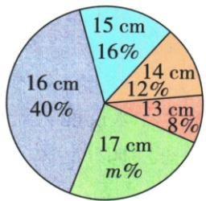
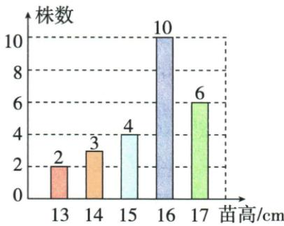
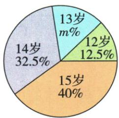
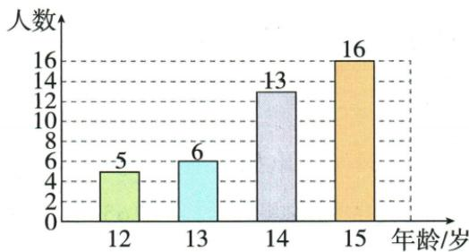

## 讲解

### 是什么

众数为一组数据中出现次数最多的值，可有多个并列。众数本身属于数据，最大频数是它出现多少次，二者不同。可用众数描述最常见规格或多数水平，适合原衬衫尺码进货。

### 怎么来的

逐值计数再查最大频数，原投篮频数8最大但对应进球数1，众数1不是8；麦苗频数10最大对应16cm，众16。原2、2、4、4、1的2与4各2次同最大，两个众数。原6、6、m、7、7、8若唯一众数7，m需7才能升到3次压6的2次；如果只说7为众数之一，不能推出唯一m。

### 什么时候能用

无特别重复或多值并列时，众数对代表典型数值的意义弱，不能为强求唯一任意选某个。原“众数为7”按题答案使用唯一众数口径，文中注明；实际表或题说“之一”必须保全部并列。

## 例题

### 四十五前二十二奖中位判据同分缺口与衬衫众数

> 来源ID Q30-03；第30章数据的分析；351-377/full.md 第943–947行。原答案与解析定位：351-377/full.md 第949–949行。

例3 根据下列情况,选择合适的统计量填空.

(1)某次数学竞赛,45人进入复赛,其中前22名都能获奖,小明已经查出自己的成绩,他想判断自己是否获奖,只需知道45人复赛成绩的\_\_\_\_.

(2)某专卖店专营某品牌的衬衫,店主对上一周中不同尺码的衬衫销售量情况进行统计,影响该店主决定本周进货时,多进某种尺码衬衫的统计量是\_\_\_\_.

**原资料答案与解析：**

答案 (1) 中位数 (2) 众数

**展开解析（依据原详解补足理由与步骤）：**

(1)45人按成绩从低到高排，中位为第23位。若小明成绩严格大于该中位，至多22人严格在其以上或同侧，在按成绩取前22的通常规则下能进入获奖侧；严格小于则在第23名以后，不获奖。若恰等中位且有同分跨界，只有中位数不能确定具体名次，须同分规则；原答案“中位数”省此条件，不声明任何同分情形都充分。(2)补货要找最常售尺码，众数反映最多重复的类别，均值尺码可能不是可售规格。

### 二十女生投篮众一中二均一点九

> 来源ID Q30-05；第30章数据的分析；351-377/full.md 第986–990行。原答案与解析定位：351-377/full.md 第992–992行。

例2 某中学为了解七年级女同学定点投篮水平,从中随机抽取20名女同学进行测试,每人定点投篮5次,进球数统计如下表:

| 进球数 | 0 | 1 | 2 | 3 | 4 | 5 |
| --- | --- | --- | --- | --- | --- | --- |
| 人数 | 1 | 8 | 6 | 3 | 1 | 1 |

求被抽取的 20 名女同学进球数的众数、中位数、平均数.

**原资料答案与解析：**

解析 进球数为 1 的人数最多, 所以众数为 1; 将 20 名女同学的进球数按从小到大排序后, 第 10、11 位的进球数均为 2, 所以中位数为 2; 平均数为 $\frac{0 \times 1 + 1 \times 8 + 2 \times 6 + 3 \times 3 + 4 \times 1 + 5 \times 1}{20} = 1.9$ .

**展开解析（依据原详解补足理由与步骤）：**

频数1+8+6+3+1+1=20。0球第1位、1球第2至9位、2球第10至15位，所以偶数第10/11位均2，中位2。最多频数8对应进球数1，众数1而不是8。总进球0×1+1×8+2×6+3×3+4×1+5×1=38，平均38/20=1.9球；实际个人不一定有1.9球，中位/平均都是统计量。

### 麦苗两图总二十五十七占二十四均十五点六中众十六

> 来源ID Q30-07；第30章数据的分析；351-377/full.md 第1014–1052行。原答案与解析定位：351-377/full.md 第1054–1060行。

例4 农科院为了解某种小麦的长势,随机抽取了部分麦苗,对苗高(单位:cm)进行了测量.根据统计的结果,绘制出如下统计图.

图①

图②

请根据相关信息,解答下列问题:

(1)本次抽取的麦苗的株数为\_\_\_\_，图①中 m 的值为\_\_\_\_。

(2) 求统计的这组苗高的平均数、众数和中位数.

**原资料答案与解析：**

解析（1）抽取的麦苗株数 $= \frac{4}{16\%} = 25, m\% = \frac{6}{25} \times 100\% = 24\%$ , $\therefore m = 24$ 。故答案为 25; 24.

(2) 观察条形图, 得这组苗高的平均数是 $\frac{13 \times 2 + 14 \times 3 + 15 \times 4 + 16 \times 10 + 17 \times 6}{2 + 3 + 4 + 10 + 6} = 15.6 \, (\text{cm})$ .

∵在这组数据中,16出现了10次,出现的次数最多,∴这组苗高的众数为16cm.

将这组数据按从小到大的顺序排列,处于中间位置的数是16,∴这组苗高的中位数为16 cm.

**展开解析（依据原详解补足理由与步骤）：**

15cm对应4株占16%，总4/0.16=25；也可柱数2+3+4+10+6=25检。17cm6株占6/25=24%，m24。总高度13×2+14×3+15×4+16×10+17×6=26+42+60+160+102=390cm，平均390/25=15.6cm。最多频数10对应16cm，众16；累计至15cm为9株，16cm占第10–19，25株中位第13，所以中位16cm。OCR扇表把类别和值混列，依原两图。

### 六六未知七七八唯一众七使未知七中七

> 来源ID Q30-09；第30章数据的分析；351-377/full.md 第1092–1092行。原答案与解析定位：351-377/full.md 第1100–1102行。

例2（2024四川南充）若一组数据6,6,m,7,7,8的众数为7,则这组数据的中位数为\_\_\_\_.

**原资料答案与解析：**

例2 解析 由众数是7可得m=7.该组数据从小到大排序后,排在中间的两个数都是7,则中位数是7.

答案7

**展开解析（依据原详解补足理由与步骤）：**

按原题“众数为7”表示唯一众数7，已有6和7各2次，未知m只有取7才能使7出现3次超过6的2次。排6、6、7、7、7、8，中位第3/4位均7，结果7。如果仅说“7是众数之一”，m其他值可能保留6与7并列，不能由它推出m7；这里明确原答案所依赖的唯一众数口径。

### 年龄双图十二五占十二点五总四十十三十五均中十四众十五

> 来源ID Q30-13；第30章数据的分析；351-377/full.md 第1201–1237行。原答案与解析定位：351-377/full.md 第1116–1132行。

例6（2023 天津）为培养青少年的劳动意识,某校开展了剪纸、编织、烘焙等丰富多彩的活动.该校为了解参加活动的学生的年龄情况,随机调查了 a 名参加活动的学生的年龄(单位:岁).根据统计的结果,绘制出如下的统计图 1 和图 2.

图1

图2

请根据相关信息,解答下列问题:

(1) 填空: a 的值为 \_\_\_\_, 图 1 中 m 的值为 \_\_\_\_.

(2)求统计的这组学生年龄数据的平均数、众数和中位数.

**原资料答案与解析：**

例6 解析 (1)40;15.

(2)由题中的条形图得,

$$
\frac {1 2 \times 5 + 1 3 \times 6 + 1 4 \times 1 3 + 1 5 \times 1 6}{5 + 6 + 1 3 + 1 6} = 1 4,
$$

∴ 这组数据的平均数是 14;

在这组数据中,15出现了16次,出现的次数最多,

∴ 这组数据的众数是 15;

将这组数据按由小到大的顺序排列,处于中间的两个数都是14,

∴ 这组数据的中位数是 14.

**展开解析（依据原详解补足理由与步骤）：**

12岁5人占12.5%，总5/0.125=40，或柱和5+6+13+16=40。13岁6/40=15%，m15。总年龄12×5+13×6+14×13+15×16=60+78+182+240=560，平均560/40=14岁。15岁16人最多，众数15；累计12/13岁11人，14岁占第12–24位，偶数第20/21都14，中位14。扇图13岁标m%，OCR1.0不是原给出的百分比，不能拿它算总数。

## 易错

以柱最高的纵轴人数16当年龄众数会错，真正众是15岁；平均与中位不要求必须在原数据里，众数要求。
