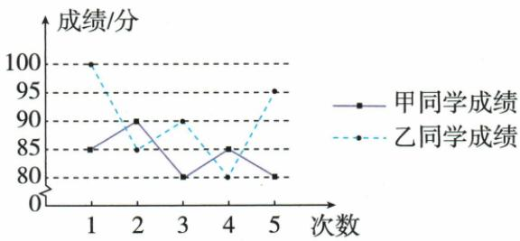

## 讲解

### 是什么

一组数据围绕它自身均值的波动，用各离均差平方再平均表示方差：

$$s^2=\frac{(x_1-\bar{x})^2+\cdots+(x_n-\bar{x})^2}{n}.$$

方差单位是原单位平方，非负；仅当每个数都等于均值时为0。初中该描述公式除n，不换成另一统计估计口径的n−1。

### 怎么来的

若直接平均差，总差=原总和−n均=0，会把正负波动抵消；先平方使所有偏离贡献非负、远离贡献更大，再除n防止只是记录多便总和大。原投壶5/2/4/3/6均4，差1/−2/0/−1/2，平方和10除五次得2。展开每平方为x²−2x均+均²，合后中项−2均·总和=−2n均²，末n均²，故s²=各x²平均−均²；每一步由总和=n均出发，不用无依据“简化得到”。

### 什么时候能用

数据同单位、同指标，比较方差只是比绕各自均值的绝对波动，不等于均值高低。原每次投8支但观察五次投中数，分母5。若数据无波动方0，不可能负；计算负通常漏平方、平均错或舍入误差，应回原数据。

## 例题

### 五次投壶五二四三六均四方差二

> 来源ID Q30-15；第30章数据的分析；351-377/full.md 第1322–1322行。原答案与解析定位：351-377/full.md 第1324–1326行。

例2 春节期间,小宇体验了投壶这一民俗活动,一共投壶5次,每次要投8支箭,投进去的箭数分别为5,2,4,3,6,则这5次投壶中投进的箭数的方差为\_\_\_\_.

**原资料答案与解析：**

解析 这组数据的平均数是 $(5 + 2 + 4 + 3 + 6) \div 5 = 4$ ，则方差为 $\frac{1}{5} \times [(5 - 4)^2 + (2 - 4)^2 + (4 - 4)^2 + (3 - 4)^2 + (6 - 4)^2] = 2$ .

答案2

**展开解析（依据原详解补足理由与步骤）：**

先平均(5+2+4+3+6)/5=20/5=4；各差1、−2、0、−1、2，平方1、4、0、1、4和10，方差10/5=2。每次虽投8箭，数据组是五次投进去的数，方差分母为5而不是8；平方后非负，不能让负差抵消正差。

### 两生成绩甲均八四方十四乙均九〇方五十逐项D

> 来源ID Q30-17；第30章数据的分析；351-377/full.md 第1370–1391行。原答案与解析定位：351-377/full.md 第1393–1399行。

例1 甲、乙两名同学五次数学测试成绩的折线图如图所示.

比较甲、乙的成绩,下列说法正确的是 ( )

A. 甲平均分高, 成绩稳定  
B.甲平均分高,成绩不稳定  
C.乙平均分高,成绩稳定  
D.乙平均分高,成绩不稳定

**原资料答案与解析：**

解析 $\overline{x}_{\text{甲}} = \frac{85 + 90 + 80 + 85 + 80}{5} = 84$ (分), $\overline{x}_{\text{乙}} = \frac{100 + 85 + 90 + 80 + 95}{5} = 90$ (分),

∴ 与甲相比, 乙的平均分高.

根据折线图分析可知,乙同学成绩的波动明显大于甲同学,故乙的成绩不稳定.

# 答案 D

**展开解析（依据原详解补足理由与步骤）：**

甲总420平均84，差1/6/−4/1/−4的平方和1+36+16+1+16=70，方差14。乙总450平均90，差10/−5/0/−10/5平方和100+25+0+100+25=250，方差50。所以乙平均高但相对甲更不稳定，D。A甲平均高且稳定、B甲平均高均错在平均；C乙平均高但稳定，后半错。稳定是相对本数据组比较，不宣布乙现实每次都会失常。

### 八次射击均九方甲三四乙五四选甲

> 来源ID Q30-18；第30章数据的分析；351-377/full.md 第1401–1407行。原答案与解析定位：351-377/full.md 第1409–1412行。

例2 某射击队为从甲、乙两名运动员中选拔一人参加全国比赛,对他们进行了8次测试,测试成绩(单位:环)如下表所示.

| 甲 | 10 | 8 | 9 | 8 | 10 | 9 | 10 | 8 |
| --- | --- | --- | --- | --- | --- | --- | --- | --- |
| 乙 | 10 | 7 | 10 | 10 | 9 | 8 | 8 | 10 |

(1)根据表格中的数据,计算出甲的平均成绩是\_\_\_\_环,乙的平均成绩是\_\_\_\_环.  
(2) 分别计算甲、乙两名运动员 8 次测试成绩的方差.  
(3)根据(1)(2)计算的结果,你认为推荐谁参加全国比赛更合适?并说明理由.

**原资料答案与解析：**

解析（1）甲的平均成绩为 $\frac{1}{8} \times (10 + 8 + 9 + 8 + 10 + 9 + 10 + 8) = 9$ （环），乙的平均成绩为 $\frac{1}{8} \times (10 + 7 + 10 + 10 + 9 + 8 + 8 + 10) = 9$ （环). 故答案为9;9.

(2)甲成绩的方差为 $\frac{1}{8} \times [(10 - 9)^2 + (8 - 9)^2 + (9 - 9)^2 + (8 - 9)^2 + (10 - 9)^2 + (9 - 9)^2 + (10 - 9)^2 + (8 - 9)^2] = 0.75$ , 乙成绩的方差为 $\frac{1}{8} \times [(10 - 9)^2 + (7 - 9)^2 + (10 - 9)^2 + (10 - 9)^2 + (9 - 9)^2 + (8 - 9)^2 + (8 - 9)^2 + (10 - 9)^2] = 1.25$ .  
(3) $\because 9 = 9,0.75 < 1.25,\therefore$ 甲、乙的平均成绩相同，但甲的成绩更稳定，故推荐甲参加全国比赛更合适

**展开解析（依据原详解补足理由与步骤）：**

两组和均72、平均72/8=9环。甲相对9的八个平方差1/1/0/1/1/0/1/1和6，方差6/8=0.75环²；乙1/4/1/1/0/1/1/1和10，方差10/8=1.25环²。平均相同而甲方差小，成绩在均值附近更稳定，原目标下推荐甲。不能只挑一次最高10环，因为两者都有且本题比较八次整体。

### 原方差非负与删除均值数据极差组数辨析

> 来源ID Q30-25；第30章数据的分析；351-377/full.md 第1308–1310行。原答案与解析定位：351-377/full.md 第1308–1310行；351-377/full.md 第1338–1340行。

1. 方差越大数据越不稳定，方差越小数据越稳定. （√）

2.方差可以为负数. (×)

**原资料答案与解析：**

1. 方差越大数据越不稳定，方差越小数据越稳定. （√）

2.方差可以为负数. (×)

1. 一组数据去掉与中位数相等的数据，不影响极差大小。（√）  
2.一组数据（不都相同）去掉与平均数相等的数据，方差变大，极差不变. （√）  
3. 一个样本的极差为83，取组距为10，则可以分成8组。（×）

**展开解析（依据原详解补足理由与步骤）：**

方差是非负平方的平均，非负；越小表示同单位同指标下围绕各自均值越集中，不等于所有目的越小越好。原方差可负×。后原删除中位数据若剩非空且不改变极端，极差不变；去平均值且原数据不全同，均值位于极端之间，极端留存、平方差和不变而分母从n到n−1，方差增、极差不变。极差83、组距10，8组覆盖仅80，不够，至少9组，还须端点按题覆盖。

## 易错

不能让负差抵消或先把正负差平均再平方；射击环²是方差，平均和标准差才环。
