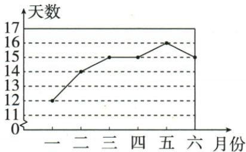

## 讲解

### 是什么

对非空n条数值数据，算术平均数是总和除n，表示若保持总量，把每条都均分成同一值时的那个值：

$$\bar{x}=\frac{x_1+\cdots+x_n}{n}.$$

平均与原值同单位，但未必是组内一个实际数；重排不改总和，因此平均唯一且无关记录顺序。

### 怎么来的

若每人同值均，n份之和n均应等于原总和，两边除n就得到定义。每项加a，总和加na，除n得均+a；每项乘k，总和乘k，除n得k均。若去一条恰等均的记录，总和由n均变(n−1)均，剩n−1条仍均，前提n>1。原投篮平均1.9并非个人可能进球数，说明平均是均分量，不是必然实际值；原优天气均14.5虽中位/众15，三数作用不同。

### 什么时候能用

数据同指标同单位并且每条同等计入总量。个别极值会拉总和，所以平均敏感；但研究总量仍适合，不能因有异常值就说平均无数学意义。加常数性质不是平均不变，空组不可除0。

## 例题

### 原平均数五辨析含去均值剩非空

> 来源ID Q30-21；第30章数据的分析；351-377/full.md 第845–849行。原答案与解析定位：351-377/full.md 第845–849行。

1.一组数的平均数一定是这组数据中的数. (×)  
2. 一组数据的平均数是唯一的，与数据的排列顺序无关。（√）  
3. 若一组数据中的每个数都加上相同的数，则这组数据的平均数不变. (×)  
4. 若一组数据中的每个数都扩大相同的倍数，则这组数据的平均数也扩大同样的倍数。（√）  
5.一组数据去掉与平均数相等的数据，所得新数据的平均数与原平均数相等. （√）

**原资料答案与解析：**

1.一组数的平均数一定是这组数据中的数. (×)  
2. 一组数据的平均数是唯一的，与数据的排列顺序无关。（√）  
3. 若一组数据中的每个数都加上相同的数，则这组数据的平均数不变. (×)  
4. 若一组数据中的每个数都扩大相同的倍数，则这组数据的平均数也扩大同样的倍数。（√）  
5.一组数据去掉与平均数相等的数据，所得新数据的平均数与原平均数相等. （√）

**展开解析（依据原详解补足理由与步骤）：**

平均由总和/个数可能不是原任何值，第一×；重排不改总和/个数，唯一且无关顺序，第二√；每项加a，总和加na、平均加a而非不变，第三×；每项乘k，总和乘k、平均乘k，第四√；去一个等于原平均的数据后总和(n−1)均、个数n−1，新平均仍原均，第五√，需n>1以免删到空集。

### 二十女生投篮众一中二均一点九

> 来源ID Q30-05；第30章数据的分析；351-377/full.md 第986–990行。原答案与解析定位：351-377/full.md 第992–992行。

例2 某中学为了解七年级女同学定点投篮水平,从中随机抽取20名女同学进行测试,每人定点投篮5次,进球数统计如下表:

| 进球数 | 0 | 1 | 2 | 3 | 4 | 5 |
| --- | --- | --- | --- | --- | --- | --- |
| 人数 | 1 | 8 | 6 | 3 | 1 | 1 |

求被抽取的 20 名女同学进球数的众数、中位数、平均数.

**原资料答案与解析：**

解析 进球数为 1 的人数最多, 所以众数为 1; 将 20 名女同学的进球数按从小到大排序后, 第 10、11 位的进球数均为 2, 所以中位数为 2; 平均数为 $\frac{0 \times 1 + 1 \times 8 + 2 \times 6 + 3 \times 3 + 4 \times 1 + 5 \times 1}{20} = 1.9$ .

**展开解析（依据原详解补足理由与步骤）：**

频数1+8+6+3+1+1=20。0球第1位、1球第2至9位、2球第10至15位，所以偶数第10/11位均2，中位2。最多频数8对应进球数1，众数1而不是8。总进球0×1+1×8+2×6+3×3+4×1+5×1=38，平均38/20=1.9球；实际个人不一定有1.9球，中位/平均都是统计量。

### 六个月优天气十二十四十五十五十六十五均十四点五逐项D

> 来源ID Q30-12；第30章数据的分析；351-377/full.md 第1176–1199行。原答案与解析定位：351-377/full.md 第1112–1114行。

例5（2024 江西）如图是某地去年一至六月每月空气质量为优的天数的折线统计图,关于各月空气质量为优的天数,下列结论错误的是()

A.五月份空气质量为优的天数是16

B.这组数据的众数是15天

C. 这组数据的中位数是 15 天

D.这组数据的平均数是15天

**原资料答案与解析：**

例5 解析 观察题中的折线图知,五月份空气质量为优的天数是16;数据15出现了3次,次数最多,即众数是15天;把数据按从小到大排列,位于中间的两个数是15,15,即中位数为15天;这组数据的平均数为 $(12+14+15\times3+16)\div6=14.5$ (天).

答案 D

**展开解析（依据原详解补足理由与步骤）：**

原六月数据12、14、15、15、16、15。A五月16真；B15出现3次最多真；排序12、14、15、15、15、16，中间第3/4均15，C真；和87除6=14.5，D声称平均15假，选错误D。中位众数同15不意味着平均也15。

## 易错

原平均唯一和顺序无关√，每项加同数均不变×；别把原列表中第一个值或某个最多值直接作平均。
