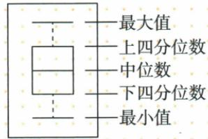

## 讲解

### 判据

原图为拓展示意而无数值任务，先按标注解释五数，不从绘图比例自造数。

### 流程

1.原上下须端标最小/最大，箱下端Q1、箱内线中位、箱上端Q3，按图方向读。2.箱长表示上下四分位的数值差，不等于人数更多。3.若要求具体Q1/Q3，先取题明确的排序分半或其他约定；原奇数中位是否纳半未给，登记缺口。4.有限并列值不保证≤Q1精确25%，不能把理想位置份额当严格计数。5.不编数值例题替原示意。

## 例题

### 原四分位箱线示意与精确四等份条件缺口

> 来源ID Q30-23；第30章数据的分析；351-377/full.md 第893–897行。原答案与解析定位：351-377/full.md 第925–939行。

知识解读 百分位数与四分位数：

百分位数是一类统计量.如果把一组数据从小到大排序,用 $m_{50}$ 表示中位数,称为第50百分位数,那么中位数把这组数据分为两部分,分别记为S和T;进一步用 $m_{25}$ 和 $m_{75}$ 分别表示S和T的中位数,那么所有数据中小于或等于 $m_{25}$ 的占25%,小于或等于 $m_{75}$ 的占75%.这样 $m_{25},m_{50},m_{75}$ 这三个数值把所有数据分为个数相等的四个部分,因此,称为四分位数.

我们可以将四分位数、最大值和最小值这些信息体现在箱线图中,以此来反映一组数据的整体分布情况.⑤

**原资料答案与解析：**

# 5 图解概念

箱线图示意图

**展开解析（依据原详解补足理由与步骤）：**

原箱线图从下到上标最小、下四分位、中位、上四分位、最大，描述中心与分布。上下四分位可依题指定的分半排序方法求，但原没明确奇数时中位是否纳入上下半，求值不能擅定版本；并且有限数据有重复时，小于等于Q1的数据不必正好25%，故原“个数相等四部分”“≤各分位精确百分数”的无条件断言需限定。资料只有示意，无数值箱线例题，保留缺口。

## 易错

此为拓展识图，求值规则必须有依据，原标注不等同所有软件箱线须都到最小最大。
