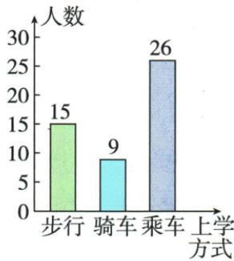
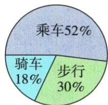
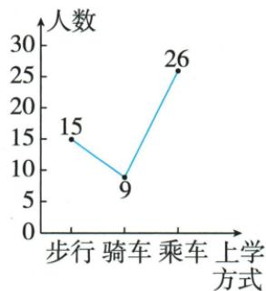
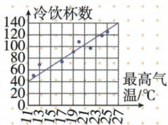

## 讲解

### 是什么

趋势图用线概括一个量与另一个量的统计变化倾向。原气温和冷饮图包含观测点与趋势线，线表示总体方向，实际点可以偏离；没有题目明确函数模型时，不能把每个观测量都当严格落在某条直线上的值。

### 怎么来的

先读横轴最高气温、纵轴冷饮杯数，点大体从左下向右上，支持该样本内气温升高时销量通常增加。趋势线在点群中概括关系，不是连接上学方式分类的折线。同一气温下营业时间、客流等也可能变化，相关图本身不能排除其他原因，更不证明气温单独造成每次销量变化。原只有图解示意与概念说明，无独立数字预测题，保留说明，不自补斜率题。

### 什么时候能用

预测仅在原数据范围与同类情境中谨慎使用，远外推或把趋势当精确承诺没有资料支持。若原题另明确函数和拟合规则，再按该模型算；这张图不给精确函数式，正文不由OCR散点表编直线方程。

## 例题

### 原五十上学方式三图与气温冷饮趋势示意

> 来源ID Q29-25；第29章数据的收集整理与描述；351-377/full.md 第276–318行。原答案与解析定位：351-377/full.md 第276–318行。

知识解读 某班共有50名学生,其中有15人步行上学,9人骑车上学,剩余26人乘车上学.下面分别是条形图、扇形图和折线图的图示.

某班学生上学方式条形图

某班学生上学方式扇形图

某班学生上学方式折线图

**原资料答案与解析：**

知识解读 某班共有50名学生,其中有15人步行上学,9人骑车上学,剩余26人乘车上学.下面分别是条形图、扇形图和折线图的图示.

某班学生上学方式条形图

某班学生上学方式扇形图

某班学生上学方式折线图

**展开解析（依据原详解补足理由与步骤）：**

原上学50人，步行15、骑车9、乘车26；频率30%、18%、52%，和100%。条形清楚数量，扇形清楚比例，原还画折线但分类上学方式没有自然时间顺序，连线起伏不能当随时间发展的趋势。原气温与冷饮点图显示该样本总体随气温增大而杯数增多，趋势线用于概括而非每一点精确等式；不能把统计相关当气温单独导致所有销量变化。

## 易错

不要把图中光滑线与每个点当成完全相等的函数关系，也不要用无序分类连线推出时间趋势。
