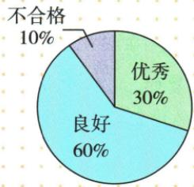

## 讲解

### 是什么

同一圆形表示总体，各互斥类别的占比r对应圆心角θ=360°r，数量f=nr。占比、角度、数量相互换算都须指同一个总体n；多个不同总量的饼图，不可只比角大就说数量大。

### 怎么来的

同半径扇形的角度份额为θ/360，原构图让它等类别频率r，乘360得θ。原质量良好60%角216°，余优秀30%108°、不合格10%36°，三角和360。节目戏曲6%对应50×6%=3人，不是6人；体育20%对应72°。球类题C9占15%，反求总60，再求E12占20%角72，两步分别用份额定义反算，不能把9人的扇角也当9%。

### 什么时候能用

各学生只选一类、统计类别覆盖全部时可频率和1。若同一人可选多个项目，次数分母与人数分母要分别定义。百分比不含总量不能唯一给人数；原书店每月党史占比的分母是当月全店收入，不能改成五个月合计182。

## 例题

### 质量扇形良好百分六十圆心角二一六

> 来源ID Q29-09；第29章数据的收集整理与描述；351-377/full.md 第223–235行。原答案与解析定位：351-377/full.md 第237–237行。

例1 下图为某企业根据对生产产品质量评测的结果绘制的扇形图.其中,质量“良好”部分所对应的圆心角为\_\_\_\_°.

**原资料答案与解析：**

答案 216

**展开解析（依据原详解补足理由与步骤）：**

原图良好60%，圆形全周360°，同圆扇形份额与角度份额相同，角=360×60%=216°。不合格10%角36、优秀30%角108，三角36+108+216=360可核。60是百分数而不是60°。

### 五类喜爱节目普查五十体育角七二逐项D

> 来源ID Q29-17；第29章数据的收集整理与描述；351-377/full.md 第659–681行。原答案与解析定位：351-377/full.md 第614–622行。

例3（2024山东济宁）为了解全班同学对新闻、体育、动画、娱乐、戏曲五类节目的喜爱情况，班主任对全班50名同学进行了问卷调查（每名同学只选其中的一类），依据50份问卷调查结果绘制了全班同学喜爱节目情况扇形统计图(如图所示).下列说法正确的是 （）

A.班主任采用的是抽样调查

B.喜爱动画节目的同学最多

C. 喜爱戏曲节目的同学有 6 名

D.“体育”对应扇形的圆心角为 $72^{\circ}$

**原资料答案与解析：**

例3 解析 对全班 50 名同学都进行了调查, 班主任采用的是全面调查, 故选项 A 不正确;

喜爱娱乐节目的同学最多,故选项 B 不正确;

喜爱戏曲节目的同学应为 $50 \times 6\% = 3$ (名), 故选项 C 不正确;

“体育”对应扇形的圆心角为 $360^{\circ} \times 20\% = 72^{\circ}$ , 故选项 D 正确.

答案D

**展开解析（依据原详解补足理由与步骤）：**

调查全班50人所以A说抽样错；娱乐36%比动画30%大，B动画最多错；戏曲6%×50=3人，C6人错；体育20%×360=72°，D对。各人只选一类，五类互斥完备，总百分6+8+20+30+36=100，圆周角份额才能一一对应。

### 五球项目篮球九占百分十五求六十补排球十五角七二估乒乓二四〇

> 来源ID Q29-20；第29章数据的收集整理与描述；351-377/full.md 第752–781行。原答案与解析定位：351-377/full.md 第787–811行。

例6（2024江苏苏州）某校计划在七年级开展阳光体育锻炼活动，开设以下五个球类项目：A（羽毛球），B（乒乓球），C（篮球），D（排球），E（足球），要求每位学生必须参加，且只能选择其中一个项目。为了了解学生对这五个项目的选择情况，学校从七年级全体学生中随机抽取部分学生进行问卷调查，对调查所得到的数据进行整理、描述和分析，部分信息如下：

各项目选择人数条形统计图

各项目选择人数占比扇形统计图

图①

  
图②

根据以上信息,解决下列问题:

(1) 将图①中的条形统计图补充完整(画图并标注相应数据).  
(2)图②中项目 E 对应的圆心角的度数为  
(3) 根据抽样调查结果, 请估计本校七年级 800 名学生中选择项目 B(乒乓球) 的人数.

**原资料答案与解析：**

例6 解析 (1) $9 \div 15\% = 60$ .

D 的人数为 60-6-18-9-12=15.
补全条形统计图如下：

各项目选择人数条形统计图

(2)72.   
(3) $800\times\frac{18}{60}=240$ （人）.

答:本校七年级800名学生中选择项目B(乒乓球)的人数约为240.

**展开解析（依据原详解补足理由与步骤）：**

C篮球9人占15%，样本总9/0.15=60。D排球缺人数=60−6−18−9−12=15，补图柱高15并标数。E足球12/60=20%，扇角360×20%=72°。B乒乓18/60=30%，估七年级800×30%=240人。四步使用同一60为样本分母，不把字母C/D项目当选择题选项，更不能把未画D柱解释为0。

### 五个月营业总一八二补四月四五党史逐月乘比

> 来源ID Q29-14；第29章数据的收集整理与描述；351-377/full.md 第516–553行。原答案与解析定位：351-377/full.md 第555–578行。

例3 图1表示的是某书店今年1\~5月的各月营业总额的情况,图2表示的是该书店“党史”类书籍的各月营业额占书店当月营业总额的百分比情况.若该书店1\~5月的营业总额一共是182万元,观察图1、图2,解答下列问题:

图 1

图2

(1) 求该书店 4 月份的营业总额, 并补全条形图.  
(2) 求 5 月份“党史”类书籍的营业额.  
(3)请你判断这5个月中哪个月“党史”类书籍的营业额最高,并说明理由.

**原资料答案与解析：**

解析（1）该书店4月份的营业总额为 $182 - (30 + 40 + 25 + 42) = 45$ （万元）.补全条形图如图所示.

(2)5月份“党史”类书籍的营业额为 $42 \times 25\% = 10.5$ (万元).  
(3) 这 5 个月中 5 月份“党史”类书籍的营业额最高.

理由:4月份“党史”类书籍的营业额为 $45\times20\%=9$ (万元).

∵ 10.5>9,且1\~3月的营业总额以及“党史”类书籍的营业额占当月营业总额的百分比都低于4、5月份，

∴ 这 5 个月中 5 月份“党史”类书籍的营业额最高.

**展开解析（依据原详解补足理由与步骤）：**

(1)其余月份30+40+25+42=137，4月182−137=45万元，按图同刻度补45高柱并标值。(2)5月党史42×25%=10.5万元。(3)依次求五个月该类别营业额：30×15%=4.5，40×10%=4，25×12%=3，45×20%=9，42×25%=10.5万元，最大5月。百分比最高本身不一定数量最高，本题以各月本身营业额为分母，必须乘回各月总量。

## 易错

百分比与角度数或人数数看似相同也只是巧合，写单位可发现把6%错成6人的问题。
